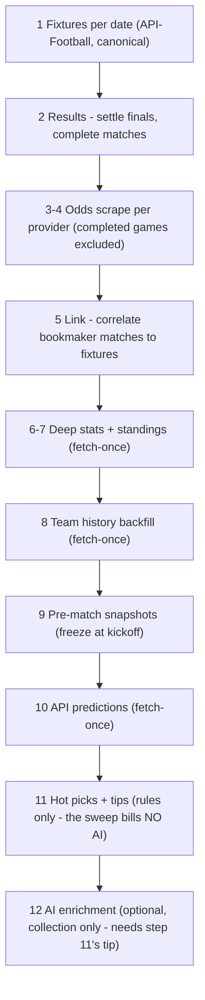
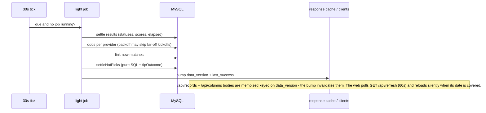

# 01 — System overview & operating modes

What oddspro does in one line: **scrape bookmaker odds (BetPawa, Betika) + ingest canonical
API-Football data → correlate → deduce tips/hot picks → rank honestly → serve a web table.**
Per-file architecture lives in `CLAUDE.md` (authoritative); this chapter explains the
*modes* the system runs in and what each execution stage does.

## Operating modes

| Mode | Entry | What runs |
|---|---|---|
| CLI one-shot | `node src/index.js <action>` (`src/index.js`) | One idempotent action (scrape, link, stats, hotpicks, …), then the knex pool closes. No action / `start` / a bare number = the full sweep below. Settings overrides load BEFORE dispatch (M6) — CLI sweeps run under the same effective gates as serve. |
| serve | `npm run serve` (`src/server.js`) | Express API on :3001 + four in-process schedulers: auto-refresh (light/full), geo backfill, AI worker (60s tick), catalog warm. The production-resident process. |
| cron | Task Scheduler `oddspro-pipeline` daily 08:00 (`scripts/pipeline-task.cmd`) / cPanel `scripts/pipeline-cron.sh` | The full sweep as an *optional backup* to serve's in-process scheduler — schedule it ≥ 1h away from `AUTO_FULL_AT`. |

Serve boot order (`src/server.js`): `.HALT` check (present = refuse boot, exit 1) →
`MIGRATE_ON_BOOT` migrations (fail-fast, if enabled) → settings overrides load → listen →
start schedulers. Graceful shutdown stops schedulers, cancels a running job cooperatively,
15s grace.

## The full sweep — 12 steps

`runStartPipeline(days)` (`src/pipeline.js`), default today..+3 days, ordered for **fewest
server hits**: a date fetch also refreshes today's statuses (shrinking the results set), and
settling results first lets the odds scrapers skip completed games entirely.

Step 12 runs last **by design**: the anchored enrichment call must see the tip step 11 just
wrote. Enrichment is full-sweep-only (a cost boundary — never wire it into the web refresh).

## Light pass vs full sweep vs manual refresh

One scheduler (`src/auto-refresh.js`), one 30s tick, one shared single-slot job — auto and
manual refreshes can never overlap (parallel refresh writers deadlock on InnoDB gap locks).

| | Light pass | Full sweep | Manual refresh |
|---|---|---|---|
| Trigger | every `AUTO_LIGHT_MINUTES` (10) | once per EAT day at `AUTO_FULL_AT` (06:00) | `POST /api/refresh?date=` (web button) |
| Scope | today only | today..+`AUTO_FULL_DAYS` (5) | one date (`runDateRefresh`) |
| Does | results settle → odds (tiered kickoff-proximity backoff + idle skip) → link → `settleHotPicks` → auth purge | all 12 steps | fixtures/results/odds/link/stats for the date; history/prematch/predictions/hotpicks only when relevant to past/future |
| Skips | fixtures-by-date, deep stats, history, snapshots, predictions, AI | — | standings (owned by the full sweep), AI enrichment (cost) |

The full sweep is stamped due **at start** — one attempt per day even on failure; a mid-day
restart never fires a surprise sweep. Successful jobs bump the monotonic `data_version`
(the client freshness signal) and log to self-truncating `logs/auto-refresh.log`.

## Serve behavior notes

- **Response caching:** heavy reads are memoized (serialized + gzip + ETag/304) keyed on
  `data_version`; a restart drops the memo. `?refresh=1` recomputes `/api/magic-sort` only.
- **Single writer:** run exactly ONE serve; a concurrent `npm run start` sweep
  gap-lock-deadlocks on the same odds rows.
- **`.HALT`:** creating the file stops a running serve within ~30s and blocks reboot until
  deleted — the kill-switch for hosts where Stop is unreliable.
- **Access tiers:** guests get no future dates and server-side-redacted tip reasoning; any
  session gets full detail. Server-authoritative, tier-keyed cache slots — see
  `src/db/access-rules.js` notes in `CLAUDE.md`.
- **Scheduled maintenance (M14):** the window lives in settings-catalog group
  `maintenance` (`MAINTENANCE_SCHEDULED/_START/_END/_MESSAGE`, all live; edited from the
  admin Dashboard card or Admin → Settings — every change is audit-dated). While ACTIVE,
  a pre-route gate answers 503 + `Retry-After` (JSON with the schedule on `/api/*`, a
  static notice page on document loads) UNLESS the request is an admin session, an
  `ADMIN_TOKEN`/`API_TOKEN` bearer, or `/api/auth/*` (admins can sign in mid-window). The
  schedule rides `GET /api/refresh` + every 503 body; clients cache it, warn with a
  dismissible banner pre-window, switch to a full-screen overlay on their own clock at
  start (polls/fetches/tracking suspend — network goes quiet), and recover with 5–30 s
  jitter after end. A past-end window auto-expires to off — a forgotten toggle can never
  hold a stale 503. Pure state machine: `src/db/maintenance-rules.js` (shared verbatim
  with the web).
- **User management (M8):** Admin → Users drives GET/PATCH `/api/admin/users[/:id]`
  (admin SESSION only). Patchable: active/role/phone_verified + one-way unlock,
  force-PIN-change and reset-PIN (4-digit temp PIN shown ONCE in the response — its hash
  is stored, plaintext never persisted or logged). Pure guards (`src/db/admin-rules.js`)
  reject self-disable/demote, self PIN actions and removing the last active admin.
  Disable and PIN reset revoke every session in the same transaction as the row change;
  every mutation lands changed-only `admin_audit` rows (`user.patch`/`user.unlock`/
  `user.force_pin_change`/`user.reset_pin`) in that same transaction. Manual verify
  (`phone_verified: true`) is the SMS-failure fallback: it unblocks the verified-only
  routes (profile PIN change included) without an OTP.

---
*Update this chapter when: a pipeline step is added/removed/reordered, a scheduler is
added, or light/full/manual scope or cadence knobs change (`src/pipeline.js`,
`src/auto-refresh.js`, `src/server.js`).*
