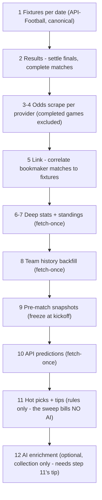
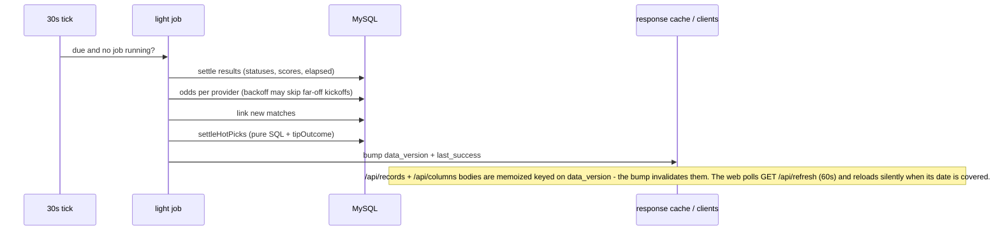

# 01 - System overview & operating modes

What oddspro does in one line: **scrape bookmaker odds (BetPawa, Betika) + ingest canonical
API-Football data → correlate → deduce tips/hot picks → rank honestly → serve a web table.**
Root `CLAUDE.md` is the map (one line per module); this chapter carries the detail for the
*modes* the system runs in, what each execution stage does, and everything the serve process
owns: multi-instance safety, the HTTP surface, accounts and admin, and the configuration.

## Operating modes

| Mode | Entry | What runs |
|---|---|---|
| CLI one-shot | `node src/index.js <action>` (`src/index.js`) | One idempotent action (scrape, link, stats, hotpicks, ...), then the knex pool closes. No action / `start` / a bare number = the full sweep below. Settings overrides load BEFORE dispatch (M6) - CLI sweeps run under the same effective gates as serve. |
| serve | `npm run serve` (`src/server.js`) | Express API on :3001 + four in-process schedulers: auto-refresh (light/full), geo backfill, AI worker (60s tick), and the warm keeper (`src/warm.js`, 5s tick - precomputes records/columns/hotpicks/performance + the magic-sort day memo the moment `warehouse_version` moves, plus an age re-warm, so no visitor ever pays a cold compute; status rides `GET /api/refresh` `warm`). The production-resident process. |
| cron | Task Scheduler `oddspro-pipeline` daily 08:00 (`scripts/pipeline-task.cmd`) / cPanel `scripts/pipeline-cron.sh` | The full sweep as an *optional backup* to serve's in-process scheduler - schedule it ≥ 1h away from `AUTO_FULL_AT`. |

Serve boot order (`src/server.js`): `.HALT` check (present = refuse boot, exit 1) →
`MIGRATE_ON_BOOT` migrations (fail-fast, if enabled) → settings overrides load → listen →
start schedulers. Graceful shutdown stops schedulers, cancels a running job cooperatively,
15s grace.

## The full sweep - 12 steps

`runStartPipeline(days)` (`src/pipeline.js`), default today..+3 days, ordered for **fewest
server hits**: a date fetch also refreshes today's statuses (shrinking the results set), and
settling results first lets the odds scrapers skip completed games entirely - they drop their
per-game detail requests through the `completedMatchIds()` exclusion set.

```mermaid
flowchart TD
    A["1 Fixtures per date (API-Football, canonical)"] --> B["2 Results - settle finals, complete matches"]
    B --> C["3-4 Odds scrape per provider (completed games excluded)"]
    C --> D["5 Link - correlate bookmaker matches to fixtures"]
    D --> E["6-7 Deep stats + standings (fetch-once)"]
    E --> F["8 Team history backfill (fetch-once)"]
    F --> G["9 Pre-match snapshots (freeze at kickoff)"]
    G --> H["10 API predictions (fetch-once)"]
    H --> I["11 Hot picks + tips (rules only - the sweep bills NO AI)"]
    I --> J["12 AI enrichment (optional, collection only - needs step 11's tip)"]
```

Step 12 runs last **by design**: the anchored enrichment call must see the tip step 11 just
wrote. Enrichment is full-sweep-only (a cost boundary, not an oversight - the web refresh
button can fire far more often than the daily sweep, and enrichment bills real per-fixture AI
calls).

**Per-step isolation (2026-08-19 durability pass, round 2).** `runStartPipeline` is the ONLY
thing that fetches odds for FUTURE dates, and it originally had no guarding: a throw in an
early step - results, the exact step that caused the 2026-08-16 outage - skipped every step
after it, including every remaining date's odds scrape, for up to 24h. Every step now runs
behind the same `makeStepGuard`/`guardStep` idiom the light pass uses
(`src/db/auto-rules.js`), so a failure is caught, logged as `[start] <step> failed: ...`, and
the run continues. Fixtures and odds are guarded PER DATE, and odds additionally PER PROVIDER
(`betpawa odds 2026-08-20` and so on - the highest-value line in the pass), so one date or
one provider failing costs only itself.

`runStartPipeline(days, onStep)` narrates its steps and returns
`{ dates, quota_remaining, step_failures, steps_verdict, data_bearing_ok }`; the last three
come from `summarizeSteps`/`hasDataBearingSuccess` over the guarded outcomes, and a total
`error` (every guarded step failed) throws instead of returning, matching `lightRefresh`. The
scheduler's full mode reads `data_bearing_ok` to decide whether the day's attempt counts as
done.

`runDateRefresh(date, onStep)` is the single-date subset behind the web refresh button: it
skips results and stats for future dates, history and snapshots for past dates, leaves
standings to the full sweep, is guarded the same way (one guard per provider suffices for a
single date) and returns the same `step_failures`/`steps_verdict`/`data_bearing_ok` shape.

## Light pass vs full sweep vs manual refresh

One scheduler (`src/auto-refresh.js`), one unref'd 30s `setInterval` tick, one shared
single-slot job - auto and manual refreshes can never overlap (parallel refresh writers
deadlock on InnoDB gap locks).

| | Light pass | Full sweep | Manual refresh |
|---|---|---|---|
| Trigger | every `AUTO_LIGHT_MINUTES` (10) | once per EAT day at `AUTO_FULL_AT` (06:00) | `POST /api/refresh?date=` (web button) |
| Scope | today only | today..+`AUTO_FULL_DAYS` (5) | one date (`runDateRefresh`) |
| Does | results settle → odds (tiered kickoff-proximity backoff + idle skip) → link → `settleHotPicks` → auth purge | all 12 steps | fixtures/results/odds/link/stats for the date; history/prematch/predictions/hotpicks only when relevant to past/future |
| Skips | fixtures-by-date, deep stats, history, snapshots, predictions, AI | - | standings (owned by the full sweep), AI enrichment (cost) |

```mermaid
sequenceDiagram
    participant T as 30s tick
    participant J as light job
    participant DB as MySQL
    participant C as response cache / clients
    T->>J: due and no job running?
    J->>DB: settle results (statuses, scores, elapsed)
    J->>DB: odds per provider (backoff may skip far-off kickoffs)
    J->>DB: link new matches
    J->>DB: settleHotPicks (pure SQL + tipOutcome)
    J->>C: bump data_version + last_success
    Note over C: /api/records + /api/columns bodies are memoized keyed on data_version - the bump invalidates them. The web polls GET /api/refresh (60s) and reloads silently when its date is covered.
```

**Per-step isolation (round 1, same date).** Each light-pass step, and each provider's odds
fetch individually, runs behind a `guardStep` wrapper that catches, records and logs the
failure (`[light] <step> failed: ...`) and lets the pass continue. The order stays
results-first (completed matches shrink the scrapers' detail requests), but one step's throw
can no longer cascade into skipping every later one - which is exactly what cost three days
of irreplaceable odds on 2026-08-16 (see
`docs/research/2026-08-19-odds-durability-and-outage-damage.md`). `summarizeSteps()`
classifies the guarded outcomes `ok`/`partial`/`error`; `refreshOutcome` surfaces `partial`
in the job log while still stamping freshness (useful work happened), and only a total
`error` withholds it. A cooperative cancel still aborts the whole pass immediately - the
cancel check sits outside every guard's `try`.

The light pass also runs `purgeExpiredAuth` (session and OTP rows 30 days past their indexed
`expires_at`), and its odds step is the only one subject to the kickoff-proximity backoff:
`ODDS_REFRESH_TIERS` (`90:0,360:30,1440:120,*:360`) decays how often a far-off kickoff's odds
detail is re-fetched, a kickoff within 90 minutes always refreshes, and an invalid or
disabled value means never skip (`parseOddsTiers`/`oddsRefreshDue` in
`src/db/odds-refresh-rules.js` fail open to true). `AUTO_IDLE_LOOKAHEAD_MINUTES` (120, 0=off)
makes `lightPassIdle` skip odds and link entirely when nothing is in play and the next
kickoff is farther out; the lookahead is clamped at or above the first tier so idling can
never starve the 90-minute always-refresh guarantee. Both are wired through
`store.oddsExcludeIds` into the LIGHT pass only - the full sweep and a manual refresh bypass
the backoff.

The "already swept today" marker (`lastFullKey`) is no longer stamped at START. It is
stamped only from the full-sweep job's own `onFinish` callback, and only when
the run finished ok, or partial with `summary.data_bearing_ok` true (`refreshOutcome`/
`hasDataBearingSuccess`/`fullSweepAttemptVerdict`, `src/db/auto-rules.js`). A failed or
total-error attempt leaves
the "done today" marker untouched, so the next 30s tick retries - up to `AUTO_FULL_MAX_ATTEMPTS`
(default 3) attempts per EAT day, the count resetting at the day boundary - before the
scheduler waits for tomorrow; a mid-day restart still never fires a surprise sweep (the marker
is pre-seeded to today's key at boot). The attempt bookkeeping is `fullAttempts`/
`fullAttemptsDayKey`, reset the instant `eatDateKey` changes, and the pure
`fullSweepAttemptVerdict({dayKey, lastKey, attempts, maxAttempts})` returns `'done'`,
`'exhausted'` (logged once per day via `fullExhaustedLoggedKey`) or `'run'`.
`DATA_BEARING_STEP_RE` is a PREFIX match, so it also covers the sweep's per-date labels like
`betpawa odds 2026-08-20`.

Successful jobs bump the shared `data_version` (the client freshness signal, backed by the
cross-instance `warehouse_version` meta), record `last_success {at, mode, dates}` in the same
shared meta, and stamp a success-only per-date freshness map (`lastFreshAt`) - deliberately
separate from `server.js`'s manual cooldown map, because a 10-minute cadence stamping the
cooldown would keep today permanently 429'd. Per-job lines land in self-truncating
`logs/auto-refresh.log` (`AUTO_LOG`/`AUTO_LOG_MAX_KB`). The pure schedule math - EAT due
times, `trimLogTail`, `shouldConsumeRefreshRequest`, `fullSweepAttemptVerdict` - lives in the
zero-import `src/db/auto-rules.js` and is offline-tested.

## Serve behavior notes

- **Response caching (`src/http-cache.js` + `src/db/cache-rules.js`):** `makeJsonCache`
  memoizes the serialized, lazily gzipped body keyed on the shared meta `warehouse_version`
  (cross-instance since the 2026-08-19 pass, so all three live `server.js` processes answer
  the same ETag no matter which one is the writer), with a 10-minute TTL as the belt against
  out-of-process writers; a restart drops the memo. Concurrent misses share one in-flight
  compute, and a weak `If-None-Match` answers 304 with no body. `sendJson` is the stateless
  ETag/304+gzip variant used by `/api/magic-sort`, whose `safe` policy is per-response fresh
  by design. Browsers get `Cache-Control: no-cache` (always revalidate). Measured end to end:
  cold 887 ms -> warm 68 ms, 916 KB -> 106 KB gzipped. `warm(key, loader, {maxAgeMs})`
  rebuilds an entry older than `maxAgeMs` even at the same version and reports `{computed}` -
  that is the warm keeper's lever for never letting an entry reach the TTL cold.
  `?refresh=1` recomputes `/api/magic-sort` only.
- **Warm keeper (`src/warm.js`, 2026-08-22):** every instance precomputes the memoized
  payloads ahead of demand - /api/columns, /api/records for yesterday..today+`WARM_DATES_AHEAD`
  per reachable access tier, /api/hotpicks, /api/performance, plus the magic-sort day memo.
  A pass runs the moment `warehouse_version` moves (writer in-process, followers via the 5s
  meta poll) and again every `WARM_MAX_AGE_MINUTES` so a memo entry can never expire cold;
  passes are sequential (one query at a time - `DB_POOL_MAX` is 3 live) and never overlap.
  Freshness is inherited, not risked: the version key invalidates atomically, the keeper only
  moves the recompute off the first visitor. Monitoring: `warmStatus()` rides
  `GET /api/refresh` as the `warm` block (last pass reason/started_at/ms/targets/computed/
  failed/errors, capped at 5) plus `[warm]` log lines. Knobs live in settings-catalog group
  `refresh` (`WARM_ENABLED`/`WARM_DATES_BACK`/`WARM_DATES_AHEAD`/`WARM_MAX_AGE_MINUTES`, all
  live). Pure decision math: `src/db/warm-rules.js`. A pass runs when `warmPassDue` says so,
  for one of three reasons - `'boot'` (the first tick), `'version'` (`warehouseVersion()`
  moved, so a refresh landed; followers see it through the 5s meta poll and re-warm within
  about 10s of the writer's bump) or `'age'` (the last pass is older than
  `WARM_MAX_AGE_MINUTES`, which force-rebuilds entries and bounds staleness against
  out-of-process writers that never bump the version). The targets are `/api/columns`,
  `/api/records` for `warmDates(today, WARM_DATES_BACK, WARM_DATES_AHEAD)` crossed with every
  REACHABLE access tier (`reachableTiers` mirrors the route's tier expression exactly, so a
  warmed key is byte-identical to a real request key; duplicate tiers collapse and no-future
  tiers skip future dates per `recordsWarmTargets`), `/api/hotpicks` and `/api/performance`,
  with the magic-sort day memo kicked off un-awaited because its ~25s cold replay must not
  block the records warm. Only the `/api/columns` loader differs by instance role - the writer
  scans, followers read the persisted meta catalog. Failures never tighten the loop:
  `lastRunAt` stamps even on a failed pass, so a retry waits for the next due reason instead
  of hammering a struggling DB every 5s. This absorbed `server.js`'s old 30s catalog-only warm
  tick. E2E verified 2026-08-22: `/api/records` for today answered in 12 ms with a full body
  and 7 ms as a 304 from a warm slot (it was ~900 ms+ cold), and an out-of-process
  `bumpWarehouseVersion()` triggered an automatic 9/9 re-warm pass.
- **Single writer:** run exactly ONE serve; a concurrent `npm run start` sweep
  gap-lock-deadlocks on the same odds rows.
- **`.HALT` (`src/halt.js`):** creating the gitignored file stops a running serve within ~30s
  and blocks reboot until deleted - the kill-switch for hosts where cPanel's Stop is
  unreliable. Boot refusal exits 1, which sticks under Passenger auto-respawn; the running
  process has its own 30s watcher whose sequence is `haltRequested` (injectable fs) ->
  `requestCancel` -> stop schedulers, worker and geo -> `server.close` -> a grace period of
  up to 15s -> `closeDb` -> exit 0.
- **Access tiers:** guests get no future dates and server-side-redacted tip reasoning; any
  session gets full detail. Server-authoritative, tier-keyed cache slots - see
  `src/db/access-rules.js` notes in `CLAUDE.md`.
- **Scheduled maintenance (M14):** the window lives in settings-catalog group
  `maintenance` (`MAINTENANCE_SCHEDULED/_START/_END/_MESSAGE`, all live; edited from the
  admin Dashboard card or Admin → Settings - every change is audit-dated). While ACTIVE,
  a pre-route gate answers 503 + `Retry-After` (`{error:'maintenance', maintenance}` JSON
  with the schedule on `/api/*`, a
  static notice page on document loads) UNLESS the request is an admin session, an
  `ADMIN_TOKEN`/`API_TOKEN` bearer, or `/api/auth/*` (admins can sign in mid-window). The
  schedule rides `GET /api/refresh` + every 503 body; clients cache it, warn with a
  dismissible banner pre-window, switch to a full-screen overlay on their own clock at
  start (polls/fetches/tracking suspend - network goes quiet), and recover with 5-30 s
  jitter after end. A past-end window auto-expires to off - a forgotten toggle can never
  hold a stale 503. Pure state machine: `src/db/maintenance-rules.js` (shared verbatim
  with the web, so there is ONE definition of "are we down"). It parses an EAT
  `YYYY-MM-DD HH:mm` with an explicit `+03:00` offset and a calendar round-trip, because V8
  rolls an impossible date over instead of returning NaN; `maintenanceStateAt` is the ms
  core; `renderMaintenanceNotice` is total over the CLOSED `${downtime_start}`/
  `${downtime_end}` placeholder set, with unknown placeholders rejected at save time by
  pattern; `windowSignature` keys banner dismissal so an edited window re-surfaces; and
  `maintenanceInfo` builds the payload. `src/maintenance.js` is the thin settings-reading
  shell - `maintenanceNow()` backs the gate and `maintenanceActive()` short-circuits on the
  scheduled flag with one catalog Map lookup, since it sits on the request hot path. Client
  side (`web/src/maintenance.js`, `MaintenanceOverlay.jsx` and the admin
  `admin/MaintenanceCard.jsx`), the schedule caches under `oddspro.maintenance` (device-local: excluded from prefs
  sync and config snapshots), the overlay switches on the client's own clock WITHOUT a reload
  so table state survives, and an extended window is re-entered via the poll or `api.js`'s
  maintenance-503 interception, which fires an `oddspro:maintenance` DOM event. The admin
  Dashboard card carries a state chip on a 30s tick, the EAT datetime pair, the message
  template with a live preview and a +1h preset, writing through the standard settings PUT.
  **Quiesce policy:** an active window pauses the BILLED and outbound background work (the AI
  review worker, the geo backfill) but deliberately NOT the auto-refresh light pass -
  declared downtime must not quietly bill the AI provider, yet the warehouse should be
  current the moment the window ends. The manual refresh endpoint and the DB export/import
  job are also not quiesced, since admins bypass the gate and windows exist partly to run
  those.
- **User management (M8):** Admin → Users drives GET/PATCH `/api/admin/users[/:id]`
  (admin SESSION only). Patchable: active/role/phone_verified + one-way unlock,
  force-PIN-change and reset-PIN (4-digit temp PIN shown ONCE in the response - its hash
  is stored, plaintext never persisted or logged). Pure guards (`src/db/admin-rules.js`)
  reject self-disable/demote, self PIN actions and removing the last active admin.
  Disable and PIN reset revoke every session in the same transaction as the row change;
  every mutation lands changed-only `admin_audit` rows (`user.patch`/`user.unlock`/
  `user.force_pin_change`/`user.reset_pin`) in that same transaction. Manual verify
  (`phone_verified: true`) is the SMS-failure fallback: it unblocks the verified-only
  routes (profile PIN change included) without an OTP.
- **Email OTP fallback + critical-change auth (M13):** `users.email` (nullable, NOT
  unique - phone stays the sole login identity) is captured the first time an email OTP
  is requested on an authenticated flow. OTP rows carry `channel`/`email`; an SMS resend
  first checks the previous send's Bonga delivery report (`provider_msg_id`, persisted on
  the row once the send verdict lands) and a DEFINITIVE failure answers
  `{delivery_failed:true}` WITHOUT rotating the code or restarting the cooldown, so the
  revealed email input is immediately usable; the emailed code completes the SAME
  verification. Self-service Forgot PIN (`purpose='pin_reset'`, unauthenticated): phone →
  code → new PIN → auto sign-in with every prior session revoked; its email fallback
  targets ONLY the account's STORED address (a typed inbox there would be an account
  takeover) and unknown phones get a generic answer. Profile PIN changes now require a
  confirmation code (`purpose='pin_change'`, requested via `POST /api/auth/pin-change-otp`)
  on top of the current PIN - forced first-login changes included. Mail seam `src/mail/`
  mirrors the SMS seam: `MAIL_MAILER=log` (default) prints emails to the server console,
  `smtp` sends via the .env-only `MAIL_*` creds (fail-closed when the host is missing);
  the admin settings editor exposes only the `MAIL_MAILER` switch (group `mail`).
- **Data notices:** every finished refresh job (light, full, manual) logs a row to
  `collection_runs` (mode, dates covered, verdict ok/partial/error/cancelled, step
  failures). A detector reads that ledger, never the shape of the collected data
  itself: a rolling row-count rule was tried and refuted against the live warehouse
  first (it fired on five healthy days in a 45-day window - the capture regime
  shifted on 2026-08-05, and a thin midweek slate looks identical to an outage by
  volume alone - the measurement is section 2 of
  `docs/dev/specs/2026-08-20-2114-data-notices.md`). No run finished OR in progress for longer than `COLLECTION_GAP_MINUTES` (90)
  proposes an `outage` for the dates spanned - the gap runs from one run's finish to the
  NEXT run's start, so the 2.5-7h full sweep holding the slot reads as busy, not down (fixed
  2026-09-05 after eleven false daily proposals, 08-26 to 09-05, each served UNCONFIRMED); a `partial` run proposes `degraded` for the dates
  it covered. Proposals insert as `unconfirmed` and are served immediately with a
  `UNCONFIRMED` title prefix - the warning must work before anyone reviews it;
  approving one only drops the prefix, dismissing one is permanent (the
  `(source, kind, date_from, date_to)` unique index blocks the same span from ever
  being re-raised). Serving costs no query: the active (non-dismissed) list
  projects into the shared `meta` table (key `data_notices`) and every instance
  reads it off the same 5s memo `column_catalog` uses. Four surfaces carry the
  resulting `{status: ok/degraded/outage, confirmed, notices}` block: `GET
  /api/records` (`coverage`, per date), `GET /api/refresh` (the raw `notices`
  array), `GET /api/daily-slip/timeline` (per-day `coverage`), and the public `GET
  /api/coverage` (optional `?date=`, for automated consumers). The web ribbon
  (`CoverageRibbon.jsx`) shows a non-dismissible one-line strip whenever the loaded
  day is affected; Admin → Dashboard's Notices card approves/dismisses/adds one by
  hand (a manual notice is born `approved`, never `unconfirmed` - an admin writing
  one has already reviewed it). `pruneRuns()` deletes rows past
  `COLLECTION_RUNS_RETENTION_DAYS` (90, settings group `refresh` like
  `COLLECTION_GAP_MINUTES`), which bounds the ledger the detector and admin list both read.
  Schema: `collection_runs` is append-only, one row per finished refresh job
  (`started_at`/`finished_at`/`mode`/`dates` JSON/`verdict` ok|partial|error|cancelled/
  `step_failures` JSON, migration `20260820000003`); `data_notices` carries
  `kind`/`severity` degraded|outage/`status` unconfirmed|approved|dismissed/`source`
  auto|manual/`date_from`/`date_to`/`title`/`note`/`evidence` JSON/`created_by` with the
  unique index on `(source, kind, date_from, date_to)` (migration `20260820000004`), and a
  proposal inserts through `onConflict(['source','kind','date_from','date_to']).ignore()`,
  which is both what makes detection idempotent and why a dismissal is permanent. The pure `src/db/notice-rules.js` (no DB or
  config imports - its only import is `DATA_BEARING_STEP_RE` from the pure `auto-rules.js` -
  and imported verbatim by the web, the magic-rules idiom) exports `SEVERITIES`,
  `severityRank`, `eatDay`, `datesBetween`, `runGapSpans`, `partialSpans`, `detectNotices`,
  `noticesForDate`, `coverageStatus`, `noticeLabel` and `coveragePayload`. An admin mutation
  (`setNoticeStatus`/`createNotice`) additionally bumps `warehouse_version` via `_publish()`,
  so `/api/records` invalidates immediately instead of serving a stale banner for up to 10
  minutes, and the ribbon is `web/src/components/CoverageRibbon.jsx`.
  **Three gating rules govern who runs what, and getting any one wrong either triplicates
  writes or silently stops serving notices:** `projectNotices()` is deliberately NOT
  writer-gated - it is an idempotent read-then-overwrite of one meta key, and a follower must
  be able to publish an admin's approve/dismiss/create so the action reaches visitors instead
  of waiting behind whichever instance happens to be the writer. `runDetector()` IS
  writer-gated, because it INSERTs proposal rows and three instances running it would
  triplicate every proposal (the unique index absorbs the duplicates, but the wasted
  scans and inserts are pure multi-instance tax). And the boot projection runs from
  `src/server.js`'s boot sequence, NOT from `startAutoRefresh()` - a cron-only host runs with
  `AUTO_REFRESH_ENABLED=0`, so a scheduler-owned boot call would never fire there and
  `/api/coverage` would answer a confident `ok` forever even with an approved outage sitting
  in `data_notices`.
- **SMS templates + broadcast campaigns (M9):** Admin → Messaging drives
  `/api/admin/sms/*` (admin SESSION only). A campaign freezes its rendered message and
  audience at creation, then sends through a **single-slot background job** - one campaign
  at a time, same one-job-at-a-time discipline as the refresh slot, with live progress on
  `GET /api/admin/sms/job` and a consecutive-failure breaker (5) that stops a run when the
  provider/credits die rather than burning the ledger into failures. **Consent is
  structural:** `audienceCriteria` emits `excludeOptOut: true` unconditionally and the
  `.strict()` audience schemas have no key that can turn it off, so an opted-out user is
  excluded even from an explicit admin hand-selection (transactional OTPs don't route
  through campaigns at all). Sending needs a typed `confirm:'SEND'` **plus** the
  `expected_count` the admin saw; the server re-counts and applies `countDriftVerdict` -
  **any growth is refused 409** (those recipients were never previewed and bill beyond the
  approved estimate), shrink proceeds (opt-out/disable/un-verify only remove someone
  already approved). Nothing is written until that check passes, so a refusal leaves no
  partial state; the `(campaign_id, user_id)` unique index makes ledger materialization
  idempotent, and a terminal campaign is FROZEN (recovery from a partial send is a NEW
  campaign over the remainder, never a re-send). `SMS_ENABLED=0` makes the whole path a
  dry run that touches no network. Transactional auth texts go out wrapped in the
  configured auth-default template (`wrapAuthText`, fail-open).

## Multi-instance: one writer, shared meta

The live host runs three concurrent LiteSpeed (`lsnode`) instances of `src/server.js`. Until
2026-08-19 each of them silently ran its own copy of every in-process singleton - schedulers,
the AI worker, `data_version`, the `/api/columns` catalog scan - so every scheduled job
happened three times and the three processes disagreed about how fresh the data was.

**The lease (`src/db/lease.js` + `src/db/lease-rules.js`).** A single-writer lease over a
MariaDB `GET_LOCK('oddspro:writer', 0)`, held on a connection PINNED for as long as this
process is the writer. It is re-acquired every 30s - really a renew, since `GET_LOCK` never
expires on its own and is re-entrant on the same connection - which doubles as a liveness
check on the pinned connection. Only the winner (`isWriter()`) runs the scheduler, the AI
worker, the geo backfill and the catalog warm (`src/auto-refresh.js`, `src/ai-worker.js`,
`src/geo.js` and `src/server.js` all gate on it); the other instances serve reads only.

Two details that are load-bearing: a server-level failure (query killed, connection limit
hit) DESTROYS the pinned connection rather than returning it to the pool, because a plain
release could hand a still-lock-holding session back into rotation where it would sit
forever; and overlapping `tryAcquireWriter()` calls share one in-flight promise, so a slow-DB
tick can never race the shared `_conn`/`_writer` state across an `await`. The pure
`lease-rules.js` (zero imports, offline-tested) holds `lockOutcome`, which reads the
`GET_LOCK` row shape, and `leaseTransition`, the gained/lost edge detector that logs once per
transition rather than once per tick.

**The shared memo (`src/meta.js`).** A cross-instance key/value table (`meta`, migration
`20260818000001_meta`) that is now the home of what used to be those separate singletons:

| Key | What it holds |
|---|---|
| `warehouse_version` | atomically bumped `v = v + 1` on every successful refresh - the row is inserted first if missing, so a fresh DB or a deleted key never throws |
| `last_success` | `{at, mode, dates}` - the client freshness signal, identical on every instance |
| `column_catalog` | the discovered catalog JSON, so a follower's `/api/columns` never repeats the `odds_markets` scan |
| `refresh_request` | a follower-queued manual refresh (see below) |
| `data_notices` | the projected non-dismissed notice list |

`getMeta`/`setMeta` are a plain JSON-text get/set (`onConflict('k').merge`). A 5s unref'd
poll (`startMetaPoll`/`refreshMetaMemo`) keeps `warehouseVersion()`/`lastSuccessMemo()`
synchronous in-memory reads, so hot paths such as the ETag cache key never await a query; a
poll failure keeps the previous memo and logs once per distinct error message rather than
crashing the timer.

**Follower-safe refresh.** A follower's `POST /api/refresh` cannot run the job itself, so it
queues a `refresh_request` in meta. The writer drains it via
`consumePendingRefreshRequest()` at the TOP of every 30s tick, before the full/light checks,
under the same `REFRESH_CACHE_MINUTES`/`REFRESH_COOLDOWN_MINUTES` guards a writer-direct
click gets (`shouldConsumeRefreshRequest`, pure). On every OK completion the writer also
persists the column catalog to meta (`_storeColumnCatalog`, throttled to once per 30 minutes
outside a full sweep, which always refreshes it).

The throttle stores the EARLIEST time the next scan may run, not the last time one started
(`nextCatalogStoreMs`), because the two differ on failure. A short retry window
(`CATALOG_RETRY_INTERVAL_MS`, 5 min) is reserved BEFORE the await, which still stops two
overlapping passes both scanning; the full 30 minutes is committed only once the scan lands.
Stamping the full interval up front - the behaviour before 2026-08-31 - meant a scan that
FAILED bought silence for the whole window, and on the live host that scan failed every
time, so the refresher was neither succeeding nor retrying often enough to make its own
failure visible.

**`meta.updated_at` means "last written", not "last changed" (2026-08-31).** `setMeta`
merges an explicit `{ v, updated_at }` list, bumping the timestamp itself. It previously
merged only `v` and left `updated_at` to `ON UPDATE CURRENT_TIMESTAMP`, which MySQL skips
when the value is unchanged - so a key rewritten with identical content kept its old
timestamp and a healthy writer read exactly like a dead one. That is the signal that failed
to expose the nine-day `column_catalog` outage: it read 2026-08-22 both while the scan was
dying on every attempt and, after the fix, while the same 307-market catalog was being
rewritten successfully. Any timestamp recorded before that date carries the old, weaker
meaning. The explicit merge list also matters on MySQL, where a bare `.merge()` updates
every column including the key.

## The HTTP API surface (`src/server.js`)

The Express API on :3001 also serves `web/dist` when it has been built. `src/export.js` is
the CSV export action of the same read layer.

| Route | Notes |
|---|---|
| `GET /api/records` | `sort`/`filters` are JSON-encoded query params validated against the column registries - an unknown key or op is a 400 (ops `eq/ne/gt/gte/lt/lte/like/not-contains/in/not-in`, where `in`/`not-in` take a CSV-list value). `completed=0` hides concluded games, `providers=a,b` filters bookmakers, `per_page=all` returns the whole selection (the web table is unpaginated). `optionalAuth` + guest gating, tier-keyed cache slot |
| `GET /api/columns` | the discovered column catalog |
| `GET /api/magic-sort` | backtest-ranked strategies + calibration (chapter 05) |
| `POST /api/refresh?date=` | starts the single-slot background `runDateRefresh` job. 409 while ANY job runs (parallel refreshes deadlock on delete+insert gap locks), `200 {fresh:true}` when the date was successfully refreshed inside `REFRESH_CACHE_MINUTES`, 429 on the manual cooldown |
| `GET /api/refresh` | job state + freshness signal (`data_version`, `last_success`, `warm`, `notices`). The web polls it slowly (60s) for silent reloads and fast (2s) while a job runs |
| `GET /api/hotpicks`, `GET /api/performance`, `GET /api/coverage` | summaries backed by `hotpicksSummary()`, `performanceSummary()`, `coveragePayload()` |
| `/api/auth/*` | signup/login/verify-otp/resend-otp/change-phone/logout/me/profile - per-route JSON body limits, the ONE shared `csrfOk`, best-effort sliding-window rate limits keyed on IP/phone/user, an `authGuard` factory with role and verified variants plus the forced-PIN-change H4 gate |
| `/api/prefs` GET/PUT | `requireAuth`, deliberately NOT `requireVerified` |
| `GET /api/settings` | the public subset of the settings catalog |
| `/api/admin/settings` PUT/DELETE | behind `requireAdminDual` - an admin-role session OR the legacy `ADMIN_TOKEN` bearer (transitional dual-auth, shared `adminBearerOk`) |
| `/api/admin/users`, `/api/admin/sms/*`, `/api/admin/db/*`, `/api/admin/track/summary` | admin SESSION only |
| `GET /api/visits/daily-unique` | public, backs the status-bar visitor badge |
| `GET /api/visits/summary`, `GET /admin` | behind `requireAdmin` - `ADMIN_TOKEN` bearer only, no `?token=` query path, constant-time compare |
| `GET /robots.txt` | always disallows AI crawlers and `/api/` |

Cross-cutting server behavior:

- **CSRF:** the refresh POST (and the auth/beacon routes) require an `X-Requested-With`
  header. A custom header forces a CORS preflight this server never approves.
- **Binding:** `API_HOST` defaults to `127.0.0.1`; set `0.0.0.0` to expose on the LAN.
- **Boot sequence:** async/await, fail-fast - `migrateOnBoot` (awaits `db.migrate.latest()`
  BEFORE listening when `MIGRATE_ON_BOOT` is set, summary via the pure
  `src/db/migrate-rules.js`) -> `loadOverrides` -> listen -> start schedulers. Shutdown stops
  the schedulers and cancels a running job cooperatively.
- **Deadlock retry:** `src/db/retry-rules.js`'s `withRetry` wraps
  `apisports._saveFixtureItems` and `store.saveMatches`, so a transient InnoDB
  deadlock/lock-timeout self-heals. Run only ONE `serve`: a second concurrent writer is the
  deadlock source.
- **Bot protection (opt-in, off by default, pure logic in the offline-tested
  `src/bot-rules.js`):** a `BOT_UA_FILTER_ENABLED` middleware 403s known bot and AI-scraper
  user agents site-wide (`isBlockedUserAgent`; Googlebot and Bingbot are exempt).
- **Visitor logging:** `trust proxy` plus a fire-and-forget visit-log middleware on HTML
  navigations, with `index.html` served `Cache-Control: no-cache` so reloads recount.
- The proof-of-work human gate (`/api/challenge`, `/api/human`, `X-Human-Token`,
  `src/human-pow.js`, the `HUMAN_POW_*`/`VITE_HUMAN_POW` knobs) was **removed 2026-07-16** as
  irrelevant at this stage; leftover `HUMAN_*` env lines are ignored, since the zod schema
  strips unknown keys. Two non-PoW helpers survive in `src/crypto-utils.js`: `sha256Hex` and
  `bearerMatches`, the latter still backing every machine-bearer and admin gate.

## Accounts, sessions and OTP

Auth is v1.1.0: phone + 4-digit PIN, session tokens, and an OTP lifecycle shared by
signup, login and the recovery flows below.

- **Crypto and rules (`src/auth-rules.js` / `src/authlimit-rules.js`, node:crypto + zod,
  offline-tested - the src/-root convention for crypto-bearing pure modules alongside
  `crypto-utils.js`):** PIN hashing is scrypt, stored as a self-describing
  `scrypt$N$r$p$salt$dk` string so the cost params travel with the hash and can be
  raised WITHOUT a migration; a sync pair backs the users migration and async twins
  `hashPinAsync`/`verifyPinAsync` run the KDF on the libuv pool for request paths.
  Session tokens are random 32 B and **only their sha256 is stored** (a DB leak yields
  no usable token). OTP codes are hashed with a pepper. The module also carries
  PIN-lockout and OTP-attempt math, the forced-PIN-change route gate
  (`mustChangePinBlocks` - a `must_change_pin` session may only change PIN, log out,
  read `/me`, or finish phone-verify), and the request zod schemas.
  `authlimit-rules.js` is a best-effort sliding-window rate limit keyed on IP - IPs are
  spoofable behind `trust proxy`, so the DB-side lockout/cooldowns stay authoritative.
- **Service (`src/auth.js`, thin knex orchestration, same loader idiom as `magic.js`):**
  `createUser`/`authenticate` answer a generic "invalid phone or PIN" 401 either way
  (lockout kicks in after `PIN_MAX_ATTEMPTS`). `mintSession`/`resolveSession` store only
  the hashed bearer, throttle `last_seen_at` to about once a minute, and normalize the
  IP via visit-rules' `normalizeIp` so `sessions.ip` matches the `visits.ip` format. The
  OTP lifecycle keeps ONE active row per user+purpose; the issue gate is keyed on the
  USER (not the phone) so alternating phones can't reset the flood clock; resend backoff
  is `60 * n` seconds with a hard cap; consumption is single-use inside a transaction; a
  resend always re-anchors to the account's CURRENT phone; provider verdicts fold into
  `{sent}` with the response wait capped at 8 s (a hard UX bound - late SMS failures log
  server-side instead of blocking the response). `changePhone` runs its flood-gate
  BEFORE mutating the account; `updateProfile`'s PIN change requires the current PIN;
  `purgeExpiredAuth` is the light-pass job that deletes session/OTP rows 30 days past
  their indexed `expires_at`. Boot warns loudly when `PIN_PEPPER` is unset.
- **`src/errors.js`:** `AuthError` (HTTP-status-carrying, mapped by `server.js`'s
  `authErr`) lives in its own file rather than in `auth.js` because `auth.js` imports
  `src/sms/templates.js` - a template module throwing `AuthError` from `auth.js` would
  close an import cycle. `auth.js` re-exports it, so existing imports are unchanged.

Email OTP fallback, forgot-PIN and critical-change auth (M13) are already summarized in
this chapter's serve-behavior notes above; the facts below fill the gaps left there:
migration batch 18 added `users.email` (nullable, deliberately **NOT unique** - phone
stays the sole login identity, an inbox may be shared) and `otp_codes.channel`/`email`.
`otpIssueDecision` compares against the pure `otpRowTarget(row)` (phone for SMS rows,
address for email rows, so an email code can never be "reused" for a phone send);
`issueOtp`/`resendOtp` take `{channel, email}`, and `sendOtpSms`/`sendOtpEmail` share one
response shape and the 8s response-wait cap, persisting `provider_msg_id` when the verdict
lands (guarded on `code_hash`, so a late verdict cannot stamp a rotated-away send's id onto
its successor). **The delivery check is the deliverability evidence:** the pure
`isDeliveryFailure` treats impossible/blacklist/reject/expired/undeliverable as DEFINITIVE,
while a transient `AbsentSubscriber`, an uncertain report and an unknown report are NOT
failures. Forgot PIN is the unauthenticated `POST /api/auth/forgot-pin` plus `/reset-pin`
pair (`purpose='pin_reset'`).
`emailFallbackTarget` is the rule that an unauthenticated flow (Forgot PIN) may only
target the account's STORED address - honoring a typed inbox there would be an account
takeover - while an authenticated purpose DOES accept a typed address and captures it
onto the account, which is where `users.email` actually gets populated. Forgot-PIN
completion revokes every prior session **in the same transaction** as the PIN write and
mints one fresh auto-sign-in session. The PIN-change confirmation route
(`POST /api/auth/pin-change-otp`) is route-exempted from the `must_change_pin` gate so
the forced first-login flow can request one. `_checkOtp` is the ONE code-check ladder
(pending/expiry/target/attempts/mismatch) shared behind verify, PIN reset and PIN
change; each caller consumes its row in its own transaction. Mail transport is
nodemailer, exact-pinned. Web surfaces: `ForgotPinView.jsx` (plus a "Forgot your PIN?"
link on SignIn and the AuthGate `forgot` view), `VerifyPhoneView`'s revealed email
input, and `ProfileView`'s confirmation-code field (forced-change mode included).

## SMS and mail seams

- **`src/sms/index.js` + `src/sms/bonga.js` + `src/db/sms-rules.js`:** Bonga is the only
  SMS provider; `getProvider()` is the single swap point. `SMS_ENABLED` off means zero
  network - the OTP logs to the server console (dev ergonomics); on-but-credless
  **fails closed**. Transport retries go through net-rules, but a Bonga `666` app error
  answers `{ok:false}` and is never retried. The cleartext send-host warning
  (`isCleartextUrl`, WHATWG-URL host parsing) fires once. Pure `sms-rules.js` owns E.164
  validation and `normalizePhone` (local/national/MSISDN/00-prefix forms into E.164 via
  a region calling-code map, fail-safe null) - the login route normalizes
  `req.body.phone` with `SMS_DEFAULT_REGION` BEFORE the zod gate, so the rate limiter
  and the `users.phone` comparison always see one canonical form. It also holds OTP
  generate/expiry/resend-cooldown/issue-decision math and Bonga envelope parsing
  (`_ms`, exported and shared with `auth-rules.js`). `node scripts/reset-users.js
  [--yes]` wipes ALL users (sessions/OTP/prefs cascade) and re-seeds the
  `+254799944004` admin from the CURRENT `ADMIN_SEED_PIN`/`PIN_PEPPER` - the
  changed-pepper recovery tool; dry-run without `--yes`.
- **`src/mail/index.js` + `src/mail/smtp.js`:** the mail provider seam mirrors the SMS
  one - `getProvider()` is the single swap point, on-but-credless fails closed.
  `MAIL_MAILER=log` (the default) hits no network and prints the email to the server
  console, the ergonomic twin of `SMS_ENABLED=0`, so every fallback flow is testable
  without an SMTP account; `smtp` sends via the `.env`-only `MAIL_*` credentials (not a
  live-editable knob - only the mailer switch is). See "Accounts, sessions and OTP"
  above for the OTP-lifecycle facts this seam serves.

## Runtime settings catalog

`src/settings.js` + `src/db/settings-rules.js` is the dynamic runtime-settings layer
(v1.1.0): a CURATED catalog (M6-era; 87 keys across 16 groups as of the 2026-08-07 trim
- `safe`/`refresh`/`pipeline`/`hotpick`/`tip`/`ai`/`ai-dark`/`auth-policy`/`otp`/`sms`/
`mail`/`geo`/`bot`/`logging`/`tracking`/`maintenance`) carries label/hint/unit metadata
per key, `regime:true` warnings on `TIP_*`/`HOTPICK_*`/`SAFE_*`/DARK keys, and `pattern`
validation; secrets, DB/VITE keys and `AUTH_ENABLED` are excluded by construction, never
by convention. Admin-editable overrides persist in the `settings` table (migration
batch 11, `updated_by` a `SET NULL`-on-delete audit pointer) merged over the immutable
config defaults. The catalog itself is `SETTINGS_CATALOG`, and a `live:true` entry there is
what makes a knob take effect without a restart. Consumers either late-read `effective(key)`
(catalog `live:true`, no
restart needed) or read once at boot/scheduler start (`restart_required` surfaces in the
admin UI for those). `loadOverrides()` fail-fasts at boot except on a missing table (a
pre-migration boot is legitimately empty). The settings PUT validates EVERY key before
ANY write - all-or-nothing, behind the zod `settingsPutSchema` envelope.

## Premium feature registry and access tiers

`src/db/feature-rules.js` is THE premium feature registry (generalized 2026-08-19 at
owner request - "premium features should be easy to toggle so they can later be gated to
users or a subscription"). It defines a `guest`/`user`/`admin` tier lattice (`TIERS`,
`userTier(user)`) and one entry per premium surface in `FEATURES` with a `minTier`
floor: `tip_reasoning`, `future_dates`, `sure_bets`, `safe_picks`, `methodology`,
`daily_multibet` all default `minTier:'guest'`, plus the `accountBound` `slip_sharing`/
`prefs_sync` pinned at `minTier:'user'` - structurally impossible to open to a guest
since they read/write rows owned by a user id, so `GUEST_PREMIUM` can never touch them
by construction, not by comment. `effectiveMinTier(feature, opts)` resolves the floor
against runtime policy: `opts.guestPremium` off lifts every guest-tier feature to
`'user'` (the pre-2026-08 behavior); on, it leaves them at `'guest'` except any key
named in `opts.guestExcept` (the `GUEST_PREMIUM_EXCEPT` setting, parsed by
`parseFeatureList`) - the per-feature clawback that re-gates one surface with no deploy.
`featureAllowed(user, feature, opts)` and `featureMap(user, opts)` are the two consumer
entry points. The module is pure and zero-import, so the web imports it VERBATIM
(`web/src/details.js`'s `useFeature`/`useShowDetails`/`useShowMethodology`, resolved
once server-side into `session.features` and gated again client-side) - one registry,
client and server cannot drift, the same idiom as `magic-rules.js`. Gating a surface
later is one `minTier` edit or one `GUEST_PREMIUM_EXCEPT` entry; nothing else in the
codebase should branch on guest-vs-signed-in for a premium decision again.

`src/db/access-rules.js` is the pure guest-tier rule set (v1.1.0 Phase 8, the
`GUEST_PREMIUM` extension; 2026-08-19 generalized onto the feature registry above).
`accessFromUser(user, opts)` now PROJECTS `canFuture`/`fullDetail` off
`featureAllowed('future_dates'/'tip_reasoning')` - the one sanctioned cross-pure import
into this otherwise-pure module - instead of deciding them itself, so a gating change
lands in the registry alone. The resulting shape is unchanged: no session with
`opts.guestPremium` falsy is guest `{canFuture:false, fullDetail:false}`; no session
with it truthy is guest `{canFuture:true, fullDetail:true}` unless the key is named in
`opts.guestExcept` (= `GUEST_PREMIUM_EXCEPT`); the role STAYS `'guest'` either way, since
account-bound features gate on role/session and never on this detail flag; any session
gets full. `guestDateAllowed` does the ISO compare (`'all'` delegates to the SQL
ceiling). `redactRecordForRole` strips `tip_breakdown`/AI reasons+reviews/hot signals
and **quantizes `tip_confidence` to 0.05** so the guest Tip sort still works - the tip
itself, its price, outcome and veto flag stay; the "why" is the guarded part. It keys
purely on `role`, so a premium guest's row is spared redaction one level up, in
`records.js`'s `!access.fullDetail` check, not inside this function.

This is enforced in `records.js` (the guest all-dates ceiling
`start_time < CURDATE() + 1 day` in the pinned +03:00 session, plus post-hydrate
redaction) and in `server.js` (`optionalAuth` on `/api/records`,
`accessFromUser(req.user, featureOpts())` as the ONE helper resolving
`GUEST_PREMIUM`/`GUEST_PREMIUM_EXCEPT` live so no route can gate on a different policy
than its neighbours; future-date access denial answers 403 `{auth_required}`; the
tier-keyed cache slot is computed AFTER the query spread so `?tier=` can't spoof it - a
premium guest lands on the same `full`/`slim` tier slot a signed-in user does, so
flipping the setting live can never serve a stale body from the other tier's slot).
`API_TOKEN`/`ADMIN_TOKEN` machine bearers and `AUTH_ENABLED=0` stay on the legacy
full-access path (`access=null`). The Daily MultiBet full-vs-teaser gate
(`server.js`'s `_dailySlipFull`) is a SEPARATE axis, decided entirely by the registry
(`featureAllowed(user, 'daily_multibet', featureOpts())` - the old inline
`!req.user && GUEST_PREMIUM` special case is gone, so naming `daily_multibet` in
`GUEST_PREMIUM_EXCEPT` closes the card again with no deploy); slip sharing/saving stay
untouched (session-only, `requireAuth`).

## Visitor analytics and tracking

Two generations coexist: v1.0.2's page-view analytics and the v2 session/beacon
tracking that superseded its public badge.

- **`src/visits.js` / `src/db/visit-rules.js` (v1.0.2):** pure `visit-rules.js` turns a
  UA into device/browser/os, extracts the XFF client IP, and gates on page navigations
  (offline-tested). `visits.js` provides best-effort `logVisit` plus
  `dailyUniqueVisitors`/`visitsSummary` - the public unique-visitor badge now reads
  `dailyUniqueSessions` from the v2 tracking tables below, and `dailyUniqueVisitors`
  remains only for reading legacy history. The `visits` table (migration batch 9)
  stores IP/UA/device/path/referer plus NULLABLE country/region, resolved later.
- **`src/geo.js` / `src/db/geo-rules.js` (v1.0.2, migration batch 10):** background
  country/region backfill. `backfillGeo` resolves each new PUBLIC IP once via an
  ip-api.com batch call; private/unresolvable IPs are cached in `ip_geo` and never
  re-queried, while transient failures leave the IP pending rather than burning it. It
  copies results onto pending `visits` rows. An unref'd periodic scheduler starts/stops
  with the server; `node src/index.js geo` forces a pass; the geo tick QUIESCES during
  an active maintenance window. (`src/admin-dashboard.js`, the standalone `GET /admin`
  HTML dashboard, was REMOVED - the React admin panel's DashboardSection replaced it.)
- **`src/track.js` / `src/db/track-rules.js` (v2, migration batch 15: `visitors`/
  `visit_sessions`/`visitor_devices`/`visit_events`):** three public beacons
  (`POST /api/visit/checkin|events|checkout`) behind a shared `_beacon` wrapper, which
  owns their CSRF check AND a per-IP rate limit (20/min for check-in and checkout,
  60/min for events) - best-effort by contract, so every failure and every refusal
  answers `{ok:true}` rather than surfacing as an app error. `checkin` is the source of
  `dailyUniqueSessions` (the public badge); `trackSummary` backs the admin dashboard's
  pre-binned traffic charts. **Retention:** `TRACK_EVENTS_RETENTION_DAYS` defaults to 0
  = keep forever, and `visitors`/`visit_sessions` have NO purge at all - set a finite
  retention on a quota'd host. The anonymous id `oddspro.visitor` is DEVICE-LOCAL: it is
  excluded from prefs sync (`prefs-rules.js`'s `DEVICE_EXACT`) and from `.oddspro`
  config snapshots (`configSnapshot.js`'s `isTransient`), because two devices of one
  account collapsing into a single `visitors.anon_id` would conflate the unique/repeat
  metrics.

## Admin user management and campaigns: implementation detail

The serve-behavior notes above cover M8 (user management) and M9 (campaigns) end to end;
these are the implementation facts they leave out.

- **M8 (`src/admin-users.js` + `src/db/admin-rules.js`, 2026-07-19):** routes require
  `csrfOk` in addition to the admin session, over a strict zod patch envelope whose fields
  are `is_active`/`role`/`phone_verified` plus the one-way trio. `reset_pin` mints its
  4-digit temp PIN via `newTempPin = generateOtp(4)`; the one-way patch fields
  (`unlock`/`force_pin_change`/`reset_pin`) are typed `z.literal(true)` so a client bug can't
  mass-apply them. The changed-only `admin_audit` rows carry per-field targets shaped
  `user:<id>:<field>`.
  `adminUserView` is the ops-facing projection - it carries lockout/session/consent
  state and never `pin_hash`. `UsersSection.jsx` renders that view with typed confirms
  (`DISABLE`/`RESET`/`ADMIN`/`NORMAL`), a one-time temp-PIN reveal, self-footgun hiding,
  and the multi-select that feeds M9 campaign audiences.
- **M9 (`src/campaigns.js` + `src/db/campaign-rules.js` + `src/sms/templates.js`,
  2026-07-19; migration batch 19: `users.sms_opt_out`, `sms_templates`,
  `sms_campaigns`, `sms_campaign_recipients`):** `campaign-rules.js` is zod-only and
  owns the whole broadcast decision surface. The template placeholder contract is
  CLOSED (`${message}`/`${name}` only, unknown placeholders rejected AT SAVE so
  `renderTemplate` is TOTAL in the request path - the same discipline M14's
  maintenance notices use); substitution is ONE pass, so a placeholder appearing inside
  campaign TEXT stays literal instead of reaching into the template's own variable
  space. `smsSegments` computes real GSM-7/UCS-2 segment counts (escape-table
  characters cost two septets, so this is the actual send cost, not an approximation)
  feeding `costEstimate`; the audience is a discriminated union,
  `campaignBatchPlan` sizes the send, and `sendBreakerOpen` is the CONSECUTIVE-failure
  breaker (5 - scattered dead numbers are normal, five in a row means the provider is down). `src/campaigns.js` is the thin knex orchestration
  layer (same split as admin-users/admin-rules): CRUD, preview+balance, the
  single-slot background job, cancel. Send order is status guard -> live re-count ->
  drift verdict -> materialize ledger -> claim slot, so a refused send leaves NO
  partial state. Routes are admin-SESSION-only plus `csrfOk`.

## Cross-device prefs sync and DB observability

- **`src/prefs.js` + `src/db/prefs-rules.js`** (v1.1.0, shared verbatim server/web like
  `magic-rules.js`): one JSON blob per user, last-write-wins via the pure `reconcile`
  (version is the primary clock, `updated_at` tie-breaks a raced version
  deterministically). Device-local keys - `oddspro.session`/`oddspro.human`, per-date
  selections, the sync cursor itself - are excluded BOTH ways. `validatePrefsPut`
  sanitizes to scalar `oddspro.*` keys (max 500, reporting `dropped`). The loader runs
  an atomic conditional `UPDATE ... WHERE version <` (no transaction needed) and
  answers 409 `{conflict, server}` on a stale write; a raced first-INSERT loser catches
  `ER_DUP_ENTRY` and reports the winner instead of erroring.
- **`src/db-info.js`** is read-only DB observability (`dbOverview`/`dbHealth`) behind
  `GET /api/admin/db/overview|health` - the only place in the codebase that queries
  `information_schema`/`knex_migrations`, so both reads go through `db.raw()`. (The
  M10 admin DB transfer wizard - `src/db-transfer.js`/`transfer-rules.js`, chunked
  NDJSON export/import, `--sync-db` bundles, `SYNC_IMPORT_ON_BOOT` - was REMOVED
  2026-08-07 in the core-focus trim, superseded by the SSH deploy route
  `scripts/deploy-remote.js`; git history has it.)

## Configuration: what lives in `.env`, what lives in Settings

**The `.env` doctrine (2026-08-07):** `.env` (gitignored, see `.env.example`, validated by
zod in `src/config.js`) holds **credentials and boot infrastructure only**. Runtime knobs
live in Admin -> Settings, where a change is dated by `admin_audit` and mostly takes effect
without a restart; `.env` remains the fallback default layer beneath the catalog.

**Database (`knexfile.js`).** MySQL credentials use Laravel-style names:
`DB_HOST`/`DB_PORT`/`DB_DATABASE`/`DB_USERNAME`/`DB_PASSWORD`/`DB_CHARSET`/`DB_COLLATION`.
Two pool-safety knobs were added 2026-08-20:

| Knob | Default | Meaning |
|---|---|---|
| `DB_ACQUIRE_TIMEOUT` | 30000 ms | how long a caller waits for a pool slot before erroring instead of hanging forever. `DB_POOL_MAX` is 3 on the live host, so before this one stuck query starved every later caller with no error and no deadline |
| `DB_STATEMENT_TIMEOUT` | 120s | a per-connection statement cap set in `afterCreate` |

`DB_STATEMENT_TIMEOUT` is applied as MariaDB's `max_statement_time` in SECONDS with a MySQL
`max_execution_time` MILLISECOND fallback, since the two engines disagree on both the
variable name and its unit. It is best-effort: a server supporting neither warns once per
process rather than failing every connection, so the required, fatal timezone `SET` is never
put at risk. It bounds SELECTs only, never an in-flight write, and whole-warehouse replay
scripts should set `DB_STATEMENT_TIMEOUT=0`. The 120s came from measurement, not from
rounding: the slowest live endpoint, `/api/magic-sort?refresh=1`, takes about 39s on a cold
cache.

**API-Football:** `X_APISPORTS_URL`, `X_APISPORTS_KEY`.

**Refresh and warm** (settings group `refresh`, all live unless noted):

| Knob | Default | Meaning |
|---|---|---|
| `AUTO_REFRESH_ENABLED` | on | `0` opts a host out of the in-process scheduler entirely (cron-only hosts) |
| `AUTO_LIGHT_MINUTES` | 10 | light-pass cadence |
| `AUTO_FULL_AT` | `06:00` EAT | daily full sweep time; `off` disables |
| `AUTO_FULL_DAYS` | 5 | how many days forward the full sweep covers |
| `AUTO_FULL_MAX_ATTEMPTS` | 3 | same-EAT-day retries for a failed or partial sweep |
| `AUTO_LOG` / `AUTO_LOG_MAX_KB` | - | the self-truncating `logs/auto-refresh.log` |
| `REFRESH_CACHE_MINUTES` | 5 | a manual refresh inside this window is answered "fresh" |
| `ODDS_REFRESH_TIERS` | `90:0,360:30,1440:120,*:360` | light-pass kickoff-proximity backoff |
| `AUTO_IDLE_LOOKAHEAD_MINUTES` | 120 | skip odds+link on a quiet slate; 0 = off |
| `COLLECTION_GAP_MINUTES` / `COLLECTION_RUNS_RETENTION_DAYS` | 90 / 90 | data-notice detection window and ledger retention |
| `WATCHDOG_STALE_MINUTES` / `WATCHDOG_QUIET_STALE_MINUTES` / `WATCHDOG_ALERT_AFTER` / `WATCHDOG_RESTART_COOLDOWN_MINUTES` | 45 / 240 / 3 / 30 | `scripts/collection-watchdog.js`: stale floors (busy slate / quiet slate), SMS after N consecutive stale runs, one restart per cooldown |
| `WATCHDOG_FULL_SWEEP_GRACE_MINUTES` | 480 | the watchdog reports `busy` (no restart, no SMS) while the writer's `job_state` meta beacon (`src/auto-refresh.js#startJob`, cleared when the job ends) shows a full sweep younger than this; past it a dead writer trips `stale` as before |
| `WARM_ENABLED` / `WARM_DATES_BACK` / `WARM_DATES_AHEAD` / `WARM_MAX_AGE_MINUTES` | on / 1 / 2 / 5 | the warm keeper (keep the age under the 10-minute memo TTL) |

**Deploy and ops (opt-in, off by default):** `MIGRATE_ON_BOOT` makes the server self-run
`knex migrate:latest` on boot, fail-fast - the no-SSH migration path.
`BOT_UA_FILTER_ENABLED`/`BOT_UA_EXTRA`/`BOT_UA_ALLOW` drive the bot-UA blocklist that ships
alongside the AI `robots.txt`. Full deployment configuration lives in
`docs/DEPLOYMENT.md` section 8. The `./.HALT` file is described under serve behavior above.

## Configuration: accounts, messaging and analytics knobs

All knobs below are validated in `src/config.js` (zod). "Live" knobs in the settings
catalog take effect without a restart.

| Knob | Default | Meaning |
|---|---|---|
| `AUTH_ENABLED` | ON | `0` restores legacy anonymous full access (no accounts). |
| `GUEST_PREMIUM` | OFF | Settings group `auth-policy`, public + live. Grants signed-out visitors future dates, full tip reasoning, the Daily MultiBet timeline and Sure Bets. Account-bound features (saved/shareable slips, prefs sync, admin) stay gated on a real session regardless - see `src/db/access-rules.js`. |
| `GUEST_PREMIUM_EXCEPT` | empty | Same settings group, public + live. CSV of `src/db/feature-rules.js` keys (`tip_reasoning`/`future_dates`/`sure_bets`/`safe_picks`/`methodology`/`daily_multibet`) held back from guests while `GUEST_PREMIUM` is on - the per-feature clawback with no deploy needed. |
| `PIN_PEPPER` | unset | Server-wide scrypt pepper - effectively REQUIRED for production, loud boot warning when unset. Set it BEFORE the users migration seeds the admin, and NEVER rotate it casually - a changed pepper invalidates every stored PIN. |
| `ADMIN_SEED_PIN` | `0000` | Exactly 4 digits; first login forces a change. |
| `SESSION_TTL_DAYS` | - | Session lifetime. |
| `PIN_MAX_ATTEMPTS` | - | Attempts before lockout. |
| `PIN_LOCKOUT_MINUTES` | - | Lockout duration. |
| `SMS_ENABLED` | off | Codes log to the server console, no network, when off. |
| `SMS_DEFAULT_REGION` | - | Region used by `normalizePhone` before the zod gate. |
| `BONGA_API_CLIENT_ID` / `BONGA_API_KEY` / `BONGA_API_SECRET` / `BONGA_SERVICE_ID` | - | Bonga SMS provider credentials. |
| `BONGA_API_URL_*` (three vars) | - | Provider endpoints; the vendor SEND host is cleartext HTTP - one-time boot warning, proxy it. |
| `OTP_TTL_MINUTES` / `OTP_LENGTH` / `OTP_MAX_ATTEMPTS` / `OTP_RESEND_BASE_SECONDS` / `OTP_MAX_RESENDS` | - | OTP lifecycle knobs consumed by `sms-rules.js`. |
| `ADMIN_TOKEN` | unset | Guards `/admin` + `/api/visits/summary`. SEPARATE from `API_TOKEN` (falls back to it, 404 if neither set) because `API_TOKEN` gates ALL `/api` and would break the public SPA. |
| `GEO_*` (enable / provider batch URL / interval) | ip-api.com over HTTP | Geo backfill provider config for `src/geo.js`. |
| `API_DETAILS` | ON in production | Not a tier decision - a global bandwidth kill-switch for the per-row reasoning JSON. Off strips `tip_breakdown`/AI reviews/hot signals from EVERY web payload regardless of entitlement, so tip runners-up and "Why this tip" render empty even for a fully entitled tier. It OVERRIDES the feature registry rather than participating in it - see `server.js`'s `slimDetails` and `access-rules.js`'s `stripDetails`. |
| `VITE_SHOW_DETAILS` | commented out in `.env.production` | Build-time HARD override only, kept for local/demo builds that want the reasoning surfaces off regardless of policy. No longer the premium gate - that lives in `src/db/feature-rules.js` plus the `GUEST_PREMIUM`/`GUEST_PREMIUM_EXCEPT` settings, editable live with no rebuild. |

Note: the mail transport switch (`MAIL_MAILER`, default `log`; `smtp` uses `.env`-only
`MAIL_*` credentials) is a settings-catalog knob (group `mail`) rather than a line in
the main `.env` paragraph - see "SMS and mail seams" above.

---
*Update this chapter when: a pipeline step is added/removed/reordered, a scheduler is
added, light/full/manual scope or cadence knobs change, data-notice detection/serving
changes, the writer lease or shared meta changes, a route or auth/admin surface changes, a
settings-catalog group or feature-registry entry changes, or an `.env`/catalog knob is added
or renamed (`src/pipeline.js`, `src/auto-refresh.js`, `src/server.js`, `src/notices.js`,
`src/db/notice-rules.js`, `src/meta.js`, `src/db/lease.js`, `src/warm.js`,
`src/http-cache.js`, `src/auth.js`, `src/settings.js`, `src/db/feature-rules.js`,
`src/db/access-rules.js`, `src/admin-users.js`, `src/campaigns.js`, `src/track.js`,
`knexfile.js`).*
