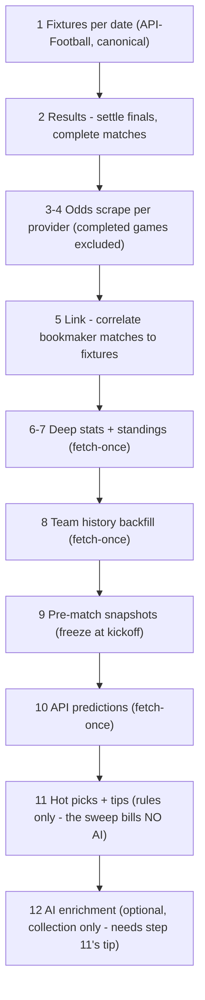
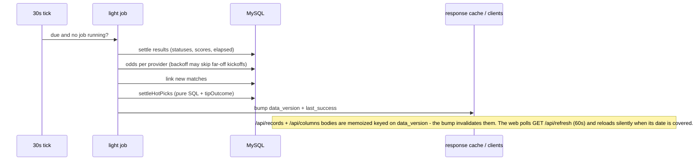

# 01 - System overview & operating modes

What oddspro does in one line: **scrape bookmaker odds (BetPawa, Betika) + ingest canonical
API-Football data → correlate → deduce tips/hot picks → rank honestly → serve a web table.**
Per-file architecture lives in `CLAUDE.md` (authoritative); this chapter explains the
*modes* the system runs in and what each execution stage does.

## Operating modes

| Mode | Entry | What runs |
|---|---|---|
| CLI one-shot | `node src/index.js <action>` (`src/index.js`) | One idempotent action (scrape, link, stats, hotpicks, ...), then the knex pool closes. No action / `start` / a bare number = the full sweep below. Settings overrides load BEFORE dispatch (M6) - CLI sweeps run under the same effective gates as serve. |
| serve | `npm run serve` (`src/server.js`) | Express API on :3001 + four in-process schedulers: auto-refresh (light/full), geo backfill, AI worker (60s tick), and the warm keeper (`src/warm.js`, 5s tick - precomputes records/columns/hotpicks/performance + the magic-sort day memo the moment `warehouse_version` moves, plus an age re-warm, so no visitor ever pays a cold compute; status rides `GET /api/refresh` `warm`). The production-resident process. |
| cron | Task Scheduler `oddspro-pipeline` daily 08:00 (`scripts/pipeline-task.cmd`) / cPanel `scripts/pipeline-cron.sh` | The full sweep as an *optional backup* to serve's in-process scheduler - schedule it ≥ 1h away from `AUTO_FULL_AT`. |

Serve boot order (`src/server.js`): `.HALT` check (present = refuse boot, exit 1) →
`MIGRATE_ON_BOOT` migrations (fail-fast, if enabled) → settings overrides load → listen →
start schedulers. Graceful shutdown stops schedulers, cancels a running job cooperatively,
15s grace.

## The full sweep - 12 steps

`runStartPipeline(days)` (`src/pipeline.js`), default today..+3 days, ordered for **fewest
server hits**: a date fetch also refreshes today's statuses (shrinking the results set), and
settling results first lets the odds scrapers skip completed games entirely.

```mermaid
flowchart TD
    A["1 Fixtures per date (API-Football, canonical)"] --> B["2 Results - settle finals, complete matches"]
    B --> C["3-4 Odds scrape per provider (completed games excluded)"]
    C --> D["5 Link - correlate bookmaker matches to fixtures"]
    D --> E["6-7 Deep stats + standings (fetch-once)"]
    E --> F["8 Team history backfill (fetch-once)"]
    F --> G["9 Pre-match snapshots (freeze at kickoff)"]
    G --> H["10 API predictions (fetch-once)"]
    H --> I["11 Hot picks + tips (rules only - the sweep bills NO AI)"]
    I --> J["12 AI enrichment (optional, collection only - needs step 11's tip)"]
```

Step 12 runs last **by design**: the anchored enrichment call must see the tip step 11 just
wrote. Enrichment is full-sweep-only (a cost boundary - never wire it into the web refresh).

## Light pass vs full sweep vs manual refresh

One scheduler (`src/auto-refresh.js`), one 30s tick, one shared single-slot job - auto and
manual refreshes can never overlap (parallel refresh writers deadlock on InnoDB gap locks).

| | Light pass | Full sweep | Manual refresh |
|---|---|---|---|
| Trigger | every `AUTO_LIGHT_MINUTES` (10) | once per EAT day at `AUTO_FULL_AT` (06:00) | `POST /api/refresh?date=` (web button) |
| Scope | today only | today..+`AUTO_FULL_DAYS` (5) | one date (`runDateRefresh`) |
| Does | results settle → odds (tiered kickoff-proximity backoff + idle skip) → link → `settleHotPicks` → auth purge | all 12 steps | fixtures/results/odds/link/stats for the date; history/prematch/predictions/hotpicks only when relevant to past/future |
| Skips | fixtures-by-date, deep stats, history, snapshots, predictions, AI | - | standings (owned by the full sweep), AI enrichment (cost) |

```mermaid
sequenceDiagram
    participant T as 30s tick
    participant J as light job
    participant DB as MySQL
    participant C as response cache / clients
    T->>J: due and no job running?
    J->>DB: settle results (statuses, scores, elapsed)
    J->>DB: odds per provider (backoff may skip far-off kickoffs)
    J->>DB: link new matches
    J->>DB: settleHotPicks (pure SQL + tipOutcome)
    J->>C: bump data_version + last_success
    Note over C: /api/records + /api/columns bodies are memoized keyed on data_version - the bump invalidates them. The web polls GET /api/refresh (60s) and reloads silently when its date is covered.
```

The full sweep is stamped done only from the job's own completion callback, and only when
the run finished ok, or partial with at least one data-bearing step succeeding
(`fullSweepAttemptVerdict`, `src/db/auto-rules.js`). A failed or total-error attempt leaves
the "done today" marker untouched, so the next 30s tick retries - up to `AUTO_FULL_MAX_ATTEMPTS`
(default 3) attempts per EAT day, the count resetting at the day boundary - before the
scheduler waits for tomorrow; a mid-day restart still never fires a surprise sweep (the marker
is pre-seeded to today's key at boot). Successful jobs bump the shared `data_version`
(the client freshness signal, backed by the cross-instance `warehouse_version` meta) and log
to self-truncating `logs/auto-refresh.log`.

## Serve behavior notes

- **Response caching:** heavy reads are memoized (serialized + gzip + ETag/304) keyed on
  `data_version`; a restart drops the memo. `?refresh=1` recomputes `/api/magic-sort` only.
- **Warm keeper (`src/warm.js`, 2026-08-22):** every instance precomputes the memoized
  payloads ahead of demand - /api/columns, /api/records for yesterday..today+`WARM_DATES_AHEAD`
  per reachable access tier, /api/hotpicks, /api/performance, plus the magic-sort day memo.
  A pass runs the moment `warehouse_version` moves (writer in-process, followers via the 5s
  meta poll) and again every `WARM_MAX_AGE_MINUTES` so a memo entry can never expire cold;
  passes are sequential (one query at a time - `DB_POOL_MAX` is 3 live) and never overlap.
  Freshness is inherited, not risked: the version key invalidates atomically, the keeper only
  moves the recompute off the first visitor. Monitoring: the `warm` block on `GET /api/refresh`
  (last pass reason/targets/computed/failed/ms) + `[warm]` log lines. Knobs live in
  settings-catalog group `refresh` (`WARM_ENABLED`/`WARM_DATES_BACK`/`WARM_DATES_AHEAD`/
  `WARM_MAX_AGE_MINUTES`, all live). Pure decision math: `src/db/warm-rules.js`.
- **Single writer:** run exactly ONE serve; a concurrent `npm run start` sweep
  gap-lock-deadlocks on the same odds rows.
- **`.HALT`:** creating the file stops a running serve within ~30s and blocks reboot until
  deleted - the kill-switch for hosts where Stop is unreliable.
- **Access tiers:** guests get no future dates and server-side-redacted tip reasoning; any
  session gets full detail. Server-authoritative, tier-keyed cache slots - see
  `src/db/access-rules.js` notes in `CLAUDE.md`.
- **Scheduled maintenance (M14):** the window lives in settings-catalog group
  `maintenance` (`MAINTENANCE_SCHEDULED/_START/_END/_MESSAGE`, all live; edited from the
  admin Dashboard card or Admin → Settings - every change is audit-dated). While ACTIVE,
  a pre-route gate answers 503 + `Retry-After` (JSON with the schedule on `/api/*`, a
  static notice page on document loads) UNLESS the request is an admin session, an
  `ADMIN_TOKEN`/`API_TOKEN` bearer, or `/api/auth/*` (admins can sign in mid-window). The
  schedule rides `GET /api/refresh` + every 503 body; clients cache it, warn with a
  dismissible banner pre-window, switch to a full-screen overlay on their own clock at
  start (polls/fetches/tracking suspend - network goes quiet), and recover with 5-30 s
  jitter after end. A past-end window auto-expires to off - a forgotten toggle can never
  hold a stale 503. Pure state machine: `src/db/maintenance-rules.js` (shared verbatim
  with the web).
- **User management (M8):** Admin → Users drives GET/PATCH `/api/admin/users[/:id]`
  (admin SESSION only). Patchable: active/role/phone_verified + one-way unlock,
  force-PIN-change and reset-PIN (4-digit temp PIN shown ONCE in the response - its hash
  is stored, plaintext never persisted or logged). Pure guards (`src/db/admin-rules.js`)
  reject self-disable/demote, self PIN actions and removing the last active admin.
  Disable and PIN reset revoke every session in the same transaction as the row change;
  every mutation lands changed-only `admin_audit` rows (`user.patch`/`user.unlock`/
  `user.force_pin_change`/`user.reset_pin`) in that same transaction. Manual verify
  (`phone_verified: true`) is the SMS-failure fallback: it unblocks the verified-only
  routes (profile PIN change included) without an OTP.
- **Email OTP fallback + critical-change auth (M13):** `users.email` (nullable, NOT
  unique - phone stays the sole login identity) is captured the first time an email OTP
  is requested on an authenticated flow. OTP rows carry `channel`/`email`; an SMS resend
  first checks the previous send's Bonga delivery report (`provider_msg_id`, persisted on
  the row once the send verdict lands) and a DEFINITIVE failure answers
  `{delivery_failed:true}` WITHOUT rotating the code or restarting the cooldown, so the
  revealed email input is immediately usable; the emailed code completes the SAME
  verification. Self-service Forgot PIN (`purpose='pin_reset'`, unauthenticated): phone →
  code → new PIN → auto sign-in with every prior session revoked; its email fallback
  targets ONLY the account's STORED address (a typed inbox there would be an account
  takeover) and unknown phones get a generic answer. Profile PIN changes now require a
  confirmation code (`purpose='pin_change'`, requested via `POST /api/auth/pin-change-otp`)
  on top of the current PIN - forced first-login changes included. Mail seam `src/mail/`
  mirrors the SMS seam: `MAIL_MAILER=log` (default) prints emails to the server console,
  `smtp` sends via the .env-only `MAIL_*` creds (fail-closed when the host is missing);
  the admin settings editor exposes only the `MAIL_MAILER` switch (group `mail`).
- **Data notices:** every finished refresh job (light, full, manual) logs a row to
  `collection_runs` (mode, dates covered, verdict ok/partial/error/cancelled, step
  failures). A detector reads that ledger, never the shape of the collected data
  itself: a rolling row-count rule was tried and refuted against the live warehouse
  first (it fired on five healthy days in a 45-day window - the capture regime
  shifted on 2026-08-05, and a thin midweek slate looks identical to an outage by
  volume alone). No successful run inside `COLLECTION_GAP_MINUTES` (90) proposes an
  `outage` for the dates spanned; a `partial` run proposes `degraded` for the dates
  it covered. Proposals insert as `unconfirmed` and are served immediately with a
  `UNCONFIRMED` title prefix - the warning must work before anyone reviews it;
  approving one only drops the prefix, dismissing one is permanent (the
  `(source, kind, date_from, date_to)` unique index blocks the same span from ever
  being re-raised). Serving costs no query: the active (non-dismissed) list
  projects into the shared `meta` table (key `data_notices`) and every instance
  reads it off the same 5s memo `column_catalog` uses. Four surfaces carry the
  resulting `{status: ok/degraded/outage, confirmed, notices}` block: `GET
  /api/records` (`coverage`, per date), `GET /api/refresh` (the raw `notices`
  array), `GET /api/daily-slip/timeline` (per-day `coverage`), and the public `GET
  /api/coverage` (optional `?date=`, for automated consumers). The web ribbon
  (`CoverageRibbon.jsx`) shows a non-dismissible one-line strip whenever the loaded
  day is affected; Admin → Dashboard's Notices card approves/dismisses/adds one by
  hand (a manual notice is born `approved`, never `unconfirmed` - an admin writing
  one has already reviewed it). `COLLECTION_RUNS_RETENTION_DAYS` (90) bounds the
  ledger the detector and admin list both read.
- **SMS templates + broadcast campaigns (M9):** Admin → Messaging drives
  `/api/admin/sms/*` (admin SESSION only). A campaign freezes its rendered message and
  audience at creation, then sends through a **single-slot background job** - one campaign
  at a time, same one-job-at-a-time discipline as the refresh slot, with live progress on
  `GET /api/admin/sms/job` and a consecutive-failure breaker (5) that stops a run when the
  provider/credits die rather than burning the ledger into failures. **Consent is
  structural:** `audienceCriteria` emits `excludeOptOut: true` unconditionally and the
  `.strict()` audience schemas have no key that can turn it off, so an opted-out user is
  excluded even from an explicit admin hand-selection (transactional OTPs don't route
  through campaigns at all). Sending needs a typed `confirm:'SEND'` **plus** the
  `expected_count` the admin saw; the server re-counts and applies `countDriftVerdict` -
  **any growth is refused 409** (those recipients were never previewed and bill beyond the
  approved estimate), shrink proceeds (opt-out/disable/un-verify only remove someone
  already approved). Nothing is written until that check passes, so a refusal leaves no
  partial state; the `(campaign_id, user_id)` unique index makes ledger materialization
  idempotent, and a terminal campaign is FROZEN (recovery from a partial send is a NEW
  campaign over the remainder, never a re-send). `SMS_ENABLED=0` makes the whole path a
  dry run that touches no network. Transactional auth texts go out wrapped in the
  configured auth-default template (`wrapAuthText`, fail-open).

---
*Update this chapter when: a pipeline step is added/removed/reordered, a scheduler is
added, light/full/manual scope or cadence knobs change, or data-notice detection/serving
changes (`src/pipeline.js`, `src/auto-refresh.js`, `src/server.js`, `src/notices.js`,
`src/db/notice-rules.js`).*
