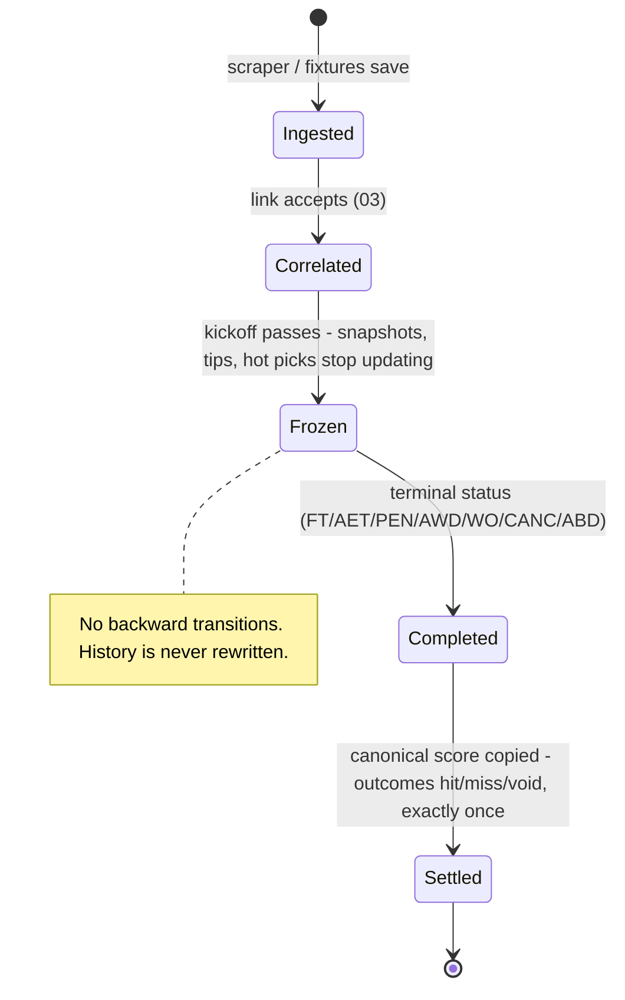

# 02 — Data pipeline & warehouse invariants

## Sources

| Source | Role | Trust |
|---|---|---|
| API-Football (`src/apisports.js`) | **Canonical base record**: fixtures, results, statistics, lineups, events, standings, history, predictions. Quota-guarded, zod-validated, EAT timezone. | Authoritative for identity and scores |
| BetPawa (`src/betpawa.js`) | Odds markets via undocumented public API | Odds only — its pre-match scores are garbage (reports 0-0) |
| Betika (`src/betika.js`) | Odds markets via undocumented public API | Odds only — no team/region/competition ids at all, scores null |

**Canonical fixture:** every bookmaker match row correlates to an API-Football fixture via
`matches.fixture_id` (chapter 03). Only correlated records are visualized or tipped.

## Fixture lifecycle

## Invariants — and why each exists

- **Fetch-once** (`stats_fetched_at` / `lineups_fetched_at` / `events_fetched_at` /
  `history_fetched_at` / `predictions_fetched_at`): each final fixture costs a bounded,
  known number of detail requests *ever*. Immutable API data is never deleted or refetched —
  re-fetching burns quota to learn nothing. Empty responses only set the flag 48h
  post-kickoff (minor leagues may never publish stats).
- **Freeze at kickoff:** prematch snapshots, tips and hot picks are selected by
  `kickoff > NOW()` — past fixtures are simply never selected again, so the last
  pre-kickoff write stands forever. The freeze *is* the selection predicate, not a status
  column. Why: historical pre-match stats must stay exactly as they were at kickoff,
  unaffected by later matches — that is what makes backtests honest.
- **Settle exactly once:** the results pass is the only writer of `result_goals` /
  `outcome` / `tip_outcome`, and only where the outcome is still NULL. The hit-rate
  scoreboard is honest *by construction* — new rules are measured via the replay scripts,
  never by editing history.
- **Results are canonical:** scores copy from final API-Football fixtures into linked
  matches, never from bookmaker payloads. Terminal fixtures complete their matches; the
  fallback completes anything still open 4h past `COALESCE(f.kickoff, m.start_time)` —
  canonicality applies to the *cutoff* too, so a linked match is judged on the fixture's
  kickoff, never on the bookmaker's `start_time` (which goes stale on a reschedule and,
  before the 2026-07-21 fix, permanently froze rescheduled games: `completed_at` is a
  one-way door). `completed_at` set ⇒ odds refreshes skip the match (the fetch-throttling
  half of the same invariant).
- **Stale odds are kept, not deleted** (`src/db/odds-diff.js`): markets present in the
  latest snapshot are replaced; vanished markets are flagged `is_stale` with their
  last-seen price (it *is* the historical price — the lab and UI need it); re-listed
  markets revive. Identity = `type_name` + name + normalized handicap — **never
  `type_id`** (Betika reuses ids across different markets).
- **`matches.metadata` is insert-only:** the first-sight raw provider blob is kept forever;
  refreshes never rewrite it (it alone was 556 MB of churn before the 2026-07-17 perf pass).
- **Migrations are forward-only:** never edit an applied migration; hosts without SSH
  migrate via `MIGRATE_ON_BOOT=1` (schema-then-listen, fail-fast).

## Pre-match snapshots

`src/prematch.js` upserts `fixture_prematch` (rank, form, H2H summary, rolling-goals
aggregates) for every upcoming correlated fixture on each pass; the read layer prefers the
frozen snapshot wholesale when one exists (a NULL snapshot rank means "no rank existed at
kickoff" and must not drift back to live standings).

**Two different rolling windows — intentional, don't "fix":** snapshots compute with
`PREMATCH_TEAM_WINDOW`/`PREMATCH_H2H_WINDOW` = **5/5** (`src/db/prematch-calc.js`, display
layer), while hot-pick/tip *evaluation* rolls `HOTPICK_TEAM_WINDOW` = **7**
(`src/db/goals-rules.js`, decision layer). They are independent consumers of the same
history; only the H2H window is shared at 5.

---
*Update this chapter when: a data source or table class is added, a fetch-once/freeze/
settle invariant changes, market identity rules change, or the snapshot windows move
(`src/apisports.js`, `src/db/store.js`, `src/db/odds-diff.js`, `src/prematch.js`).*
