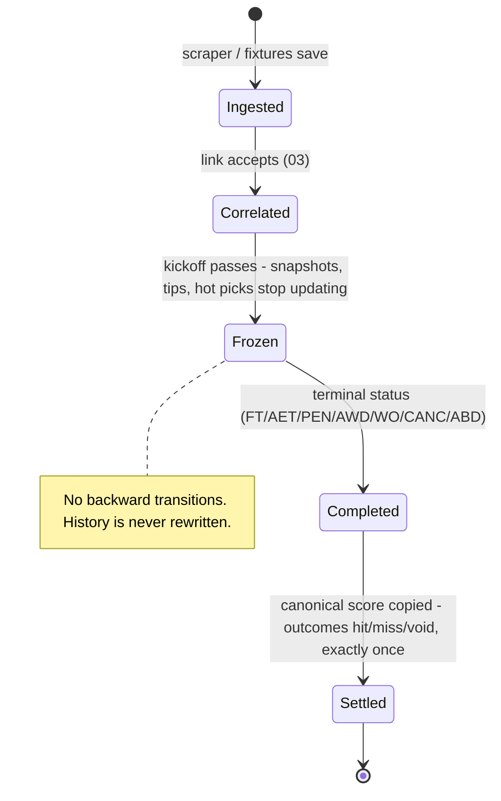

# 02 - Data pipeline & warehouse invariants

## Sources

| Source | Role | Trust |
|---|---|---|
| API-Football (`src/apisports.js`) | **Canonical base record**: fixtures, results, statistics, lineups, events, standings, history, predictions. Quota-guarded, zod-validated, EAT timezone. | Authoritative for identity and scores |
| BetPawa (`src/betpawa.js`) | Odds markets via undocumented public API | Odds only - its pre-match scores are garbage (reports 0-0) |
| Betika (`src/betika.js`) | Odds markets via undocumented public API | Odds only - no team/region/competition ids at all, scores null |

**Canonical fixture:** every bookmaker match row correlates to an API-Football fixture via
`matches.fixture_id` (chapter 03). Only correlated records are visualized or tipped.

## Fixture lifecycle

```mermaid
stateDiagram-v2
    [*] --> Ingested: scraper / fixtures save
    Ingested --> Correlated: link accepts (03)
    Correlated --> Frozen: kickoff passes - snapshots, tips, hot picks stop updating
    Frozen --> Completed: terminal status (FT/AET/PEN/AWD/WO/CANC/ABD)
    Completed --> Settled: canonical score copied - outcomes hit/miss/void, exactly once
    Settled --> [*]
    note right of Frozen: No backward transitions. History is never rewritten.
```

## Invariants - and why each exists

- **Fetch-once** (`stats_fetched_at` / `lineups_fetched_at` / `events_fetched_at` /
  `history_fetched_at` / `predictions_fetched_at`): each final fixture costs a bounded,
  known number of detail requests *ever*. Immutable API data is never deleted or refetched - 
  re-fetching burns quota to learn nothing. Empty responses only set the flag 48h
  post-kickoff (the `STATS_GIVEUP_HOURS` threshold; minor leagues may never publish stats) - 
  see "API-Football client" below for how that threshold is computed safely.
- **Freeze at kickoff:** prematch snapshots, tips and hot picks are selected by
  `kickoff > NOW()` - past fixtures are simply never selected again, so the last
  pre-kickoff write stands forever. The freeze *is* the selection predicate, not a status
  column. Why: historical pre-match stats must stay exactly as they were at kickoff,
  unaffected by later matches - that is what makes backtests honest.
- **Settle exactly once:** the results pass is the only writer of `result_goals` /
  `outcome` / `tip_outcome`, and only where the outcome is still NULL. The hit-rate
  scoreboard is honest *by construction* - new rules are measured via the replay scripts,
  never by editing history.
- **Results are canonical:** scores copy from final API-Football fixtures into linked
  matches, never from bookmaker payloads. Terminal fixtures complete their matches; the
  fallback completes anything still open 4h past `COALESCE(f.kickoff, m.start_time)` - 
  canonicality applies to the *cutoff* too, so a linked match is judged on the fixture's
  kickoff, never on the bookmaker's `start_time` (which goes stale on a reschedule and,
  before the 2026-07-21 fix, permanently froze rescheduled games: `completed_at` is a
  one-way door). `completed_at` set ⇒ odds refreshes skip the match (the fetch-throttling
  half of the same invariant).
- **Stale odds are kept, not deleted** (`src/db/odds-diff.js`): markets present in the
  latest snapshot are replaced; vanished markets are flagged `is_stale` with their
  last-seen price (it *is* the historical price - the lab and UI need it); re-listed
  markets revive. Identity = `type_name` + name + normalized handicap - **never
  `type_id`** (Betika reuses ids across different markets). The handicap needs
  normalizing because mysql2 returns a DECIMAL column as a string (`'2.5'`) while a
  freshly scraped snapshot carries a number; the pure `oddsIdentity`/`diffOddsRows`
  helpers (zero imports, so their tests run without config/.env) normalize both sides
  before comparing.
- **`matches.metadata` is insert-only:** the first-sight raw provider blob (~39 KB/row of
  provider JSON, with no code currently reading it back) is kept forever; refreshes never
  rewrite it (it alone was 556 MB of churn before the 2026-07-17 perf pass).
- **Migrations are forward-only:** never edit an applied migration; hosts without SSH
  migrate via `MIGRATE_ON_BOOT=1` (schema-then-listen, fail-fast).

## Pre-match snapshots

`src/prematch.js`'s `updatePrematchSnapshots()` upserts `fixture_prematch` (rank, form, H2H
summary, rolling-goals aggregates) for every upcoming correlated fixture on each pass; the read layer prefers the
frozen snapshot wholesale when one exists (a NULL snapshot rank means "no rank existed at
kickoff" and must not drift back to live standings). Writes are single-statement chunked
upserts, never delete+insert, so there is no deadlock exposure.

The math behind both the writer and the read-layer live fallback lives in the pure
`src/db/prematch-calc.js` (`h2hSummary`, `computePrematch`, `formatGoals`; zero imports, so
its tests skip config/.env entirely). Callers filter `status IN RESULT_STATUSES` in SQL;
the calc itself additionally enforces non-null FT scores plus a kickoff strictly before the
fixture's own kickoff, so a snapshot can never leak a future or unfinished result.

**Two different rolling windows - intentional, don't "fix":** snapshots compute with
`PREMATCH_TEAM_WINDOW`/`PREMATCH_H2H_WINDOW` = **5/5** (`src/db/prematch-calc.js`, display
layer), while hot-pick/tip *evaluation* rolls `HOTPICK_TEAM_WINDOW` = **7**
(`src/db/goals-rules.js`, decision layer). They are independent consumers of the same
history; only the H2H window is shared at 5.

## Collectors and silent-truncation durability

`src/betpawa.js` and `src/betika.js` are browser-mimicking axios clients against each
bookmaker's undocumented public API; both emit the same standardized game record that
`store.saveMatches()` consumes (see "Odds persistence" below).

**The 2026-08-16 outage was a silent-truncation bug, not a crash.** BetPawa's list pager
(`fetchBetpawaGames`) used to swallow a failed page into an empty one via `.catch`, so a
transient fault (timeout/429/5xx/malformed body) computed `done = len < take` as TRUE and
persisted a truncated day as a complete one. The 2026-08-19 fix retries the page through
`withRetry`/`isRetryableApiError` (the same `tries:4, base:1500` policy as `apisports.js`)
and, on genuine exhaustion, THROWS instead of returning a success-shaped result.

**2026-08-20, two correction rounds.** Round one over-corrected: BetPawa signals a
genuinely empty page by OMITTING the inner `responses[0].responses` key rather than
returning `[]` (`{"responses":[{}]}` versus `{"responses":[{"responses":[...]}]}`, probed
live), and the new guard was reading that "nothing left to collect" shape - every night
past the last kickoff, or any day whose count is an exact multiple of the page size - as
malformed, firing a false alarm every 15 minutes and burning four retries per pass. Pure
`src/db/collector-rules.js` (`listPageOutcome`/`listPageDone`, zero imports,
offline-tested) now classifies a page `ok`/`empty`/`malformed` by the response ENVELOPE
shape rather than item count, so only a genuinely unreadable body retries and throws.

Separately, the audit's claim that "Betika's pager already threw by construction" was
WRONG: `fetchBetikaGames` read each page as `Array.isArray(data.data) ? data.data : []`, so
a degraded 200 with no `data` array silently collapsed to an empty page, and since the walk
ends on `len < limit`, a failure on page 3 of 10 returned the first two pages as the
complete day - the identical silent-truncation class that had just cost three days of
irreplaceable BetPawa odds, unfixed the whole time in the other provider. `dataPageOutcome`
(same module) classifies Betika pages the same way - a real `data: []` is a genuine
end-of-data (confirmed live, no ambiguity there unlike BetPawa), anything else is malformed
- and Betika's pager now gets the same bounded retry the other two clients have.

Both providers' per-match detail fetch (the `_batch` loop) is now individually try/caught:
a single match's failure is logged (`[betpawa]`/`[betika] detail fetch failed for match
<id>: <reason>`) and skipped rather than rejecting the whole `_batch` and discarding every
game already fetched that day. Both fetchers log a `<Provider> <date> - N games, M detail
failures` summary and return a compacted (no sparse/undefined) array.

## API-Football client: quota, pacing, per-item isolation

`src/apisports.js` is the API-Football client plus all of its fetchers: quota-guarded (the
`x-ratelimit-requests-remaining` header, halting at the `APISPORTS_MIN_REMAINING` floor),
paginated, zod-validated. Fixtures are fetched with `timezone=Africa/Nairobi` so kickoffs
align with bookmaker wall-clock times.

**Pacing versus fatal quota.** The per-minute burst budget (`x-ratelimit-remaining`
header) is paced, not fatal: `_getPage` sleeps into the next minute window when it runs out
and retries an `errors.rateLimit` response, bounded to 2 retries - decision logic lives in
pure `src/db/rate-rules.js` (offline-tested; the daily-quota error deliberately does NOT
match this rule and stays fatal).

**Results polling is bounded.** The results refresh only re-polls non-terminal
past-kickoff fixtures within `RESULTS_MAX_AGE_DAYS` (7) - stuck upstream `NS`/`PST`
zombies older than that are retired from the poll set (a reschedule moves kickoff forward
and the fixture re-enters naturally).

**Per-item isolation (2026-08-19 audit fix).** Fixture parsing/aggregation is delegated to
the pure `src/apisports-fixtures.js` (`FixtureItem`, `_fixtureRows`, `buildFixtureItemRows`,
offline-tested, mirroring `apisports-events.js`/`apisports-standings.js`): a malformed item
is skipped and reported instead of throwing before any write, which previously could
discard every other already-fetched item in the same call. `_saveFixtureItems` is reached
from the fixtures fetch, `refetchFixtureIds`, the history backfill, and the ~10-minute
`settleApisportsResults`, so one persistently malformed fixture could have jammed all score
settlement indefinitely. Statistics/lineups parsing and the history/predictions
per-fixture loops got the same per-item isolation, so one team's or one fixture's bad
record no longer discards its sibling's valid data.

Event parsing is delegated to the tolerant `src/apisports-events.js` (a v1.0.2 fix):
`EventItem` tolerates `type:null` from live `/fixtures/events`, and `buildEventRows` drops
the typeless events outright since `fixture_events.type` is a NOT NULL column - a
per-fixture ZodError is caught and skipped rather than aborting the whole deep-stats sweep
(quota/network faults stay fatal). The **2026-08-20 follow-up (audit A4/A5/A6)** extended
`buildEventRows` with the same per-item try/catch/skip/report treatment `buildStandingRows`
already had - the 2026-07 fix only made `type` nullable, tolerating the one observed shape,
so any other malformation still discarded every event for the fixture. The five write paths
that called `db.transaction` bare - statistics, lineups, events, predictions, standings -
now go through the same `withRetry` idiom `_saveFixtureItems` already had, so a transient
deadlock against a concurrent writer self-heals instead of failing the write outright.

**Transient 403s are retried, not fatal (2026-08-08).** API-Football's WAF answers 403 under
load, so `isRetryableApiError` treats it as transient and the client backs off
exponentially rather than failing the step.

**The settle UPDATE is guarded and narrowed (2026-08-19).** A live-host probe found the
warehouse frozen since 2026-08-16: the results-settle `UPDATE` threw `ER_DATA_OUT_OF_RANGE`
on an awarded fixture whose half-time score exceeded its full-time score, against the
UNSIGNED second-half columns. One bad fixture stopped every settle. The statement is now
guarded and narrowed so an impossible pair can no longer poison the pass.
`node scripts/refetch-fixtures.js --ids <a,b,c> | --inconsistent` force-refetches specific
API-Football fixture ids (or auto-selects every `FINAL_STATUSES` fixture with an ft<ht
inconsistency), re-runs the settle pass and prints the before/after ht/ft/goals with the ids
that changed.

**Give-up threshold, computed in the right clock.** The Invariants section above names the
48h stats give-up window (`STATS_GIVEUP_HOURS`); that threshold is now a
`TIMESTAMPDIFF(HOUR, f.kickoff, NOW())` computed inside the pinned +03:00 SQL session (the
`enrich.js` `KICKOFF_SQL_EXPR` idiom) rather than process-local `new Date(f.kickoff)` math
on a raw column, which used to skew the give-up window on any non-EAT host.

## Odds persistence

`src/db/connection.js` is the only knex instance in the codebase (never raw mysql2); its
session `time_zone` is pinned to +03:00 in `knexfile.js` so SQL `NOW()` compares correctly
against stored EAT wall-clock datetimes - the freeze predicates above rely on this.

`src/db/store.js` owns odds persistence. It upserts `matches` by `(provider,
provider_match_id)`, with an explicit `updated_at` bump because MySQL's ON UPDATE clause
skips a no-op update. It then refreshes `odds_markets` via `src/db/odds-diff.js` as
described in the Invariants section above; `store.js` never touches `completed_at` or
`fixture_id` - those columns are owned by the results and link passes.

**A degraded-but-200 response must not stale-bomb a frozen match (2026-08-19 durability
fix).** `parseBetpawaGame`/`parseBetikaGame` both default to `markets: []` when the
expected array is missing, which is structurally identical to a genuine "no markets right
now" snapshot - feeding it straight into `diffOddsRows` would stale-bomb every fresh
existing row of a match that is never revisited once frozen. `saveMatches` now checks
`emptySnapshotIsSuspect(existingOdds, rows)` (`src/db/odds-diff.js`, pure and total - true
only when the parsed snapshot is empty AND at least one existing row is still fresh) before
touching `odds_markets`: when suspect it skips the diff/stale/delete step entirely, leaves
the existing rows untouched, and logs once (`[store] <provider> <match_id>: empty market
snapshot ignored (kept N existing rows)`). A genuine first sighting with zero markets
(nothing existing yet) is unaffected.

`store.js` also writes `matches.is_virtual` on every upsert (migration
`20260820000002_matches_is_virtual`, indexed), via the pure `isVirtualCompetition` predicate
in `src/db/collector-rules.js` - scrape time is where the provider's own product-naming
taxonomy is known. Because `_matchRow` feeds both the insert and the update branch, a later
correction to the predicate re-classifies existing rows on their next odds refresh, with no
backfill script. Chapter 03 covers what that flag is used
for downstream (excluding simulated competitions from linking work).

## Market taxonomy (M2) and the column catalog

`src/markets.js` is the canonical, fixed odds-market registry: 1, X, 2, 1X, X2, 12, and U/O
lines 0.5 through 6.5 (defaults 1.5-4.5). One registry drives both the JS odds pivot and the
SQL sort/filter conditions, and it matches markets by `type_name`, never `type_id`, because
Betika reuses ids across different markets.

**The M2 all-markets path (2026-07-15)** is a parallel, generic taxonomy that sits
ALONGSIDE that fixed registry, which stays untouched and remains the ONLY thing feeding
predictions - this whole path is display/filter/sort only (predictions are M3's
territory). `canonicalMarket(row)` maps ANY provider `(type_name, name, handicap)` to a
stable cross-provider `{key, group, label, columnizable}` via `MARKET_FAMILIES` plus
`_normType`, which strips Betika's `1ST/2ND HALF -`/`N MINUTES -` prefixes and BetPawa's `|
First/Second Half` suffixes into a `period` tag, folds team-embedded `<TEAM> TOTAL` /
`{home}/{away}` phrasing into `team_total`, and tags `A & B`/`A and B` combos - with a
deterministic `raw:` passthrough so nothing is silently dropped. `marketIdentity(qb, key)`
is the generic WHERE builder: canonical keys delegate to `whereMarket`; the simple families
`GG`/`NG`/`DNB1`/`DNB2`/`ODD`/`EVEN` match exact real FT spellings (Betika has NO DNB or
odd/even markets - BetPawa-only); `TT:`/`combo:`/`HTFT:`/`CS:`/`raw:`/period-tagged keys
fall back to best-effort LIKE matching against lossy slugs.

`discoverMarketColumns(rows, {minMatches=200})` builds the column catalog from data with a
per-canonical-key SUMMED coverage threshold, which caps Betika's roughly 16,000-`type_name`
dynamic tail (canonical keys are seeded coverage-exempt; `filter-only` keys are excluded;
BTTS and DNB are promoted to `default`). `isKnownMarketKey(key)` gates `_sqlTarget`
(mirroring `marketIdentity`'s branches and reusing its `_PERIOD_TAG`/`_SIMPLE_FT_TYPES`
tables): an unknown or garbage key returns `null`, which throws a `TypeError`, which the
server turns into a 400. `columnizable` is one of `column`/`grouped`/`filter-only`.

## Read layer (`src/db/records.js`)

`src/db/records.js` is the read layer behind the visualization API. `queryRecords()`
returns correlated records only, with multi-sort and filters: comparison ops
`eq/ne/gt/gte/lt/lte`, text ops `like`/`not-contains`, and CSV-list ops `in`/`not-in` (via
`filter-csv.js`, below); a text/set op against a base field with a `like_sql` target - for
example `tip` matching against `fp.tip_market` - works the same way. Pagination is
optional: `per_page: 'all'` disables it (what the web table uses), while the CSV export
still pages. A `providers` array filters bookmakers, and `completed: false` hides concluded
games.

`columnCatalog()` discovers market columns from `odds_markets` via `discoverMarketColumns`
(M2, above): `count(distinct match_id)` per `(type_name, name, handicap)`, keeping every
canonical key plus any `column`/`grouped` family with 200-match coverage or better, with
BTTS and DNB promoted `default`. STATS columns are discovered dynamically from
`fixture_statistics`, and `providers` are discovered from `matches`, so a new bookmaker or
stat type appears in the settings UI with no frontend change.

**Payload size is a standing tension.** The odds pivot (`_hydrate`) keys each price by
`canonicalMarket().key` and skips only `filter-only` rows, so `row.markets`/
`row.markets_stale` carry every canonical plus `column`/`grouped` key a match offers - on a
rich Betika date that is tens to 100+ keys per row. The extras enable no-refetch
sort/filter, but the default view only shows canonical+BTTS+DNB. Since the 2026-07-17 perf
pass the pivot is catalog-gated: only the keys `discoverMarketColumns` offers ride the
payload, `?markets=all` bypasses the gate per request, and before the first in-process
`columnCatalog()` call the pivot is ungated (the serve process arms it at boot via the A5
warm - see chapter 01). Deeper cuts are decision-gated: the catalog itself admits roughly
275 keys (`markets` is 64% of a guest payload), and the reasoning JSON
(`tip_breakdown`/`tip_ai_review`/`hot_review`/`hot_signals`) has been RENDERED for every
entitled tier since the 2026-08-19 feature registry, so it rides the wire again - a full
day measured 182 KB gzipped against about 106 KB before. `API_DETAILS=0` is the lever that
stops shipping that reasoning JSON, at the cost of blanking those surfaces for every tier
regardless of entitlement.

`_sqlTarget` builds a `MIN(price)` pivot via `marketIdentity` for any key `isKnownMarketKey`
accepts - the server does NOT validate keys against the catalog itself; that gate lives in
`_sqlTarget`. Pre-match stats prefer the frozen `fixture_prematch` snapshot wholesale when
one exists (see "Pre-match snapshots" above); fixtures predating that feature fall back to
live rank/form (standings) and H2H (fixtures history) derivation. The rolling-goals columns
(`h2h_count`, `home/away_goals_h2h`, `home/away_goals_oth`, and the compact `"gf/ga (avg)"`
strings) are snapshot-only. Score and goals are only surfaced once the fixture status is
final, since bookmaker pre-match scores are garbage.

**Orientation display swap (2026-08-20, audit F2).** The stored score columns are always
in the CANONICAL fixture's orientation; when `matches.sides_swapped` is set (maintained by
`src/link.js`'s `revalidateOrientation` - chapter 03's territory), the hydrate step swaps
the home/away score before rendering, so the displayed result always agrees with the
bookmaker team names shown beside it. The goals-sum sort and the settle SQL are untouched
either way - this is display-only.

Rows also carry `updated_at` (odds refresh time), `markets_stale` (last-seen prices of
vanished markets), `available` (false once the fixture is terminal, the match completed,
or the latest update had no markets), and `elapsed` (live match minute, display-only - the
Status tooltip appends it for in-play statuses; refreshed by the results settle pass, so at
most one light cadence stale).

**Multi-instance reads (2026-08-19).** `columnCatalogFromMeta()` is the follower-safe
read: it serves the writer-persisted `meta.column_catalog` (`src/meta.js`) instead of
repeating the `odds_markets`/`fixture_statistics` scan, falling back to a live
`columnCatalog()` compute only when meta is still empty (the very first boot ever, before
the writer's first OK refresh). `/api/columns` and a follower's catalog warm call it in
place of `columnCatalog()` directly.

## Shared pure helpers

A handful of small, zero-import modules back the pipeline and are shared verbatim (or
close to it) between server and tooling:

- **`src/db/filter-csv.js`** - the pure CSV-list parser `parseFilterList` (offline-tested)
  behind the `in`/`not-in` filter operators, shared VERBATIM by the server (`records.js`)
  and the web app (`filterValues.js`, an out-of-root import). Values are comma-separated;
  double-quote an item to include commas or spaces (`""` inside becomes a literal quote);
  empty items are dropped.
- **`src/utils.js`** - shared helpers `_date`, `_dtime`, `_batch`. `_batch` runs promises
  at a bounded concurrency; DB-writing batches must stay at concurrency 1, because
  parallel delete+insert transactions deadlock on InnoDB index gap locks.

---
*Update this chapter when: a data source or table class is added, a fetch-once/freeze/
settle invariant changes, market identity rules change, the snapshot windows move, a
collector's page-classification or retry policy changes, API-Football quota/pacing/give-up
knobs change, the M2 market taxonomy or column catalog changes, or `records.js`'s payload
shape / orientation-swap / multi-instance catalog read changes (`src/apisports.js`,
`src/apisports-fixtures.js`, `src/apisports-events.js`, `src/betpawa.js`, `src/betika.js`,
`src/db/collector-rules.js`, `src/db/store.js`, `src/db/odds-diff.js`,
`src/db/connection.js`, `src/prematch.js`, `src/db/prematch-calc.js`, `src/markets.js`,
`src/db/records.js`, `src/db/filter-csv.js`, `src/utils.js`).*
