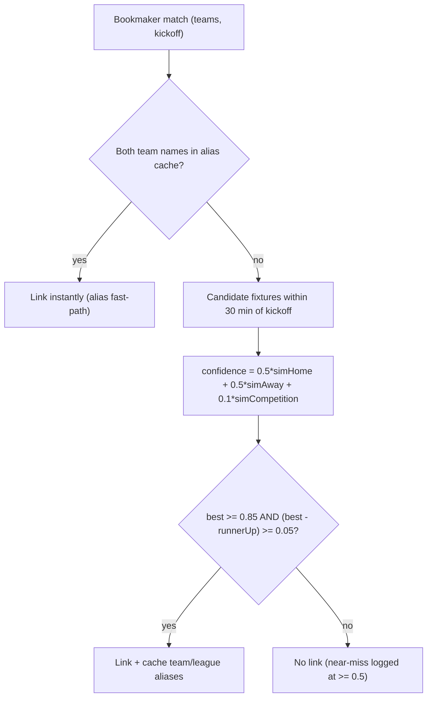

# 03 — Linking: bookmaker match ↔ canonical fixture

The problem: BetPawa/Betika spell team and league names their own way (and Betika exposes no
ids at all), so correlation is fuzzy string matching over normalized names — made cheap over
time by learned aliases. All in `src/link.js`.

## Algorithm

Names are normalized first (lowercase, diacritics stripped, noise tokens like FC/United
expansions applied). Then, per name pair:

```
nameSimilarity(a, b) = max( bigramDice(a, b),                 // Sorensen-Dice over char bigrams
                            max(tokenDice, 0.9 * overlap),    // token-set variants
                            initialism(a, b) ? 0.9 : 0 )      // "MUFC" vs "Manchester United FC"
```

Candidate fixtures are those within **±30 minutes** of the match kickoff. Per candidate:

```
confidence = min(1, 0.5 * simHome + 0.5 * simAway + 0.1 * simCompetition)
```

Competition similarity is a corroborating **bonus, never a veto** — bookmakers rename
leagues too aggressively for it to gate.



Acceptance needs BOTH the absolute floor and the **0.05 margin over the runner-up** — a
high score that two fixtures share is ambiguity, not confidence.

## Tunables & order

| Knob | Default | Meaning |
|---|---|---|
| `LINK_MIN_CONFIDENCE` | 0.85 | absolute acceptance floor (`.env`-overridable) |
| `MIN_MARGIN` | 0.05 | required gap to the runner-up (code constant) |
| Provider order | betpawa → betika | betika (no ids) additionally scores against betpawa matches already linked to a candidate — the richer provider seeds the poorer one |

Confident links cache `team_aliases` / `league_aliases` per provider; the alias fast-path
(both names known) skips scoring entirely, so correlation gets faster and more accurate as
data grows. Inspect failures by running `node src/index.js link` and reading the near-miss
log lines.

---
*Update this chapter when: the similarity components, normalization, acceptance thresholds,
candidate window, or provider order change (`src/link.js`).*
