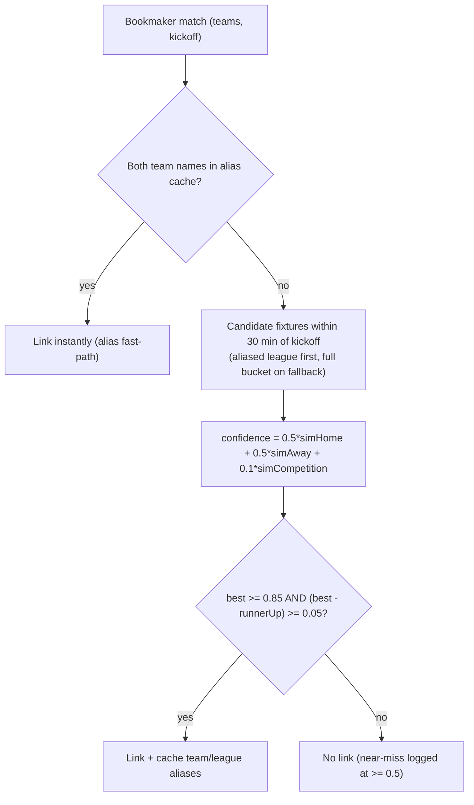

# 03 - Linking: bookmaker match ↔ canonical fixture

The problem: BetPawa/Betika spell team and league names their own way (and Betika exposes no
ids at all), so correlation is fuzzy string matching over normalized names - made cheap over
time by learned aliases. All in `src/link.js`.

## Excluded before scoring: simulated competitions

Betika sells software-generated football (`-Zoom`, `SRL`) next to real matches.
API-Football cannot carry a fixture that does not exist, so these rows can never
correlate - yet before 2026-08-20 nothing said so, and the pass re-scored the
whole open set against the full candidate pool every 10 minutes until the 4h
completion fallback closed each row. Measured: 26,713 of 50,994 matches (52.4%),
about 15,000-17,000 wasted candidate queries and 1-1.5M similarity evaluations
per day, plus near-miss log noise that buries genuine correlation failures.

`_linkProvider` now selects only `is_virtual = false` rows. The flag is
persisted on `matches`, indexed, and written at SCRAPE time by `store.js`'s
`_matchRow` behind the pure `isVirtualCompetition` (`src/db/collector-rules.js`)
- both the insert and update branch pass through `_matchRow`, so correcting the
predicate re-classifies existing rows on their next odds refresh.

Two rules that are not negotiable:

- **The rows are excluded from the work, never from the warehouse.** They carry
  real bettable odds and the web layer still serves them.
- **Both tokens match at a word boundary, never as a bare substring.** A false
  negative costs CPU on a pass that already runs; a false positive permanently
  orphans a real match, because nothing would ever re-examine it.
  `SRLanka Premier League` and `Serie A Zoomers Cup` are the shapes an
  `includes()` test breaks on.

The pass reports `virtual_skipped` plus the DISTINCT names skipped, so a false
positive surfaces by name on the first pass it happens rather than hiding in a
count.

## Algorithm

Names are normalized first (lowercase, diacritics stripped, noise tokens like FC/United
expansions applied). Then, per name pair:

```
nameSimilarity(a, b) = max( bigramDice(a, b),                 // Sorensen-Dice over char bigrams
                            max(tokenDice, 0.9 * overlap),    // token-set variants
                            initialism(a, b) ? 0.9 : 0 )      // "MUFC" vs "Manchester United FC"
```

Candidate fixtures are those within **±30 minutes** of the match kickoff (see "Candidate pool"
below for how that set is fetched and narrowed). Per candidate:

```
confidence = min(1, 0.5 * simHome + 0.5 * simAway + 0.1 * simCompetition)
```

Competition similarity is a corroborating **bonus, never a veto** - bookmakers rename
leagues too aggressively for it to gate.


```mermaid
flowchart TD
    M["Bookmaker match (teams, kickoff)"] --> A{Both team names in alias cache?}
    A -- yes --> L1["Link instantly (alias fast-path)"]
    A -- no --> W["Candidate fixtures within 30 min of kickoff<br/>(aliased league first, full bucket on fallback)"]
    W --> S["confidence = 0.5*simHome + 0.5*simAway + 0.1*simCompetition"]
    S --> D{"best >= 0.85 AND (best - runnerUp) >= 0.05?"}
    D -- yes --> L2["Link + cache team/league aliases"]
    D -- no --> N["No link (near-miss logged at >= 0.5)"]
```

Acceptance needs BOTH the absolute floor and the **0.05 margin over the runner-up** - a
high score that two fixtures share is ambiguity, not confidence.

## Candidate pool: batched, then league-scoped

Until 2026-08-23 the pool was one query PER OPEN ROW, filtered on kickoff alone (audit F7).
Measured on the live warehouse: 438 fixtures inside a single row's +/-30 minute window, 152
per row on average, and 1,754 round trips for one 2026-08-22 pass across both providers.

Fetching is now batched, and it is a pure mechanical change - the pool a row sees is the same
set:

- `candidateWindows` turns the pass's open rows into a few bounded kickoff ranges: min/max
  `start_time` padded by the same +/-30 minute tolerance, split wherever consecutive kickoffs
  sit more than 180 minutes apart. An overnight lull is never scanned, and one stray row
  cannot stretch a single range across years - the shared host kills long scans.
- `bucketByMinute` indexes the result by kickoff minute; `candidatesNear` cuts each row's pool
  out of it and re-applies the exact millisecond distance, inclusive at both ends, so the
  in-memory pool is byte-for-byte the set the SQL `BETWEEN` returned. Verified read-only
  against the per-row SQL on 80 live rows: 80/80 identical.

Selection is then narrowed by league, and this is a behavior change:

- when `league_aliases` resolves the row's competition to a canonical league,
  `candidateAttempts` scores THAT league's candidates first, and the full time bucket is only
  reached if the scoped pool produced no acceptable link. Measured: widest pool per row 438 ->
  35, average 152 -> 25.5, with a league alias resolving on 922 of 1,006 betika rows.
- **Scoping is a preference, never a veto.** A stale or missing alias costs one extra scoring
  pass, never a lost link. That asymmetry is the whole design: nothing in the repo ever
  re-examines a match the linker failed to correlate.

The scorer, the acceptance floor, the runner-up margin, the claim contest and the
alias-teaching bar are untouched. The pass log gains `candidate_queries`,
`candidates_loaded`, `candidates_max`, `league_scoped` and `league_fallback`.

This is the intended fix for the audit's cross-league error (F4): the men's fixture won that
row because it was uncontested in a wide pool, and the name veto proposed for it was measured
against 18,022 links and refuted - it rejects 57 to 994+ correct links. The fix is honestly
**partial**: when the correct league carries no fixture at that kickoff the scoped pool is
empty and the fallback restores the wide pool, so the error class is narrowed, not closed.

## Tunables & order

| Knob | Default | Meaning |
|---|---|---|
| `LINK_MIN_CONFIDENCE` | 0.85 | absolute acceptance floor (`.env`-overridable) |
| `MIN_MARGIN` | 0.05 | required gap to the runner-up (code constant) |
| Provider order | betpawa → betika | betika (no ids) additionally scores against betpawa matches already linked to a candidate - the richer provider seeds the poorer one |

Confident links cache `team_aliases` per provider; the alias fast-path (both team names known)
skips scoring entirely, so correlation gets faster and more accurate as data grows.
`league_aliases` is also written on a confident link and, since 2026-08-23, is finally READ:
it picks the league-scoped candidate pool a row is scored against first (see "Candidate pool"
above). That closes audit finding F6, which had the table write-only - read only to skip a
redundant INSERT, never to score, scope or short-circuit a match. Inspect failures by running
`node src/index.js link` and reading the near-miss log lines.

## Claim contest (one match per provider)

A canonical fixture may be held by at most one match per provider at a time. Before a link is
written, `_linkProvider` checks whether the target fixture is already claimed by another match
of the same provider (`src/db/link-rules.js`'s pure `claimVerdict`): the listing whose
`start_time` sits closest to the canonical kickoff keeps the link; a tie keeps the incumbent
(no churn); an unparseable clock never evicts a claim, since unlinking on a guess would destroy
a good link. The loser is unlinked and any scores it inherited from the fixture are cleared -
`completed_at` is left alone, it is a one-way door and reopening a dead `provider_match_id`
would only buy pointless odds requests.

This exists because API-Football reschedules a fixture by moving its kickoff, and the
bookmaker then relists the game under a new `provider_match_id` at the new time. Without the
contest, the OLD listing kept its `fixture_id`, and because the settle pass joins on
`m.fixture_id = f.id` it stamped the eventual score onto every claimant - so the stale listing
displayed a result under its original, never-played date. Found 2026-08-19: 103 duplicate
`(provider, fixture_id)` claims warehouse-wide, 93 carrying a score from the wrong fixture,
drifts of 3 to 32 days (`docs/research/2026-08-19-linker-and-apisports-audit.md`).
`scripts/repair-duplicate-claims.js` applies the same rule to repair an already-corrupted
warehouse (dry-run by default, idempotent).

---
*Update this chapter when: the similarity components, normalization, acceptance thresholds,
candidate window, provider order, or the claim-contest rule change (`src/link.js`,
`src/db/link-rules.js`).*
