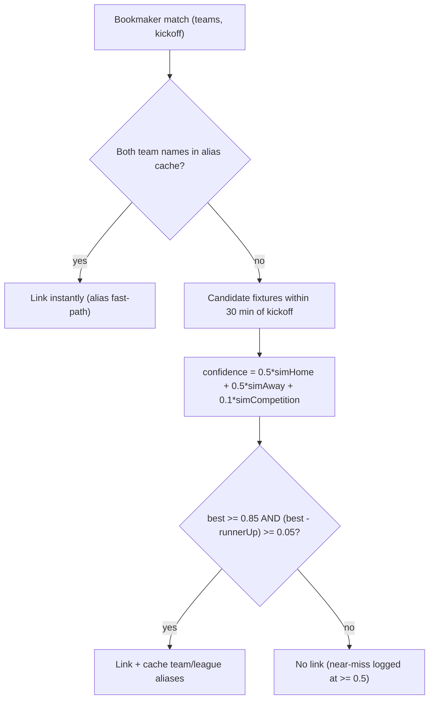

# 03 — Linking: bookmaker match ↔ canonical fixture

The problem: BetPawa/Betika spell team and league names their own way (and Betika exposes no
ids at all), so correlation is fuzzy string matching over normalized names — made cheap over
time by learned aliases. All in `src/link.js`.

## Algorithm

Names are normalized first (lowercase, diacritics stripped, noise tokens like FC/United
expansions applied). Then, per name pair:

```
nameSimilarity(a, b) = max( bigramDice(a, b),                 // Sorensen-Dice over char bigrams
                            max(tokenDice, 0.9 * overlap),    // token-set variants
                            initialism(a, b) ? 0.9 : 0 )      // "MUFC" vs "Manchester United FC"
```

Candidate fixtures are those within **±30 minutes** of the match kickoff. Per candidate:

```
confidence = min(1, 0.5 * simHome + 0.5 * simAway + 0.1 * simCompetition)
```

Competition similarity is a corroborating **bonus, never a veto** — bookmakers rename
leagues too aggressively for it to gate.


```mermaid
flowchart TD
    M["Bookmaker match (teams, kickoff)"] --> A{Both team names in alias cache?}
    A -- yes --> L1["Link instantly (alias fast-path)"]
    A -- no --> W["Candidate fixtures within 30 min of kickoff"]
    W --> S["confidence = 0.5*simHome + 0.5*simAway + 0.1*simCompetition"]
    S --> D{"best >= 0.85 AND (best - runnerUp) >= 0.05?"}
    D -- yes --> L2["Link + cache team/league aliases"]
    D -- no --> N["No link (near-miss logged at >= 0.5)"]
```

Acceptance needs BOTH the absolute floor and the **0.05 margin over the runner-up** — a
high score that two fixtures share is ambiguity, not confidence.

## Tunables & order

| Knob | Default | Meaning |
|---|---|---|
| `LINK_MIN_CONFIDENCE` | 0.85 | absolute acceptance floor (`.env`-overridable) |
| `MIN_MARGIN` | 0.05 | required gap to the runner-up (code constant) |
| Provider order | betpawa → betika | betika (no ids) additionally scores against betpawa matches already linked to a candidate — the richer provider seeds the poorer one |

Confident links cache `team_aliases` per provider; the alias fast-path (both team names known)
skips scoring entirely, so correlation gets faster and more accurate as data grows.
`league_aliases` is also written on a confident link, but it is **write-only**: it is read only
to skip a redundant INSERT, never to score, scope or short-circuit a match (open finding F6,
`docs/research/2026-08-19-linker-and-apisports-audit.md` - either the table starts earning its
keep as the scoping signal the wide, unscoped candidate pool currently lacks, or the write is
removed). Inspect failures by running `node src/index.js link` and reading the near-miss
log lines.

## Claim contest (one match per provider)

A canonical fixture may be held by at most one match per provider at a time. Before a link is
written, `_linkProvider` checks whether the target fixture is already claimed by another match
of the same provider (`src/db/link-rules.js`'s pure `claimVerdict`): the listing whose
`start_time` sits closest to the canonical kickoff keeps the link; a tie keeps the incumbent
(no churn); an unparseable clock never evicts a claim, since unlinking on a guess would destroy
a good link. The loser is unlinked and any scores it inherited from the fixture are cleared -
`completed_at` is left alone, it is a one-way door and reopening a dead `provider_match_id`
would only buy pointless odds requests.

This exists because API-Football reschedules a fixture by moving its kickoff, and the
bookmaker then relists the game under a new `provider_match_id` at the new time. Without the
contest, the OLD listing kept its `fixture_id`, and because the settle pass joins on
`m.fixture_id = f.id` it stamped the eventual score onto every claimant - so the stale listing
displayed a result under its original, never-played date. Found 2026-08-19: 103 duplicate
`(provider, fixture_id)` claims warehouse-wide, 93 carrying a score from the wrong fixture,
drifts of 3 to 32 days (`docs/research/2026-08-19-linker-and-apisports-audit.md`).
`scripts/repair-duplicate-claims.js` applies the same rule to repair an already-corrupted
warehouse (dry-run by default, idempotent).

---
*Update this chapter when: the similarity components, normalization, acceptance thresholds,
candidate window, provider order, or the claim-contest rule change (`src/link.js`,
`src/db/link-rules.js`).*
