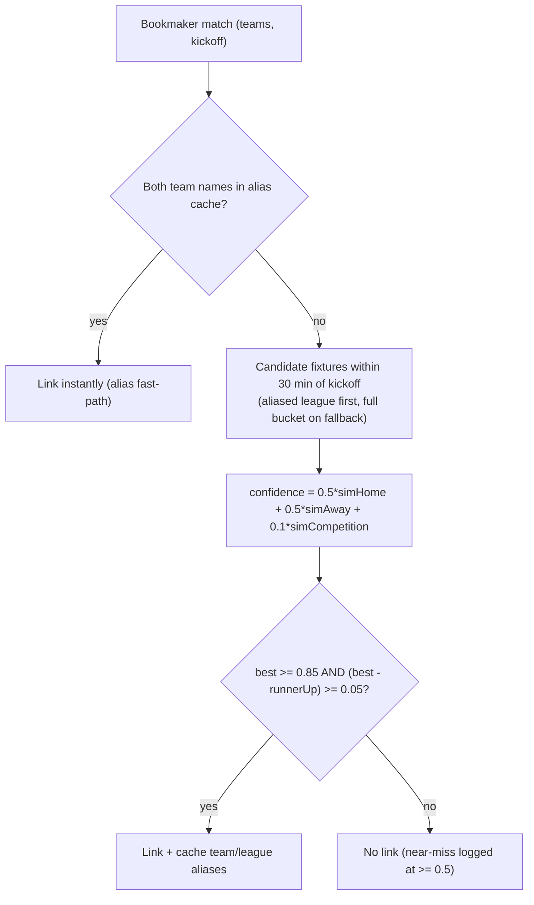

# 03 - Linking: bookmaker match ↔ canonical fixture

The problem: BetPawa/Betika spell team and league names their own way (and Betika exposes no
ids at all), so correlation is fuzzy string matching over normalized names - made cheap over
time by learned aliases. All in `src/link.js`.

## Excluded before scoring: simulated competitions

Betika sells software-generated football (`-Zoom`, `SRL`) next to real matches.
API-Football cannot carry a fixture that does not exist, so these rows can never
correlate - yet before 2026-08-20 nothing said so, and the pass re-scored the
whole open set against the full candidate pool every 10 minutes until the 4h
completion fallback closed each row. Measured: 26,713 of 50,994 matches (52.4%),
about 15,000-17,000 wasted candidate queries and 1-1.5M similarity evaluations
per day, plus near-miss log noise that buries genuine correlation failures.

`_linkProvider` now selects only `is_virtual = false` rows. The flag is
persisted on `matches`, indexed, and written at SCRAPE time by `store.js`'s
`_matchRow` behind the pure `isVirtualCompetition` (`src/db/collector-rules.js`)
- both the insert and update branch pass through `_matchRow`, so correcting the
predicate re-classifies existing rows on their next odds refresh.

Two rules that are not negotiable:

- **The rows are excluded from the work, never from the warehouse.** They carry
  real bettable odds and the web layer still serves them.
- **Both tokens match at a word boundary, never as a bare substring.** A false
  negative costs CPU on a pass that already runs; a false positive permanently
  orphans a real match, because nothing would ever re-examine it.
  `SRLanka Premier League` and `Serie A Zoomers Cup` are the shapes an
  `includes()` test breaks on.

The pass reports `virtual_skipped` plus the DISTINCT names skipped, so a false
positive surfaces by name on the first pass it happens rather than hiding in a
count.

The anchoring the audit itself proposed - a `-Zoom` suffix plus an `SRL ` prefix - was
measured WRONG and not shipped: it misses 1,465 real virtual rows, because
`Premier-Zoom Turbo` puts `-Zoom` mid-string and seven competitions carry `SRL` as a
suffix (`LaLiga SRL`). Verified on 50,994 matches: 26,713 flagged (52.4%), 0 of the
17,938 already-linked rows flagged, 0 canonical `leagues` rows flagged, and a live
scrape wrote 26,896 rows with 0 flag/predicate disagreements.

## Algorithm

Names are normalized first (lowercase, diacritics stripped, noise tokens like FC/United
expansions applied). Then, per name pair:

```
nameSimilarity(a, b) = max( bigramDice(a, b),                 // Sorensen-Dice over char bigrams
                            max(tokenDice, 0.9 * overlap),    // token-set variants
                            initialism(a, b) ? 0.9 : 0 )      // "MUFC" vs "Manchester United FC"
```

Candidate fixtures are those within **±30 minutes** of the match kickoff (see "Candidate pool"
below for how that set is fetched and narrowed). Per candidate:

```
confidence = min(1, 0.5 * simHome + 0.5 * simAway + 0.1 * simCompetition)
```

Competition similarity is a corroborating **bonus, never a veto** - bookmakers rename
leagues too aggressively for it to gate.


```mermaid
flowchart TD
    M["Bookmaker match (teams, kickoff)"] --> A{Both team names in alias cache?}
    A -- yes --> L1["Link instantly (alias fast-path)"]
    A -- no --> W["Candidate fixtures within 30 min of kickoff<br/>(aliased league first, full bucket on fallback)"]
    W --> S["confidence = 0.5*simHome + 0.5*simAway + 0.1*simCompetition"]
    S --> D{"best >= 0.85 AND (best - runnerUp) >= 0.05?"}
    D -- yes --> L2["Link + cache team/league aliases"]
    D -- no --> N["No link (near-miss logged at >= 0.5)"]
```

Acceptance needs BOTH the absolute floor and the **0.05 margin over the runner-up** - a
high score that two fixtures share is ambiguity, not confidence.

### The initialism arm stays at 2 letters (audit F9, measured and refuted)

The obvious complaint about `initialism(a, b) ? 0.9 : 0` is that `_initialismSim` accepts
`[a-z]{2,4}`, so a two-letter form like `sm` matches `santa maria`, `san marino` and
`sporting mendoza` alike. Measured over all 20,041 existing links, that arm decided a team
side (scoring strictly above both the bigram-dice and token arms) on **exactly 12 rows, and
all 12 are correct** - every one is API-Football's `MP` for Mikkelin Palloilijat in the
Finnish Ykkosliiga, 6 pairings linked by both providers with betpawa and betika agreeing.
Those 12 clear the 0.85 floor ONLY through this arm: requiring 3+ letters drops them from
1.000 to 0.55-0.60, destroying 12 correct links and every future MP fixture against zero
wrong links found. (56 further links were decided by 3-4 letter initialisms.)

The feared ambiguity is already handled one layer up: two candidates matching the same
initialism both score 0.9, tie, and the 0.05 runner-up margin rejects both. **Do not
rebuild this** - same class as the F4 qualifier veto below.

## Candidate pool: batched, then league-scoped

Until 2026-08-23 the pool was one query PER OPEN ROW, filtered on kickoff alone (audit F7).
Measured on the live warehouse: 438 fixtures inside a single row's +/-30 minute window, 152
per row on average, and 1,754 round trips for one 2026-08-22 pass across both providers
(748 betpawa rows + 1,006 betika rows, one candidate query each now instead of 1,754).

Fetching is now batched, and it is a pure mechanical change - the pool a row sees is the same
set:

- `candidateWindows` turns the pass's open rows into a few bounded kickoff ranges: min/max
  `start_time` padded by the same +/-30 minute tolerance, split wherever consecutive kickoffs
  sit more than 180 minutes apart. An overnight lull is never scanned, and one stray row
  cannot stretch a single range across years - the shared host kills long scans.
- `bucketByMinute` indexes the result by kickoff minute; `candidatesNear` cuts each row's pool
  out of it and re-applies the exact millisecond distance, inclusive at both ends, so the
  in-memory pool is byte-for-byte the set the SQL `BETWEEN` returned. Verified read-only
  against the per-row SQL on 80 live rows: 80/80 identical.

Selection is then narrowed by league, and this is a behavior change:

- when `league_aliases` resolves the row's competition to a canonical league,
  `candidateAttempts` scores THAT league's candidates first, and the full time bucket is only
  reached if the scoped pool produced no acceptable link. Measured: widest pool per row 438 ->
  35, average 152 -> 25.5, with a league alias resolving on 922 of 1,006 betika rows.
- **Scoping is a preference, never a veto.** A stale or missing alias costs one extra scoring
  pass, never a lost link. That asymmetry is the whole design: nothing in the repo ever
  re-examines a match the linker failed to correlate.

The scorer, the acceptance floor, the runner-up margin, the claim contest and the
alias-teaching bar are untouched. The pass log gains `candidate_queries`,
`candidates_loaded`, `candidates_max`, `league_scoped` and `league_fallback`.

This is the intended fix for the audit's cross-league error (F4): the men's fixture won that
row because it was uncontested in a wide pool. The alternative proposed for it - a hard veto
on a squad-qualifier mismatch (women vs men, reserve vs senior) - was measured against all
18,022 live links and **REFUTED, not fixed**: the two sources tag qualifiers inconsistently
and in different fields (the bookmaker in the competition name, API-Football in the team name,
and API-Football is not even self-consistent about it), so a veto at any of the three tested
strictness levels rejects 57 to 994+ correct links against one single confirmed cross-team
error. The full numbers sit in `src/db/link-rules.js` next to `aliasWorthCaching` and in
`docs/research/2026-08-19-linker-and-apisports-audit.md`. Candidate scoping is the real fix,
and it is honestly **partial**: when the correct league carries no fixture at that kickoff the
scoped pool is empty and the fallback restores the wide pool, so the error class is narrowed,
not closed. The name veto stays refuted.

## Tunables & order

| Knob | Default | Meaning |
|---|---|---|
| `LINK_MIN_CONFIDENCE` | 0.85 | absolute acceptance floor (`.env`-overridable) |
| `MIN_MARGIN` | 0.05 | required gap to the runner-up (code constant) |
| Provider order | betpawa → betika | betika (no ids) additionally scores against betpawa matches already linked to a candidate - the richer provider seeds the poorer one |

Confident links cache `team_aliases` per provider; the alias fast-path (both team names known)
skips scoring entirely, so correlation gets faster and more accurate as data grows.
`league_aliases` is also written on a confident link and, since 2026-08-23, is finally READ:
it picks the league-scoped candidate pool a row is scored against first (see "Candidate pool"
above). That closes audit finding F6, which had the table write-only - read only to skip a
redundant INSERT, never to score, scope or short-circuit a match. Inspect failures by running
`node src/index.js link` and reading the near-miss log lines.

## The alias-teaching bar (audit F3)

Learning a `team_aliases`/`league_aliases` entry is a STRICTER decision than accepting the
link itself. An alias short-circuits the scorer for every future fixture of those teams and
nothing in the repo can re-validate or expire one, so a link accepted at the very edge of the
gate used to write a permanent, unreviewable rule. `aliasWorthCaching(conf, runnerUp,
threshold)` requires the confidence to clear `LINK_MIN_CONFIDENCE` by 0.05 AND the runner-up
margin by 0.15; withheld links are counted in the pass log as `alias_withheld`.

`scripts/forget-alias.js` is the escape hatch that was missing (`--list`/`--team`/`--league`,
`--provider`, dry-run by default, `--yes` to apply). Deleting an alias only removes a
shortcut, so it is safe by construction: the next pass re-derives the correlation by scoring.

Deliberately NOT done: re-scoring the alias fast path itself. A club rename ("Zhenis Nur
Sultan" -> "Zhenys") scores near zero by name, which is exactly why the alias exists - the
audit's own sweep found 314 such entries below 0.60.

## Orientation re-validation (audit F2)

`home_team_id`/`away_team_id` are in API-Football's fixtures upsert merge list, so the source
can swap a fixture's sides AFTER a link was made (neutral-venue ties, friendlies). The link
stays correct - same teams, same kickoff - but the read layer pairs the bookmaker's team names
with the canonical score, so the row renders the result backwards. This is not a bad-link
problem: on every affected row both bookmakers agree with each other and disagree with the
fixture, and the cached aliases are correct and would not have matched the reversed pairing.
API-Football moved, the link did not.

`revalidateOrientation({sinceDays=30})` runs on every link pass over a bounded recent window
(the shared host punishes unbounded scans, and sides flip around kickoff, not years later)
and stamps `matches.sides_swapped` (migration `20260820000001_matches_sides_swapped`) via the
pure `orientationVerdict`/`orientationUpdate` (`src/db/link-rules.js`). Two deliberate
non-actions: a `'unknown'` verdict (the two pairings are too close to call - short abbreviated
names score low both ways) LEAVES the stored flag alone rather than guessing, and a row that
did not move gets no UPDATE at all, because an unconditional rewrite would bump `updated_at`,
which the web reads as the odds refresh time. Since 2026-08-24 (audit F10) that column is
also protected directly: every link-path write - the link itself, the claim-contest
unlink, and this `sides_swapped` write - pins `updated_at = updated_at` in the UPDATE, so
correlation work can never masquerade as an odds refresh (the column is `ON UPDATE
CURRENT_TIMESTAMP`, so without the pin it bumped on all three). `scripts/repair-orientation.js`
runs the identical pass unbounded for links older than the flag. Verified 18,024 links checked across
local and production, exactly 13 flagged, zero false positives, second run clean on both.

What the read layer does with the flag is chapter 02's read-layer section: the stored score
columns stay in the canonical orientation forever and the display swaps.

## Failure isolation

The per-row loop is individually try/caught and the per-provider pass in `linkMatches` is
isolated too, so one row's DB error or one provider's failure no longer aborts the provider
after it. Providers run sequentially, so before this a betpawa failure meant betika never ran
at all.

## Claim contest (one match per provider)

A canonical fixture may be held by at most one match per provider at a time. Before a link is
written, `_linkProvider` checks whether the target fixture is already claimed by another match
of the same provider (`src/db/link-rules.js`'s pure `claimVerdict`): the listing whose
`start_time` sits closest to the canonical kickoff keeps the link; a tie keeps the incumbent
(no churn); an unparseable clock never evicts a claim, since unlinking on a guess would destroy
a good link. The loser is unlinked and any scores it inherited from the fixture are cleared -
`completed_at` is left alone, it is a one-way door and reopening a dead `provider_match_id`
would only buy pointless odds requests.

This exists because API-Football reschedules a fixture by moving its kickoff, and the
bookmaker then relists the game under a new `provider_match_id` at the new time. Without the
contest, the OLD listing kept its `fixture_id`, and because the settle pass joins on
`m.fixture_id = f.id` it stamped the eventual score onto every claimant - so the stale listing
displayed a result under its original, never-played date. Found 2026-08-19: 103 duplicate
`(provider, fixture_id)` claims warehouse-wide, 93 carrying a score from the wrong fixture,
drifts of 3 to 32 days (`docs/research/2026-08-19-linker-and-apisports-audit.md`).
`scripts/repair-duplicate-claims.js` applies the same rule to repair an already-corrupted
warehouse (dry-run by default, idempotent).

---
*Update this chapter when: the similarity components, normalization, acceptance thresholds,
candidate window, provider order, the alias-teaching bar, orientation re-validation, the
virtual-competition predicate, or the claim-contest rule change (`src/link.js`,
`src/db/link-rules.js`, `src/db/collector-rules.js`).*
