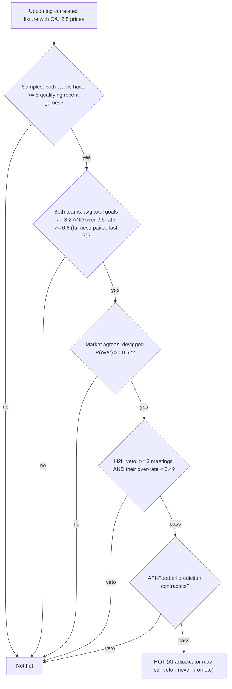

# 04 — The prediction engine: hot picks, tips, settlement

Two distinct products, both frozen at kickoff and settled exactly once from canonical
scores:

- **Hot pick 🔥** — a *binary flag*: this fixture passed every strict Over-2.5 gate.
  Precision over recall by design; rare on purpose. Logic: `src/db/goals-rules.js`.
- **Tip** — the *safest bettable outcome* per fixture across seven market families, with a
  confidence blend and a persisted justification (`tip_breakdown`). Logic:
  `src/db/tip-rules.js`.

Both are pure, zero-import modules — that's what keeps the test suite offline.

## Hot picks: the 9-gate cascade (`scoreOverLine`)

ALL gates must pass (`hot = signals.every(pass)`). Rolling stats use **fairness pairing**:
both teams are judged over the SAME window length, capped at the smaller side's qualifying
count — mixed windows bias the rate gates.



| `DEFAULT_THRESHOLDS` | Value | Note |
|---|---|---|
| `teamWindow` | 7 | rolling last-N per team (keep ≤ ~8 — history backfills 10 games/team) |
| `minGames` | 5 | minimum qualifying sample per team |
| `minOverRate` | 0.6 | share of last-N with 3+ total goals, per team |
| `minAvgTotal` | 3.2 | average total goals per game, per team |
| `minImpliedOver` | 0.52 | vig-removed market P(over 2.5) floor — missing odds FAIL |
| `h2hMinOverRate` / `h2hMinMeetings` | 0.4 / 3 | veto-only: thin H2H is neutral, never a pass requirement |

`LINE_THRESHOLDS = { 2.5 }` — only lines with an entry can EVER fire hot. The 2026-07-16
line sweep (1.5/2.5/3.5) found no other line beats 2.5's ~73% precision bar, so no
expansion shipped. Devig: `impliedProbability(o, u) = (1/o) / (1/o + 1/u)`.

A composite 0..1 `score` (weights 0.25 home-over / 0.25 away-over / 0.30 implied / 0.20
H2H, ±0.05/−0.10 for API support/contradiction) exists for **display and ranking only —
the gates alone decide hot**.

## Tips: eligibility → bestTip → guards

**Eligibility first** (`tipEligibility`): friendly/youth/reserve leagues are excluded
outright (rolling form is invalid evidence there — the epicenter of the first settled
losses); both teams need ≥ 5 qualifying games; at least one full market group must exist
(a market-only blend is just the bookmaker's devigged opinion and can't beat the vig).
Ineligible fixtures store `tip_skip_reason` instead of a junk tip.

**Seven families**, each its own stats blend feeding one shared `consider()`:
1X2 · double chance · O/U (lines 0.5–6.5) · BTTS (`GG`/`NG`) · draw-no-bet
(`DNB1`/`DNB2`) · team totals (`TT:H|A:O|U <line>`) · odd/even.

**Confidence blend** (renormalized over present components):

```
confidence = 0.6 * devigged market prob + 0.3 * rolling-stats support + 0.1 * API-Football percentages
```

Floors: `TIP_MIN_PRICE` 1.2 (near-certain junk odds excluded — what survives at high
confidence is the "hidden gem"); `minConfidence` 0.5; `TIP_MIN_UNDER_LINE` 4.5 (no
U 2.5/U 3.5 tips — near-Unders realized 61.9% vs a 78.1% break-even). The full blend,
samples, runners-up and book overround persist as `tip_breakdown` JSON.

**Book-integrity guards (new families only** — the legacy 1X2/DC/O-U path deliberately
bypasses them for byte-compat): a family book must be complete with overround
`sum(1/price)` inside **[1.01, 1.30]** (below smells like a palpable error, far above
ruins the devig); one provider's full book is used (betpawa → betika, never mixed), with a
cross-provider devig-divergence veto at **0.15**.

## Settlement

`tipOutcome(market, ftHome, ftAway)` → `hit` | `miss` | **`void`** (a DNB draw is a push —
stake returned; voids are excluded from rate buckets). Throws on unknown keys — a persisted
junk key must be a loud bug. Hot picks settle via one SQL pass (`settleHotPicks`, cheap
enough for the light pass), tips via `tipOutcome` batches; both only where the outcome is
still NULL. Measurement lives in `src/db/perf-rules.js` (flat-stake ROI, edge buckets,
AI-veto impact) — `node src/index.js performance` / `GET /api/performance`.

---
*Update this chapter when: a gate/threshold/line changes, a market family is added, blend
weights or floors move, book guards change, or settlement semantics change
(`src/db/goals-rules.js`, `src/db/tip-rules.js`, `src/hotpicks.js`).*
