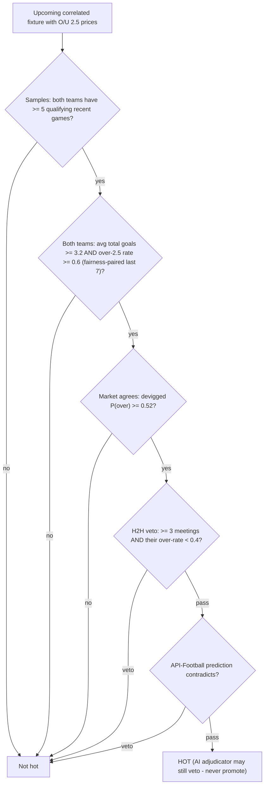

# 04 - The prediction engine: hot picks, tips, settlement

Two distinct products, both frozen at kickoff and settled exactly once from canonical
scores:

- **Hot pick 🔥** - a *binary flag*: this fixture passed every strict Over-2.5 gate.
  Precision over recall by design; rare on purpose. Logic: `src/db/goals-rules.js`.
- **Tip** - the *safest bettable outcome* per fixture across seven market families, with a
  confidence blend and a persisted justification (`tip_breakdown`). Logic:
  `src/db/tip-rules.js`.

Both are pure, zero-import modules - that's what keeps the test suite offline.

## Hot picks: the 9-gate cascade (`scoreOverLine`)

ALL gates must pass (`hot = signals.every(pass)`). Rolling stats use **fairness pairing**:
both teams are judged over the SAME window length, capped at the smaller side's qualifying
count - mixed windows bias the rate gates.


```mermaid
flowchart TD
    S["Upcoming correlated fixture with O/U 2.5 prices"] --> G1{"Samples: both teams have >= 5 qualifying recent games?"}
    G1 -- no --> R["Not hot"]
    G1 -- yes --> G2{"Both teams: avg total goals >= 3.2 AND over-2.5 rate >= 0.6 (fairness-paired last 7)?"}
    G2 -- no --> R
    G2 -- yes --> G3{"Market agrees: devigged P(over) >= 0.52?"}
    G3 -- no --> R
    G3 -- yes --> G4{"H2H veto: >= 3 meetings AND their over-rate < 0.4?"}
    G4 -- veto --> R
    G4 -- pass --> G5{"API-Football prediction contradicts?"}
    G5 -- veto --> R
    G5 -- pass --> H["HOT (AI adjudicator may still veto - never promote)"]
```

| `DEFAULT_THRESHOLDS` | Value | Note |
|---|---|---|
| `teamWindow` | 7 | rolling last-N per team (keep ≤ ~8 - history backfills 10 games/team) |
| `minGames` | 5 | minimum qualifying sample per team |
| `minOverRate` | 0.6 | share of last-N with 3+ total goals, per team |
| `minAvgTotal` | 3.2 | average total goals per game, per team |
| `minImpliedOver` | 0.52 | vig-removed market P(over 2.5) floor - missing odds FAIL |
| `h2hMinOverRate` / `h2hMinMeetings` | 0.4 / 3 | veto-only: thin H2H is neutral, never a pass requirement |

`LINE_THRESHOLDS = { 2.5 }` - only lines with an entry can EVER fire hot, and the effective
list is the `HOTPICK_LINES` knob (CSV, default `2.5`). The 2026-07-16 line sweep
(1.5/2.5/3.5) found no other line beats 2.5's ~73% precision bar, so no expansion shipped -
an honest no-expansion. Devig: `impliedProbability(o, u) = (1/o) / (1/o + 1/u)`.

The gate core is line-parameterized: `scoreOverLine(inputs, line)` is the implementation and
`scoreOver25` is the `line = 2.5` case, byte-compatible with the pre-M3 output. M3 also made
`teamGoalsAggregates`/`h2hGoalsAggregates` carry per-line `overRates` and
`apiPredictionSignal(pred, line)` line-aware. Fairness pairing lives in
`pairedTeamGoalsAggregates` (mirrored on the tip side by `pairedTeamOutcomeAggregates`); the
uncapped counts survive as `pool`, which is what eligibility attribution reads.

`DEFAULT_THRESHOLDS` was tuned with `scripts/backtest-hotpicks.js`: 54.3% baseline ->
**73.3% stats-only precision over 10,678 fixtures**, re-validated under fairness pairing on
2026-07-04.

A composite 0..1 `score` (weights 0.25 home-over / 0.25 away-over / 0.30 implied / 0.20
H2H, ±0.05/−0.10 for API support/contradiction) exists for **display and ranking only - 
the gates alone decide hot**.

## Tips: eligibility → bestTip → guards

**Eligibility first** (`tipEligibility`): friendly/youth/reserve leagues are excluded
outright (rolling form is invalid evidence there - the epicenter of the first settled
losses); both teams need ≥ 5 qualifying games; at least one full market group must exist
(a market-only blend is just the bookmaker's devigged opinion and can't beat the vig).
Ineligible fixtures store `tip_skip_reason` instead of a junk tip.

The evidence itself comes from `teamOutcomeAggregates`/`h2hOutcomeAggregates` (W/D/L plus
per-line over rates, all with the kickoff cutoff applied). The context gate runs FIRST:
`TIP_CONTEXT_EXCLUDE` skips friendly/youth/reserve leagues outright.

**Seven families**, each its own stats blend feeding one shared `consider()`:
1X2 · double chance · O/U (lines 0.5-6.5) · BTTS (`GG`/`NG`) · draw-no-bet
(`DNB1`/`DNB2`) · team totals (`TT:H|A:O|U <line>`) · odd/even. This is the spec's
`TIP_FAMILIES` registry realized as per-family candidate blocks - BTTS blends the mean of
both teams' and the H2H `bttsRate`, DNB renormalizes win-vs-win into `statsProb`, team totals
use scored-vs-conceded per-side over-rates, odd/even reads `oddRate` - so **a new family is
one candidate block plus one `tipOutcome` settle case**.

**Confidence blend** (renormalized over present components):

```
confidence = 0.6 * devigged market prob + 0.3 * rolling-stats support + 0.1 * API-Football percentages
```

Floors: `TIP_MIN_PRICE` 1.2 (near-certain junk odds excluded - what survives at high
confidence is the "hidden gem"); `minConfidence` 0.5; `TIP_MIN_UNDER_LINE` 4.5 (no
U 2.5/U 3.5 tips - near-Unders realized 61.9% vs a 78.1% break-even; a suppressed Under
yields to the runner-up rather than blanking the fixture). The full blend - component
probabilities, effective weights, samples, runners-up and the winning `book_overround` -
persists verbatim as `tip_breakdown` JSON.

**Book-integrity guards (new families only** - the legacy 1X2/DC/O-U candidate path
deliberately bypasses both guards, and carries no `book_overround`, to stay byte-compatible
with the pre-M3 output): `bookIntegrity(prices)` requires a family book to be complete with
overround `sum(1/price)` inside **[`TIP_MIN_OVERROUND` 1.01, `TIP_MAX_OVERROUND` 1.30]**
(below 1.0 smells like a palpable-error or boosted price, far above is margin loading that
ruins the devig); `selectFamilyBook` uses ONE provider's full book (betpawa -> betika, never
mixing providers inside a group) with a cross-provider devig-divergence veto at
`TIP_MAX_BOOK_DIVERGENCE` **0.15**.

`buildTipBooks(oddsRows, {homeName, awayName})` assembles the per-family/per-line books from
one fixture's FT-only rows and imports M2's `canonicalMarket` (a sanctioned cross-pure
import): period-tagged rows are excluded, the team-total side is resolved by `tt.side` or a
normalized team-name match and dropped when unresolved, and the return carries `overrounds`
plus a `rejects` audit map. `src/hotpicks.js`'s `_loadMarkets` is therefore only SQL plus
per-fixture row grouping - the family assembly is all in the pure module.

## Settlement

`tipOutcome(market, ftHome, ftAway)` → `hit` | `miss` | **`void`** (a DNB draw is a push - 
stake returned; voids are excluded from rate buckets). Throws on unknown keys - a persisted
junk key must be a loud bug. `tipHit` is the byte-compatible boolean wrapper (`=== 'hit'`)
and `tipHitSafe` the never-throw browser variant (unknown key -> `null`). Hot picks settle
via one SQL pass, tips via `tipOutcome` batches; both only where the outcome is still NULL.
`settleHotPicks()` is a standalone export - no fetches, no AI, cheap enough that the light
auto-refresh pass calls it every 10 minutes.

## Storage, freeze and the evaluation pass

`updateHotPicks()` settles first, then re-evaluates every upcoming correlated
snapshot-backed fixture through the gates. Both products live on `fixture_predictions`:
`tip_market VARCHAR(32)`, `tip_price`, `tip_confidence`, `tip_outcome ENUM('hit','miss','void')`
plus `tip_breakdown`/`tip_skip_reason`/`tip_ai_*` (migration `20260715000001_tip_market_v2`).
The web sorts and filters them through the `tip` base column, whose value is the confidence.

Writes use the same freeze idiom as prematch snapshots: `kickoff > NOW()` selection and a
chunked `onConflict`-merge upsert whose merge list EXCLUDES `result_goals`, `outcome` and
`tip_outcome`, because the settle pass owns those columns. The eight `ai_*`/`tip_ai_*` verdict
columns are likewise absent from the sweep's merge list - they belong to the background AI
worker (chapter 06); the sweep bills no AI and only re-applies an existing reusable veto to
`hot`.

`loadTeamHistory(teamIds)` is exported from `src/hotpicks.js` as the shared bulk
finished-fixtures loader grouped per team, and `src/enrich.js` reuses it VERBATIM for its
rolling-stats projection rather than growing a second, drifting definition of "recent form".

`hotpicksSummary()` backs `GET /api/hotpicks`; `performanceSummary()` backs
`GET /api/performance` and the `performance` CLI report.

## Measuring what shipped (`src/db/perf-rules.js`)

Pure, zero-import. `summarizePerformance(rows)` reports flat-stake ROI (1 unit per settled
pick), hit-rate, average price and the break-even rate for each 7d / 30d / all window, then
buckets by confidence band, market group, exact O/U line (tips only - that is what keeps the
near-Under and tail-Over residuals measurable) and edge sign (`confidence × price − 1`, the EV
proxy). AI-vetoed picks still settle but are excluded from the headline rate, so the `saved`
figure measures what following the vetoes was worth.

Hit-rate alone cannot prove profit. The edge buckets are where the false positives live.

---
*Update this chapter when: a gate/threshold/line changes, a market family is added, blend
weights or floors move, book guards change, the `fixture_predictions` column set changes, or
settlement/measurement semantics change (`src/db/goals-rules.js`, `src/db/tip-rules.js`,
`src/hotpicks.js`, `src/db/perf-rules.js`).*
