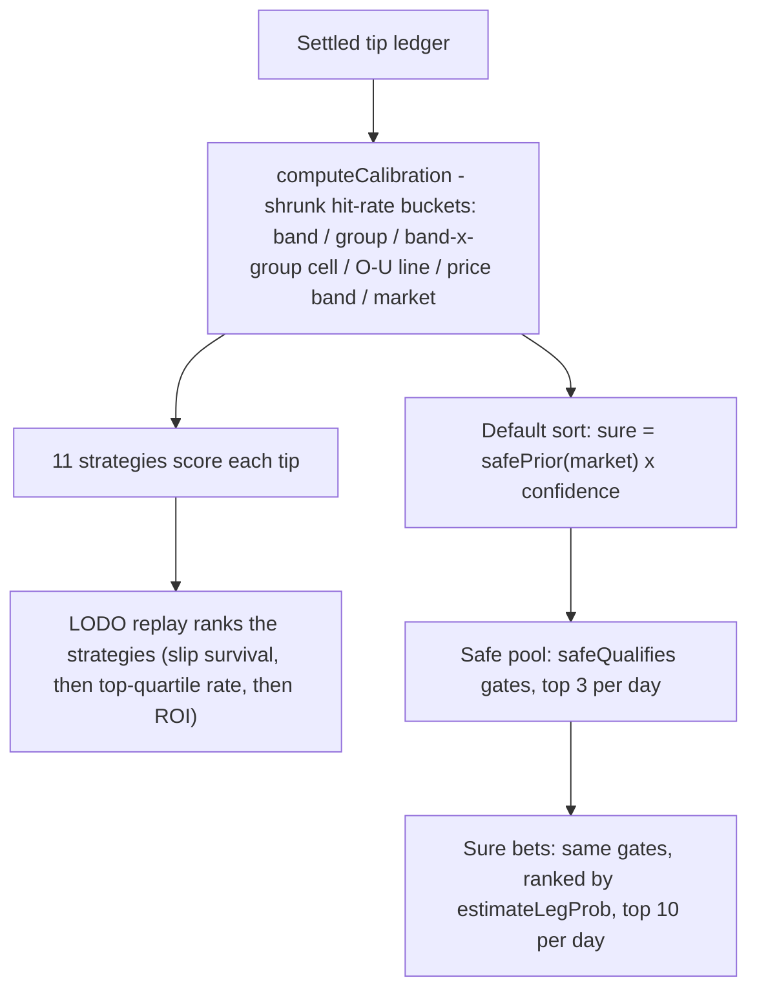

# 05 — Ranking & selection: calibration, strategies, sure, safe

> **Honesty contract** (full statement: `00-README.md`): no market is +EV on our books;
> flat-stake EV ≈ −3%. Everything below maximizes *win probability and slip survival*,
> never profit. Evidence: `docs/research/sure-win-analysis.md`,
> `docs/research/fair-comparison-and-false-positives.md`.

All logic in `src/db/magic-rules.js` — shared VERBATIM by server and browser (one scorer,
no client/server drift).



## Calibration

`computeCalibration` digests every settled tip into empirical hit-rate buckets. Thin cells
can't dominate because every rate is **beta-shrunk** toward the global rate:

```
shrunkRate = (bucket.hits + k * globalRate) / (bucket.n + k)     // k = shrink_k pseudo-counts
```

Voids are skipped from rate buckets; per-market buckets also carry flat-stake
`staked`/`profit` (the per-market honesty line in the UI).

## The 11 strategies

| id | Scores by |
|---|---|
| `sure` | **default sort** — `safePrior(market, cal) × confidence` |
| `confidence` | raw blend confidence (baseline) |
| `market` | devigged market probability |
| `stats` | rolling-stats support |
| `agreement` | weakest present blend component (min of parts) |
| `edge` | EV proxy `confidence × price − 1` (ordering only — NOT a profit claim) |
| `price_band` | shrunk hit-rate of the tip's price band |
| `bucket` | band×group cell posterior (exploits the observed 0.60–0.69 > 0.80+ inversion) |
| `line` | O/U-line (or market-group) shrunk rate |
| `cal_conf` | `√(posterior × confidence)` geometric blend |
| `cal_market` | `market × (posterior / globalRate)`, clamped |

Every scorer is total via fallback chains ending at blend confidence (old rows lack
`tip_breakdown`). `simulateStrategies` replays each strategy per settled day — top-4 slip
at real prices, **leave-one-day-out** calibration so calibrated strategies never grade
their own answers — ranked by slip survival → pooled top-quartile hit rate → ROI.
Live lesson worth remembering: **raw confidence is NOT monotonic with winning**; the
calibrated strategies are the "gets better as data grows" part.

## `sure` — the default sort

```
sure_score = safePrior(market, cal, k=20) × confidence
safePrior  = (liveBucket.hits + 20 × anchor) / (liveBucket.n + 20),  anchor = WAREHOUSE_WLO[market]
```

`WAREHOUSE_WLO` holds per-market warehouse temporal-OOS hit-rates — deliberately the
CONSERVATIVE *unconditional* rate, because warehouse stats-only precision is price-blind
and anti-correlated with live ROI (an "87% precise" Under is priced below the 1.2 floor).
The k=20 live term dominates as soon as a market accumulates real settled tips.

## Safe pool and Sure bets — two different things (naming trap)

- **Safe pool** (`safeQualifies` + `safeSelection`, the 🛡 toggle): gates each row —
  ≥ 2 blend components, weakest component ≥ 0.65, price ≤ 1.6, sufficient stats
  (`minSamples` 6), market maturity ≥ 30 settled tips — then ranks per EAT day by the
  pinned `sure` strategy, top **3/day**. Env-overridable (`SAFE_*`); NEVER retune without a
  fresh `scripts/analyze-safe-tips.js` run (LODO grid).
- **Sure bets** (⭐, `sureBetsSelection`): the SAME pinned `DEFAULT_SAFE` literal gates
  (deliberately not env-tunable in v1), but ranked by **`estimateLegProb`** — NOT the
  `sure` strategy, whose top ranks underperform in replay (rank #1 realized 63–64% vs ~85%
  at ranks 8–10). Top **10/day**, 3-leg seed slips. A *survival* claim, never EV.

```
estimateLegProb = bucketPosterior(tip, cal) ?? confidence, clamped [0.05, 0.98]
```

— also the betslip playground's per-leg survival number, so the ⭐ list and the slip UI can
never disagree.

---
*Update this chapter when: a strategy is added/changed, shrinkage or `WAREHOUSE_WLO`
anchors move, `DEFAULT_SAFE`/`SAFE_TIERS`/`DEFAULT_SURE_BETS` change, or the replay ranking
policy changes (`src/db/magic-rules.js`; retune gates only via
`scripts/analyze-safe-tips.js`).*
