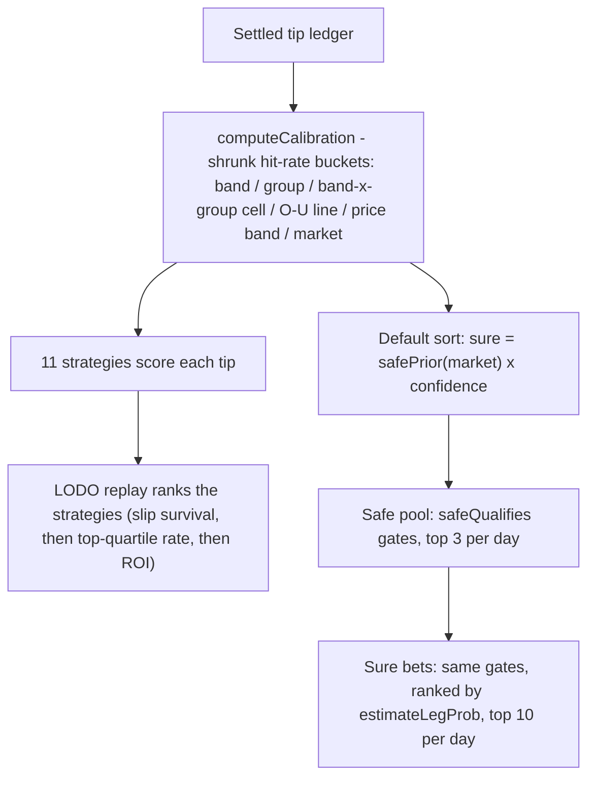

# 05 - Ranking & selection: calibration, strategies, sure, safe

> **Honesty contract** (full statement: `00-README.md`): no market is +EV on our books;
> flat-stake EV ≈ −3%. Everything below maximizes *win probability and slip survival*,
> never profit. Evidence: the 2026-07-13/14 sure-win + fair-comparison studies
> (pruned 2026-08-04 - git history).

All logic in `src/db/magic-rules.js` - pure except for the perf-rules bucket labellers it
imports, so the suite still runs offline, and shared VERBATIM by the server loader and the
web table (one scorer, no client/server drift). Vite serves the out-of-root import in dev via
`server.fs.allow ['..']`; the production build follows the relative import natively.


```mermaid
flowchart TD
    L["Settled tip ledger"] --> C["computeCalibration - shrunk hit-rate buckets: band / group / band-x-group cell / O-U line / price band / market"]
    C --> S["11 strategies score each tip"]
    S --> R["LODO replay ranks the strategies (slip survival, then top-quartile rate, then ROI)"]
    C --> D["Default sort: sure = safePrior(market) x confidence"]
    D --> SAFE["Safe pool: safeQualifies gates, top 3 per day"]
    SAFE --> SB["Sure bets: same gates, ranked by estimateLegProb, top 10 per day"]
```

## Calibration

`computeCalibration` digests every settled tip into empirical hit-rate buckets. Thin cells
can't dominate because every rate is **beta-shrunk** toward the global rate:

```
shrunkRate = (bucket.hits + k * globalRate) / (bucket.n + k)     // k = shrink_k pseudo-counts
```

Voids are skipped from rate buckets; per-market buckets also carry flat-stake
`staked`/`profit` (the per-market honesty line in the UI).

The engine-v2 **leg-cell calibrator** (`loadCalibrator` in `src/daily-slip.js`, served as
`calibration.leg_cells` on `/api/magic-sort` and feeding the Daily MultiBet) is built from
every offered menu leg of every settled fixture in a 90-day window. Its `odds_markets`
load is chunked per 200 fixtures (2026-08-23): the single `IN (...)` statement it used to
issue covered ~10k fixtures and ~7M rows, which the shared live host killed every time
("lost connection during query", the error behind the 2026-08-19 full-sweep failure) and
which peaked at 1.5 GB RSS where it did run. Chunking keeps the output byte-identical
(sha-verified) at a 443 MB peak, and live carried `leg_cells` for the first time that day.

## The 11 strategies

| id | Scores by |
|---|---|
| `sure` | **default sort** - `safePrior(market, cal) × confidence` |
| `confidence` | raw blend confidence (baseline) |
| `market` | devigged market probability |
| `stats` | rolling-stats support |
| `agreement` | weakest present blend component (min of parts) |
| `edge` | EV proxy `confidence × price − 1` (ordering only - NOT a profit claim) |
| `price_band` | shrunk hit-rate of the tip's price band |
| `bucket` | band×group cell posterior (exploits the observed 0.60-0.69 > 0.80+ inversion) |
| `line` | O/U-line (or market-group) shrunk rate |
| `cal_conf` | `√(posterior × confidence)` geometric blend |
| `cal_market` | `market × (posterior / globalRate)`, clamped |

Every scorer is total via fallback chains ending at blend confidence (rows written before
2026-07-04 lack `tip_breakdown`). `simulateStrategies` replays each strategy per settled day - 
top-4 slip at real prices, **leave-one-day-out** calibration so calibrated strategies never
grade their own answers - ranked by slip survival → pooled top-quartile hit rate → ROI, with
the user-selected policy applied to the `days >= minDays` tier first. Its stats also carry
`streak {days, avg, best}`, the depth before the first miss from the top of each day's
ranking; that number is **display-only** and does not move ranking policy until there are
more than 30 replay days. Live lesson worth remembering: **raw confidence is NOT monotonic
with winning**; the calibrated strategies are the "gets better as data grows" part.

`magicSortRows` orders by score descending with stable ties, sinking tipless and skipped
rows. **AI-vetoed rows deliberately do NOT sink** - `scoreTip` never consults
`tip_ai_verdict` (M4.1 spec section 3.8; the settled evidence is in chapter 06).
`slipSummary` and `estimateLegProb` back the web table and the betslip playground, so the
survival number a slip shows is the same one the ranking used.

## The v2 menu (2026-08-06, engine-v2 Phase 3)

The UI strategy menu is now the calibration trio, filtered into the payload by `V2_MENU` in
`src/magic.js`:

| id | Scores by |
|---|---|
| `banker` | **default sort** - the row's safest offered leg by CALIBRATED survival (`bankerProb`/`legCellProb`), scored through `rowScore` so a tipless-but-bankered row ranks instead of sinking |
| `target` | efficiency: survival cost per unit of log-odds - the odds-bearing arm |
| `value` | calibrated edge `p × price − 1` - an ordering signal, NOT an EV claim |

The legacy 11 stay exported, replayable and API-callable; they simply leave the payload.
`/api/magic-sort` carries the walk-forward menu-leg calibration cells as
`calibration.leg_cells` (the `loadCalibrator` export, about 77 cells - the layer the
2026-08-06 daily-slip grids proved load-bearing), so client and server score off ONE layer,
and `estimateLegProb` prefers a leg cell with n >= 30 over the tip-bucket posterior.
**Sure Bets are now banker top-N** on calibrated `bankerProb`; `safeQualifies` survives only
as the no-banker fallback path.

## Daily MultiBet: the GEN-2 value ladder (2026-08-08)

`buildDailySlip` v2.0 ships four tier cards per day: the **anchor** at 1.5x (the day
verdict), a **double** at 2x, a **top-3** card whose legs are each >= 1.5 odds, and an
EV-gated **grand** at 5x. The card set is **coherent by construction** - no leg contradicts
another taken leg or the fixture's own tip - and only tip-eligible fixtures are drawn from.
`errorBoost` is x2, so a published miss teaches the calibration cells harder than an
unpublished one.

The generation was baked from **313 walk-forward generations** (`scripts/evolve-gen2.js`,
both-windows rule) and the timeline was honestly backfilled by
`scripts/backfill-gen2-timeline.js`: **24/37 anchor-green, 31/37 any-card**, with the
backfilled days tagged as such in the UI.

Two same-session fixes belong with it: the daily-slip settle pass no longer keeps grading
legs on a day that is already decided, and a fixture that dies is voided after 7 days; the
magic-sort memo is warmed at boot, which removed a 25s stall on the first hit.

## `sure` - the default sort

```
sure_score = safePrior(market, cal, k=20) × confidence
safePrior  = (liveBucket.hits + 20 × anchor) / (liveBucket.n + 20),  anchor = WAREHOUSE_WLO[market]
```

`WAREHOUSE_WLO` holds per-market warehouse temporal-OOS hit-rates - deliberately the
CONSERVATIVE *unconditional* rate (not a gated precision), because warehouse stats-only
precision is price-blind and anti-correlated with live ROI (an "87% precise" Under is priced
below the 1.2 floor, or carries about zero edge where it is bettable). The k=20 live term
dominates as soon as a market accumulates real settled tips. M3 added the new-family anchors
(`GG`/`NG`/`DNB1`/`DNB2`/`ODD`/`EVEN` plus every offered `TT:*` key) over 11,372 eligible
tips on a newest-30% TEST split with DNB voids excluded. Team-total and BTTS Unders look
strong stats-only BY DESIGN - the measure is price-blind - which is exactly why they must
never be the live prior.

`sure` favours the markets that most often win at real odds (double chance broadly). Two
market-level claims are settled and must not be re-litigated without new data: the earlier
"X2 is the only live-established +EV market at +15%" is **REFUTED** by the 2026-07-14 fair,
selection-corrected and recency-robust re-test (X2 is −12.8% price-blind EV and regressed to
unresolved; **no market is +EV**), and `12` remains the biggest live loser at about −8%.
Pinning `sure` as the safe ranker lifted the safe-pool leg rate **81.5% -> 88.9%**
(`DEFAULT_SAFE.strategy` is now `sure`, best streak avg 4.2 / best 10).

**Honesty, restated where it is easiest to forget:** `sure` maximizes win probability and
slip survival, NOT profit - overall flat-stake EV is about −3.2%, the vig. M3 (2026-07-16)
did ship any-market tips, the best-supported market per fixture across all seven families,
but as HONESTLY-LABELLED picks and never as a +EV claim; the per-market honesty line in the
UI says exactly how each market has performed live.

## Safe pool and Sure bets - two different things (naming trap)

- **Safe pool** (`safeQualifies` + `safeSelection`, the 🛡 toggle, shipped 2026-07-09 as the
  Safety Net Protocol): gates each row - ≥ 2 blend components present, the weakest
  (`tipAgreement`) ≥ 0.65, price ≤ 1.6, sufficient stats (`minSamples` 6), one row per
  `api_id`, market maturity ≥ 30 settled tips - then ranks per EAT day by the pinned
  strategy (`SAFE_STRATEGY`, now `sure`; it was `market` when the pool shipped), top
  **3/day**. Env-overridable (`SAFE_*`); NEVER retune without a fresh
  `scripts/analyze-safe-tips.js` run (LODO grid). The 2026-07-09 run replayed **94.4% legs
  at 2.6 picks/day**; the runner-up swap it also tests was backtested net-negative
  (+108/−128), so `bestTip` stays untouched and the script re-tests that hypothesis weekly.
- **Sure bets** (⭐, `sureBetsSelection`, 2026-07-17): returns an ordered `[{row, prob}]`,
  gated by the SAME spec-PINNED `DEFAULT_SAFE` literals (`DEFAULT_SURE_BETS` is
  `maxPerDay: 10`, `slipSize: 3`, and the web passes only that - an env-tightened `SAFE_*`
  policy starves the list, live-verified, so v1 has NO env or user gate tunability), but
  ranked by **`estimateLegProb`** descending - NOT the `sure` strategy, whose top ranks
  underperform in replay (rank #1 realized 63-64% vs ~85% at ranks 8-10). Null-prob rows are
  excluded, the cap is per EAT day. Top **10/day**, 3-leg seed slips. A *survival* claim,
  never EV.

**The market-maturity floor** is `safeQualifies(row, opts, cal)` with `opts.minMarketSettled`
(`SAFE_MIN_MARKET_SETTLED`, default 30, shipped inside the `/api/magic-sort` `safe` object):
a market with fewer than that many settled tips cannot enter the safe pool at all, so a
brand-new family can never be selected before it has a live track record. Live-verified: no
new-family market had a single settled tip when M3 shipped, so all were excluded.

**Stats sufficiency** ("exclude risky bets") is `hasSufficientStats(row, opts)` -
`minSamples`/`minH2H` read off `tip_breakdown.samples`, tolerant of sample-less rows. It is
folded into `safeQualifies` and reused VERBATIM by the web risk-gate filter (`applyRiskGate`
in `filterValues.js`), which auto-applies whenever a magic sort or Safe-only is active,
shows a ViewPills chip and defaults ON. Knobs: `SAFE_MIN_SAMPLES`/`SAFE_MIN_H2H`.

`SAFE_TIERS` (max-precision / balanced / volume) vary only agreement, price and cap;
`minParts` is pinned at 2, because parts = 3 is a double-chance-only confound.

## Per-market honesty line and plain-language labels

`computeCalibration`'s `cal.markets[key]` carries `staked`/`profit` alongside the rate, which
is the flat-stake ROI per market the UI prints as the honesty line (void rows are skipped
from the rate buckets). `tipMarketLabel(market)` turns a stored key into plain language
(`'TT:H:O 1.5'` -> "Home team over 1.5 goals", `'DNB1'` -> "Home (draw no bet)", `'GG'` ->
"Both teams to score: Yes", ...) and falls back to the raw key; the web TipPopover and table
import it VERBATIM so labels can never drift from the engine.

## Pattern mining: read-only, and what it refuted (M4.2)

`src/db/mine-rules.js` + `scripts/mine-patterns.js` are the emergence-pattern mine. It ships
**NO ranking change** - same discipline as M4.1: mine freely, ship skeptically.

The pure module imports only the perf-rules/magic-rules labellers, **never a second
taxonomy**, since a private "market family" would silently diverge from what
`computeCalibration` buckets by. It holds:

- the anti-false-positive controls: `temporalSplit` on whole days; `benjaminiHochberg` step-up
  FDR; `dayClusteredBootstrap`, which **resamples DAYS not rows**, because same-day tips are
  correlated and a row-level CI fakes precision the data has not earned; and a seeded PRNG so
  a mine cannot be re-rolled until it looks good.
- the feature extractors `configSignature`/`hasStraddle` (runner-up configurations),
  `cascadeLadder`, `missProfile`, `consensusProxies` - all **total**, because `tip_breakdown`
  is persisted JSON written by older code versions, i.e. external data.
- `evaluatePattern` and the **closed class vocabulary** `edge` / `booster` / `refuted` /
  `underpowered` / `unbettable`. `booster` (real lift, EV <= 0 - buys survival, not profit)
  versus `edge` (clears break-even at real prices - **none has ever been found**) is the
  honesty contract; `unbettable` (real lift priced under 1.20) stays deliberately distinct
  from `refuted`, because that trap was the biggest lesson of the precursor-patterns mine.
- `PRE_REGISTERED`, the 8 hypotheses committed BEFORE the mine ran. Post-hoc finds are never
  ship-eligible. The script reuses `settledTipRows()` verbatim (zero new DB code, so it
  cannot drift from `analyze-safe-tips.js`).

**Findings (2026-07-16): zero edges, zero boosters.** Only 2 of the 8 hypotheses cleared the
volume floor and BOTH are refuted - PR-2c (confidence gap, −0.5pp at n=220) and PR-4b, the
founding contrarian thesis's sharpest form (the low-spread "consensus trap": +0.7pp, CI
[−5.4, +3.6] at n=335 - market-vs-stats agreement carries no detectable discrimination).

**The mine's most valuable output was a flaw in the ledger, not a signal in it.**
`TIP_MIN_PRICE` is a LIVE knob, and moving it 1.20 -> 1.35 on 2026-07-10 partitioned the
ledger almost exactly on the temporal-OOS boundary, so every price-correlated test was
measuring the config change (PR-4a's 414 rows all sit in train - tips under 1.30 can no
longer be generated). Hence the run-time POLICY-REGIME WARNING and `evaluatePattern`'s
"population absent from the test window" note. **Never move a generation knob mid-experiment
without recording the date.**

Two more closed questions:

- **PR-1 is CLOSED, economically REFUTED** (2026-07-16, `scripts/close-pr1-ladder-ev.js`).
  The descriptive claim held - a tip of `O 2.5` cleared `O 1.5` **85.1%** of the time against
  the tip itself landing 70.3% - but attaching `O 1.5`'s real stored price (72 of 101
  fixtures, median 1.13 against a 1.175 break-even) yields laddered flat EV **−5.9%**: class
  `unbettable`, the sub-1.20 price trap exactly as pre-registered.
- **H5, the golden-longshot spotter, is data-REFUTED and will not be built.** At >= 10x the
  ledger shows **2 wins / 153**, about −79% - favourite-longshot bias. Two positives cannot
  fit a discriminator, and the result corroborates the contrarian thesis aimed the other way.

`scripts/mine-precursors.js` is a different surface with no overlap: the 2026-07-14
Tier-A/Tier-B **warehouse** mine (203 candidates, leak-free reconstruction), rescued verbatim
from gitignored `tmp/`, read-only, about 5 minutes to run. Both study write-ups were pruned;
git history has them.

## The loader (`src/magic.js`)

A thin knex loader behind `GET /api/magic-sort`. `settledTipRows()` selects settled tips plus
a `DATE_FORMAT(kickoff)` day (grouping stays inside the pinned +03:00 SQL session) and the
final-score pair the analysis scripts need; `scripts/analyze-safe-tips.js` shares it so the
two can never drift. The loader runs `simulateStrategies`, resolves the `safe` policy object
from the `SAFE_*` config and ships it in the payload - the browser cannot read `.env`, so
shipping the resolved policy is what keeps client and server from diverging, and
`safeSelection(rows, cal, opts)` merges those opts over `DEFAULT_SAFE`. Results are memoized
per day in process; `?refresh=1` recomputes and a failed compute clears the slot.

## Knobs and the scripts that must run before you move them

| Knob | Default | Meaning |
|---|---|---|
| `SAFE_MAX_PER_DAY` | 3 | safe-pool cap per EAT day |
| `SAFE_STRATEGY` | `sure` | the pinned safe ranker (`DEFAULT_SAFE.strategy`) |
| `SAFE_MIN_PARTS` | 2 | blend components required (pinned - 3 is a double-chance confound) |
| `SAFE_MIN_AGREEMENT` | 0.65 | weakest present blend component |
| `SAFE_MAX_PRICE` | 1.6 | price ceiling |
| `SAFE_MIN_MARKET_SETTLED` | 30 | market-maturity floor for the safe pool |
| `SAFE_MIN_SAMPLES` / `SAFE_MIN_H2H` | see `DEFAULT_SAFE` | the stats-sufficiency gate |

Analysis scripts: `scripts/analyze-safe-tips.js` (LODO grid over the safe gates, mandatory
before a retune), `scripts/backtest-sure-tips.js` (full-warehouse stats-only precision +
temporal OOS + the M3 new-family anchors), `scripts/analyze-sure-live.js` (live cross-val and
ranking bake-off), `scripts/backtest-hotpicks.js` (`--line` O/U sweep),
`scripts/recon-warehouse.js` (baselines + the `odds_markets` menu).

```
estimateLegProb = bucketPosterior(tip, cal) ?? confidence, clamped [0.05, 0.98]
```

 - also the betslip playground's per-leg survival number, so the ⭐ list and the slip UI can
never disagree.

---
*Update this chapter when: a strategy is added/changed, shrinkage or `WAREHOUSE_WLO`
anchors move, `DEFAULT_SAFE`/`SAFE_TIERS`/`DEFAULT_SURE_BETS` change, the v2 menu or the leg
cells change, the Daily MultiBet card set changes, a `SAFE_*` knob moves, a mine hypothesis
is closed, or the replay ranking policy changes (`src/db/magic-rules.js`, `src/magic.js`,
`src/daily-slip.js`, `src/db/mine-rules.js`; retune gates only via
`scripts/analyze-safe-tips.js`).*
