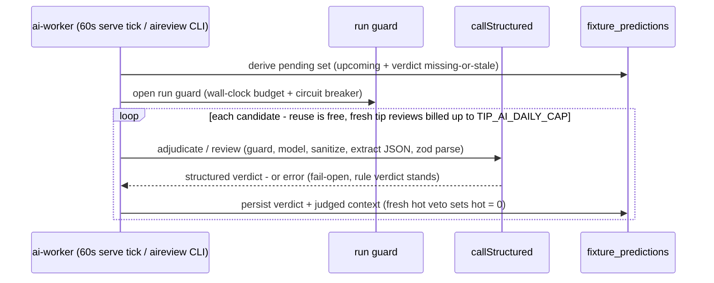

# 06 — AI layers: adjudication, worker, enrichment, guard chain

Role in one line: **AI double-checks the rules — it may veto, never promote, and every
failure falls open to the rule verdict.** The pipeline sweep itself bills NO AI; all
verdict writes belong to the background worker.

## Adjudicators (`src/ai/adjudicators.js`)

Two reviewers: `adjudicateHotPick` (confirm/veto a rule-hot Over-2.5 candidate) and
`reviewTip` (review a high-confidence tip — a tip veto FLAGS the row, never clears it, so
its settled outcome measures what the veto was worth). Prompts are de-anchored
(`PROMPT_VERSION` 3): the model researches context and team news, states its OWN
probability, and vetoes mechanically only below break-even − 0.05 or on a verified
disqualifier — a market-vs-stats contradiction alone is never a veto ground (v1's
contradiction vetoes were net-negative).

**Verdict reuse** is keyed on the judged identity (score / tip market+price within
tolerance) AND `aiModelTag()` — `<model>[+search]#p<N>` (or an ensemble tag). Reruns
re-bill nothing; changing model, grounding, prompt version, preamble or panel re-adjudicates
automatically. Corollary: **AI-call refactors must be regime-neutral (prompt bytes + tags
byte-identical) or bump the tag in the same commit** (`AGENTS.md` invariant).

Verdicts can never be backfilled: a grounded call on a played fixture would retrieve the
final score from the web — collection is strictly pre-kickoff, forward-only.

## The worker (`src/ai-worker.js`)



Work is a **derived predicate**, not a status column — an interrupted drain auto-resumes by
construction. `TIP_AI_DAILY_CAP` (20) counts BILLED tip reviews per EAT day; the counter is
**in-memory per process** (serve holds it across ticks; each CLI run starts fresh; a
restart resets — worst case one extra cap that day). Cron-only hosts must run
`node src/index.js aireview` after each sweep or verdicts stop accumulating.

## Enrichment (`src/enrich.js`, M4.1 — collection only)

Up to three calls per upcoming fixture, OFF by default: **facts** (grounded Gemini — typed
availability/motivation facts, absent evidence stays null), **blind** (a pinned NON-Google
reasoner; same screened facts, NO odds/tip), **anchored** (Gemini; sees everything
including our tip + price). Blind and anchored see IDENTICAL evidence, so
`anchored − blind` is a *paired anchoring-effect measurement*. **Nothing here feeds
ranking** — that question is answered by replay (`scripts/edge-sentinel.js`,
`scripts/ai-scorecard.js`), never by assertion.

## The guard chain (`src/ai/harness.js`)

`callStructured` is the ONE door every structured AI call takes:

```
guard check → callModel → sanitizeReply → extractJson → schema.parse → suspicion flags (observe-only)
```

The run guard latches per drain/sweep: a wall-clock budget (`AI_RUN_MAX_MINUTES`, 0=off)
and a breaker after 5 consecutive failures — once open, remaining calls refuse instantly
(`AiGuardOpen` → 'error' verdicts) instead of burning timeouts. Nothing a model returns is
executed or trusted past its zod schema. **DARK switches** (`AI_INJECTION_PREAMBLE`,
`AI_CONSENSUS_*`) are OFF by default and, since M6 (2026-07-19), live in the settings
catalog (group `ai-dark`, `regime:true`): an admin can flip them in Admin → Settings, the
editor shows the regime warning, and the `admin_audit` table dates every old→new change —
that trail replaced the manual memory-bank dated-note discipline. Flipping one still
needs an explicit user go (it triggers a bounded re-adjudication wave + a dataset split);
the `.env` lines remain the fallback default layer. The adjudicator tag/prompt read the
EFFECTIVE config (`aiModelTag(cfg)` / `_preambleActive(cfg)`), so an admin flip re-keys
verdict reuse exactly like an `.env` flip after restart used to.

Gemini 429 `RESOURCE_EXHAUSTED` = out of credits, not rate limiting — stop and escalate to
the user; adjudicate/facts/anchored are Gemini-hardcoded.

---
*Update this chapter when: PROMPT_VERSION bumps, models/tags/reuse keys change, the cap or
guard mechanics change, a new AI surface is added, or a DARK switch ships
(`src/ai/adjudicators.js`, `src/ai-worker.js`, `src/enrich.js`, `src/ai/harness.js`).*
