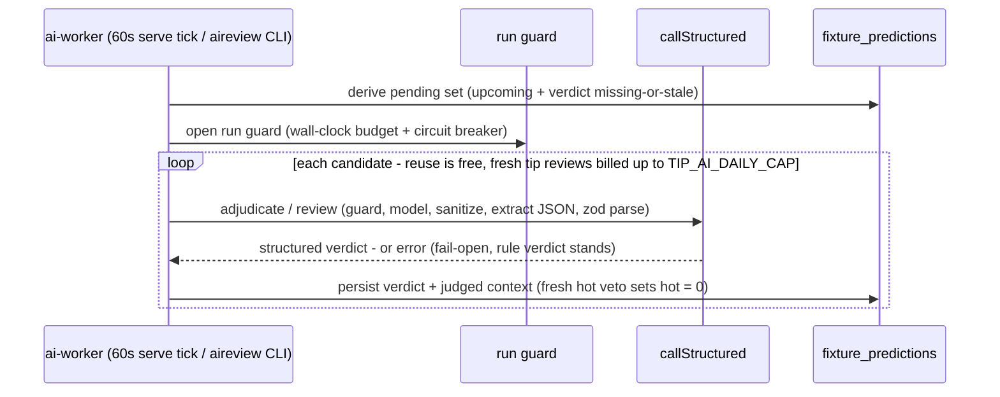

# 06 - AI layers: adjudication, worker, enrichment, guard chain

Role in one line: **AI double-checks the rules - it may veto, never promote, and every
failure falls open to the rule verdict.** The pipeline sweep itself bills NO AI; all
verdict writes belong to the background worker.

## Adjudicators (`src/ai/adjudicators.js`)

Two reviewers: `adjudicateHotPick` (confirm/veto a rule-hot Over-2.5 candidate) and
`reviewTip` (review a tip above `TIP_AI_MIN_CONFIDENCE` - a tip veto FLAGS the row, never
clears it, so its settled outcome measures what the veto was worth). Prompts are the v2
de-anchored generation (2026-07-05), carried as `PROMPT_VERSION` 3: the model researches
context and team news (web-grounded when
`HOTPICK_AI_WEB=1` via OpenRouter's web plugin, engine per `AI_WEB_ENGINE`, `parallel`
default; it replaced Gemini's `google_search` at the 2026-08-04 retirement, citations map
to the same `{title, uri}` sources shape), states its OWN
probability, and vetoes mechanically only below break-even − 0.05 or on a verified
disqualifier - a market-vs-stats contradiction alone is never a veto ground (v1's
contradiction vetoes were net-negative).

**Verdict reuse** is keyed on the judged identity (score / tip market+price within
tolerance) AND `aiModelTag()` - `<model>[+search]#p<N>` (or an ensemble tag). Reruns
re-bill nothing; changing model, grounding, prompt version, preamble or panel re-adjudicates
automatically. Corollary: **AI-call refactors must be regime-neutral (prompt bytes + tags
byte-identical) or bump the tag in the same commit** (`AGENTS.md` invariant).

Verdicts can never be backfilled: a grounded call on a played fixture would retrieve the
final score from the web - collection is strictly pre-kickoff, forward-only.

Structured verdicts (the model's probability, per-check findings, grounding citations)
persist as `ai_review`/`tip_ai_review` JSON; reply decoding lives in the pure, zod-only
`src/ai-parse.js`, which is why it is offline-testable. Every failure is fail-open: an error
keeps the rule verdict.

**The tip veto does NOT shape tip ranking or display** (M4.1 spec section 3.8). Settled data
shows no discrimination - confirm 75.0% against veto 72.7% at n = 61 - so `magicSortRows` and
`scoreTip` never consult `tip_ai_verdict`, the web table no longer strikes a vetoed tip
through, and the betslip pool does not filter on it. The verdict is still PERSISTED and still
surfaced everywhere it was: the details-gated "AI double-check" section of `TipPopover.jsx`,
the `Tip AI Verdict` column of the web selection CSV export, and `perf-rules.js`'s
`ai_impact` bucket, where vetoed picks settle but sit outside the headline rate so `saved`
keeps measuring what following the vetoes was worth. On the hot side the veto still bites:
a fresh veto sets `hot = 0`, folded into the same UPDATE
(`...(verdict.verdict === 'veto' ? { hot: 0 } : {})`, `src/ai-worker.js`) since the worker
took ownership of the verdict columns. The AI can veto a hot pick, never promote one.

## The worker (`src/ai-worker.js`)


```mermaid
sequenceDiagram
    participant W as ai-worker (60s serve tick / aireview CLI)
    participant G as run guard
    participant AI as callStructured
    participant DB as fixture_predictions
    W->>DB: derive pending set (upcoming + verdict missing-or-stale)
    W->>G: open run guard (wall-clock budget + circuit breaker)
    loop each candidate - reuse is free, fresh tip reviews billed up to TIP_AI_DAILY_CAP
        W->>AI: adjudicate / review (guard, model, sanitize, extract JSON, zod parse)
        AI-->>W: structured verdict - or error (fail-open, rule verdict stands)
        W->>DB: persist verdict + judged context (fresh hot veto sets hot = 0)
    end
```

Work is a **derived predicate**, not a status column - an interrupted drain auto-resumes by
construction. The predicate is: upcoming (via the +03:00 `KICKOFF_SQL_EXPR` projection), a
hot pick or tip present, and a verdict missing or stale under the pure adjudicate-rules reuse
keys, ordered kickoff-ASC. The serve tick skips while a refresh job is running.

`TIP_AI_DAILY_CAP` (20) counts BILLED tip reviews per EAT day; the counter is
**in-memory per process** (serve holds it across ticks; each CLI run starts fresh; a
restart resets - worst case one extra cap that day). Cron-only hosts must run
`node src/index.js aireview` after each sweep or verdicts stop accumulating.

Concurrency is `effective('HOTPICK_AI_CONCURRENCY')` (4) for the AI calls, but persistence is
**sequential single-row PK UPDATEs** - the no-parallel-DB-writers idiom this warehouse
follows everywhere. A fresh review persists its verdict-time `judged` context (`{score}` for
hot, `{tip_market, tip_price}` for a tip); that context is what makes reuse possible now that
the worker, not the sweep, owns the columns, and legacy rows written without it re-bill
exactly once, bounded by the budget. Each call re-checks the kickoff before firing, so
verdict coverage is best-effort pre-kickoff - the scorecard's S5 section measures it.

Pure rules in `src/db/adjudicate-rules.js`: `priceWithinTolerance` (against
`TIP_AI_REUSE_PRICE_TOL`, 0 by default and 0.05 in the live `.env` - a market re-pick always
re-fires regardless), `canReuseHotVerdict`/`canReuseTipVerdict`, `hotReviewPending` and
`tipReviewPending` (ONE definition, shared with `hotpicksSummary()`'s pending counts),
`selectTipReviews` (reuse never consumes budget), `latencyStats` and `marketLine`.

## Enrichment (`src/enrich.js`, M4.1 - collection only)

`enrichFixtures()` is wired as `node src/index.js enrich` and as step 12 of the sweep,
deliberately AFTER hot picks so the anchored call sees the tip `updateHotPicks()` just wrote.
It is OFF by default (`AI_ENRICH_ENABLED`) and bounded per run by `AI_ENRICH_CAP` fixtures
with `AI_ENRICH_CONCURRENCY` in flight.

Up to three calls per upcoming fixture: **facts** (grounded `AI_FACTS_MODEL`, once per
fixture - typed availability, motivation, congestion and lineup facts, where absent evidence
stays `null` rather than being guessed), **blind** (a pinned vendor-independent reasoner; the
same screened facts, NO odds and no tip), **anchored** (`AI_ANCHORED_MODEL`; sees everything
including our tip + price, and only fires once a tip exists). Blind and anchored see
IDENTICAL evidence, so `anchored − blind` is a *paired anchoring-effect measurement*.
**Nothing here feeds ranking** - that question is answered by replay
(`scripts/edge-sentinel.js`, `scripts/ai-scorecard.js`), never by assertion.

The stats block both prompts see (spec section 3.1: "teams, date, our rolling stats") is
`src/hotpicks.js`'s shared `loadTeamHistory` plus `pairedTeamGoalsAggregates`/
`h2hGoalsAggregates` from `src/db/goals-rules.js` - the same fairness-paired windows the
hot-pick evaluator itself uses, scoped to the run's capped targets. One warehouse machinery,
not a second definition of "recent form". A genuinely sample-less side or H2H is OMITTED from
the prompt rather than rendered as literal `null`s (the pure `_team` in `src/db/ai-rules.js`).

`src/ai/index.js` is the provider seam (`callModel({task, prompt, cfg})`, mirroring the SMS
seam) over `src/ai/openrouter.js`; providers expose `enabled()` as a uniform interface.
`enrichFixtures()` fails fast, before any fixture is touched, on a misconfigured blind model
(`resolveTask`) or an unset `OPENROUTER_API_KEY` (`assertAiProvidersConfigured`) - that
closes the "anchored with no blind on every fixture" failure mode a missing provider key used
to cause. The preflight collapsed to one key at the Gemini retirement but keeps its object
signature, so a second provider slots back in without touching call sites. `resolveTask` and
`callModel` route through `effectiveAiConfig()` (config defaults layered with
`settings.effectiveConfig()`'s live admin overrides), so `OPENROUTER_MODEL`/`AI_BLIND_MODEL`/
`AI_ANCHORED_MODEL`/`AI_FACTS_MODEL` take effect without a restart like every other
`live:true` catalog knob.

Enrichment carries its own `PROMPT_VERSION`, currently **2** - bumped when real stats
replaced the hardcoded placeholder, and since reuse is keyed on the tag, that fix correctly
re-enriched the upcoming fixtures. Reuse is keyed on `(fixture, kind, provider, model_tag)`
plus the stored tip identity for `anchored` rows (`insightIsFresh`): a rerun re-bills
nothing, while a changed model, grounding, prompt version or a re-picked `bestTip` re-fires
automatically.

Enrichment freezes like everything else - `kickoff > NOW()`, enforced BOTH in SQL and in the
pure, test-asserted `selectEnrichable()` guard, through the +03:00-offset-qualified
`KICKOFF_SQL_EXPR`. A bare `f.kickoff` column would decode in the NODE PROCESS's local
timezone rather than the pinned SQL session, so an off-EAT host could otherwise admit an
already-kicked-off fixture. Results land one row per `(fixture_id, kind, provider)` in
`fixture_ai_insights` (migration batch 14, `payload`/`sources` JSON plus `schema_ver`, so a
new fact field is a version bump rather than a migration) and freeze the same way prematch
snapshots and tips do.

**The blind slot ships a FREE model, and `AI_ENRICH_CAP` is sized to its quota, not to
appetite.** `enrich.js` fails OPEN on a 429 (caught and logged, never fatal), so a cap above
the provider's daily allowance does not error - it **silently truncates blind coverage**,
which corrupts the paired measurement rather than stopping it. Raise the cap only together
with the quota. Changing the blind model is also a **policy-regime change**: the id is baked
into `enrichModelTag()`, so rows never conflate, but the measurement population forks at that
date and analyses must split on the tag instead of pooling (see `docs/memory-bank.md`).

## The guard chain (`src/ai/harness.js`)

`callStructured` is the ONE door every structured AI call takes:

```
guard check → callModel → sanitizeReply → extractJson → schema.parse → suspicion flags (observe-only)
```

Its full signature is `callStructured({task, prompt, schema, cfg, guard, consensus, deps})`.
Providers are transport-only; the adjudicators (prompts, `aiModelTag`, `adjudicateHotPick`,
`reviewTip`) live in `src/ai/adjudicators.js`, moved there by T9 to break the
harness -> index -> gemini import cycle. That move was **regime-neutral**: prompt bytes and
the `#p3`/`#e2` tags were byte-identical, so nothing re-billed.

The pure guard rules (`src/db/ai-guard-rules.js`): `sanitizeReply` strips control characters
and FLAGS an oversize reply rather than truncating it; `suspicionChecks` is observe-only, its
flags feeding `debugLog` and never a verdict; the cross-vendor `consensusVerdict`,
`parseConsensusModels`, `isCrossVendor` and `consensusFor` take a majority per field and
THROW on disagreement rather than guessing; the run-guard state machine is
`newRunGuard`/`guardVerdict`/`recordCall`; and `injectionPreamble`/`structuredContract` build
the optional hardening.

The run guard latches per drain/sweep, one guard per drain or enrich sweep: a wall-clock
budget (`AI_RUN_MAX_MINUTES`, 0=off) and a breaker after `AI_BREAKER_AFTER` (5) consecutive
failures - once open, remaining calls refuse instantly (`AiGuardOpen` → 'error' verdicts,
never a batch rejection) instead of burning timeouts. Nothing a model returns is
executed or trusted past its zod schema. **DARK switches** (`AI_INJECTION_PREAMBLE`,
`AI_CONSENSUS_*`) are OFF by default and, since M6 (2026-07-19), live in the settings
catalog (group `ai-dark`, `regime:true`): an admin can flip them in Admin → Settings, the
editor shows the regime warning, and the `admin_audit` table dates every old→new change -
that trail replaced the manual memory-bank dated-note discipline. Flipping one still
needs an explicit user go (it triggers a bounded re-adjudication wave + a dataset split);
the `.env` lines remain the fallback default layer. The adjudicator tag/prompt read the
EFFECTIVE config (`aiModelTag(cfg)` / `_preambleActive(cfg)`), so an admin flip re-keys
verdict reuse exactly like an `.env` flip after restart used to.

Mechanically: `AI_INJECTION_PREAMBLE` adds the injection guard to grounded prompts and bumps
the version suffix (#p3 -> #p4, #e2 -> #e3) through the pure `effectivePromptVersion`,
exported from `src/db/ai-rules.js` rather than the harness. `AI_CONSENSUS_TASKS`/
`AI_CONSENSUS_MODELS`/`AI_CONSENSUS_MIN_AGREE` wire cross-vendor panels for the **adjudicate
task only** (the ensemble-aware `aiModelTag` comes from the harness's `ensembleTag`);
enrichment tasks are excluded until their tags get the same treatment, and the blind slot is
frozen by policy until the M4.3 verdict.

## Provider and routing (`src/db/ai-rules.js` `resolveTask`)

OpenRouter is the SOLE provider since the 2026-08-04 Gemini retirement (`src/ai/gemini.js`
deleted; historic `fixture_ai_insights` rows keep `gemini` as provenance). Task → model
defaults: adjudicate = `HOTPICK_AI_MODEL` (`openai/gpt-5.6-luna`, grounded when
`HOTPICK_AI_WEB=1`); facts = `AI_FACTS_MODEL` and anchored = `AI_ANCHORED_MODEL` (both
`deepseek/deepseek-v4-flash-0731`); blind = `AI_BLIND_MODEL`/`OPENROUTER_MODEL`
(`nvidia/nemotron-3-super-120b-a12b:free`, never grounded). `resolveTask` ENFORCES blind
vendor-independence (throws on a Google model or a vendor shared with anchored - one lab
agreeing with itself is not a consensus signal). A 429 on a `:free` slug = the daily free
quota is exhausted (50 req/day free; 1,000/day after a one-time $10 top-up) - stop and
escalate to the user; never swap models to work around it (a model switch re-keys the
reuse tags = a policy-regime fork).

## Transport resilience (2026-08-23)

Three enrichment failures were diagnosed off `logs/pipeline.log`, and the biggest one was
not the model at all - it was how a rate limit was classified.

| Log line | Count | Root cause |
|---|---|---|
| `AI run guard open: breaker-open` | 1091 | cascade, not a cause |
| `Request failed with status code 429` | 131 | 429 never retried |
| `OpenRouter reply carried no message content` | 30 | reasoning ate the budget |
| `truncated at the model's token limit (0 chars)` | 4 | same cause, different `finish_reason` |
| `Request failed with status code 404` (blind) | 1 | single-endpoint free model |

**429 is a transport condition, not a verdict.** `openrouter.js` retried on net-rules'
`isRetryableNetworkError`, which by contract matches only faults that produced NO HTTP
response - so every free-tier 429 counted as permanent, five consecutive ones latched the
run guard's breaker, and the remainder of the sweep was refused instantly. That single
misclassification turned 131 ordinary rate limits into 1091 refused calls. The AI transport
now uses its own predicate, `ai-guard-rules#aiErrorClass` -> `retry` (429/408/409/425/5xx and
responseless faults) | `model-missing` | `permanent` (401, a 403 moderation refusal, any other
400) - deliberately NOT net-rules' `isTransientHttpStatus`, which retries 403 for
API-Football's WAF. Against OpenRouter a 403 is a moderation refusal, so retrying re-bills a
prompt that will be refused again. `aiRetryAfterMs` honours the server's own bounded
`retry_after_seconds`/`Retry-After` hint.

**"No content" and "truncated" were ONE bug.** No `max_tokens` was ever sent, and every model
in the roster is a reasoning model, so the reasoning stream could consume the provider's
default budget and emit zero content tokens; whether the provider then reported
`finish_reason` `length` or `stop` is provider detail. `ai-parse#chatReplyOutcome` classifies a reply
`ok` / `truncated` / `reasoning-only` / `empty` and marks the last three retryable,
`AI_MAX_TOKENS` (3000) bounds the completion, `AI_REASONING_EFFORT` (`low`; accepts
`off`/`low`/`medium`/`high`, where `off` omits the parameter entirely for a model that
rejects it) bounds the reasoning inside it, and `src/ai/index.js` re-asks EXACTLY once at
`AI_MAX_TOKENS_RETRY` (8000) after an incomplete reply. Exactly one - a second failure fails
open as before.

`AI_JSON_MODE` (on) requests strict `response_format` JSON replies. It had been documented as
the escape hatch since 2026-08-19 but was never declared in the zod schema, so the config
loader stripped it and it did nothing; it is declared now.

**The blind slot has a fallback chain.** `AI_BLIND_MODEL_FALLBACKS` (default
`z-ai/glm-5.2:free,nvidia/nemotron-nano-9b-v2:free`) is walked by the pure `blindCandidates`
whenever a candidate cannot serve the call - the shipped blind model is a SINGLE-endpoint
free model with no internal failover. An invalid PRIMARY still throws (fail-fast unchanged);
an invalid FALLBACK is dropped and reported, because a typo in a resilience knob must never
take down the run the knob exists to protect. Live-verified end to end on a real upcoming
fixture: dead primary (400) -> rate-limited fallback (429) -> third candidate parsed OK. A slug that no longer exists does NOT answer 404 - probed live, OpenRouter answers
`400 "<slug> is not a valid model ID"` - so both statuses resolve to `model-missing`; an
ordinary 400 stays permanent so a malformed request stays loud instead of being re-sent to
every model. The chain also advances past a candidate that exhausted its own backoff, since
the free slugs sit behind separate upstream pools. Every fallback re-passes the
vendor-independence check (`blindModelRejection`, the ONE rule `resolveTask` also uses) and is
dropped if it fails - falling back onto the anchored model's vendor would quietly turn the
paired anchoring measurement into one lab agreeing with itself. The model that actually
answered is what the reuse tag records, so the row re-fires by itself once the primary is
reachable again rather than passing a fallback's answer off as the primary's.

An error still persists NOTHING (`src/enrich.js` writes only on success, and an `error`
verdict is not `_decided`), so none of these failures consume reuse - the next run retries.

## Instruments (read-only)

- **`scripts/ai-scorecard.js`** - the B3 bias instrument: per-model-tag hot/tip verdict
  hit-rates and veto value, price drift against the judged context, blind Brier score and
  reliability, and verdict coverage per day. It is CLI-only again since the 2026-08-07
  core-focus trim removed the admin route and PerformanceSection. `scorecardSummary()`
  (`src/scorecard.js`) follows the `performanceSummary()` idiom - one query scan per ledger,
  all computation delegated - and the pure `computeScorecard({picks, insights})`
  (`src/db/scorecard-rules.js`) returns STRUCTURED sections S1-S5, with every display
  decision (percentages, padding, UNDERPOWERED labels) left to the script's
  `formatScorecard`, so the module holds no opinion on presentation. It settles through
  tip-rules' canonical `tipHitSafe` rather than the local `settle()` the pre-refactor script
  duplicated; `tests/scorecard-rules.test.js` carries the equivalence proof over the 7
  `BLIND_MARKETS` (`'void'` is unreachable there - there is no DNB in the blind menu - so the
  hit/miss/null contract lines up exactly). NB the same `settle()` duplication still exists
  in `scripts/{edge-sentinel,backtest-sure-tips,mine-precursors,probe-value-edge,validate-precursor-boosters}.js`;
  only `ai-scorecard.js` was canonicalized.
- **`scripts/edge-sentinel.js`** - the standing M4.3 instrument, seconds to run: anchoring
  effect, AI-market dissent, and dissent calibration over `fixture_ai_insights`.

## AI knobs

All live in the settings catalog unless noted; group `ai` except where stated.

| Knob | Default | Meaning |
|---|---|---|
| `OPENROUTER_API_KEY` | - | `.env` only, never in git. Unset = rules-only, no AI |
| `HOTPICK_AI_MODEL` | `openai/gpt-5.6-luna` | the adjudicate task |
| `HOTPICK_AI_WEB` | off | attach the OpenRouter web plugin to grounded prompts |
| `AI_WEB_ENGINE` / `AI_WEB_MAX_RESULTS` | `parallel` | web plugin engine (`parallel`/`exa`/`native`) and result cap |
| `AI_FACTS_MODEL` / `AI_ANCHORED_MODEL` | `deepseek/deepseek-v4-flash-0731` | enrichment facts and anchored calls |
| `AI_BLIND_MODEL` / `OPENROUTER_MODEL` | `nvidia/nemotron-3-super-120b-a12b:free` | the vendor-independent blind reasoner |
| `AI_BLIND_MODEL_FALLBACKS` | `z-ai/glm-5.2:free,nvidia/nemotron-nano-9b-v2:free` | ordered blind fallback chain; blank disables it |
| `AI_ENRICH_ENABLED` / `AI_ENRICH_CAP` / `AI_ENRICH_CONCURRENCY` | off | enrichment master switch, per-run fixture cap, in-flight calls |
| `TIP_AI_MIN_CONFIDENCE` / `TIP_AI_DAILY_CAP` | - / 20 | which tips get reviewed, and the per-EAT-day BILLED budget |
| `TIP_AI_REUSE_PRICE_TOL` | 0 (`.env` 0.05) | relative price drift within which a stored tip verdict is reused |
| `HOTPICK_AI_CONCURRENCY` | 4 | worker AI-call concurrency |
| `AI_RUN_MAX_MINUTES` / `AI_BREAKER_AFTER` | 0 (off) / 5 | run-guard wall-clock budget and consecutive-failure breaker |
| `AI_MAX_TOKENS` / `AI_MAX_TOKENS_RETRY` | 3000 / 8000 | completion bound and the single automatic re-ask |
| `AI_REASONING_EFFORT` | `low` | `off`/`low`/`medium`/`high`; `off` omits the parameter |
| `AI_JSON_MODE` | on | strict `response_format` JSON replies |
| `AI_INJECTION_PREAMBLE` | OFF | DARK (group `ai-dark`, `regime:true`) - injection guard, bumps the prompt-version suffix |
| `AI_CONSENSUS_TASKS` / `AI_CONSENSUS_MODELS` / `AI_CONSENSUS_MIN_AGREE` | OFF | DARK (group `ai-dark`, `regime:true`) - cross-vendor panels, adjudicate task only |

Leftover `GEMINI_*` lines in an `.env` are ignored: OpenRouter has been the ONLY AI provider
since 2026-08-04.

---
*Update this chapter when: PROMPT_VERSION bumps, models/tags/reuse keys change, an AI knob is
added or its default moves, transport classification changes, the cap or guard mechanics
change, a new AI surface or instrument is added, or a DARK switch ships
(`src/ai/adjudicators.js`, `src/ai-worker.js`, `src/enrich.js`, `src/ai/harness.js`,
`src/ai/openrouter.js`, `src/db/ai-guard-rules.js`, `src/db/ai-rules.js`, `src/ai-parse.js`,
`src/scorecard.js`).*
